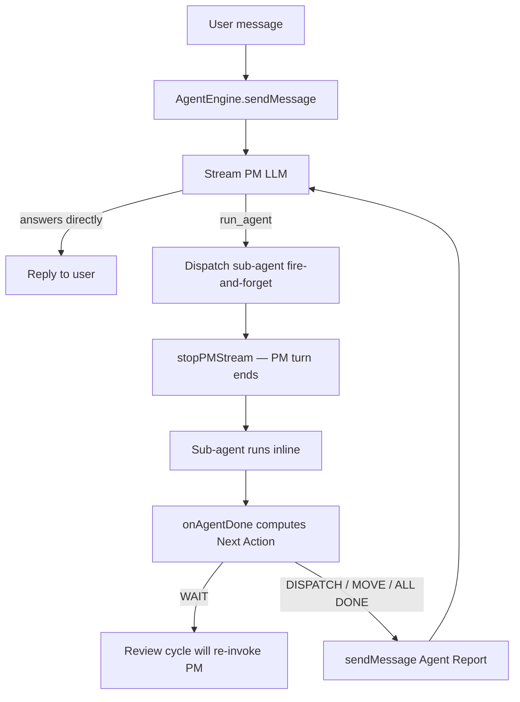

# PM is the Sole Orchestrator

**There is no separate WorkflowEngine state machine in AgentDesk.** A single LLM —
the Project Manager (`project-manager`) — *is* the orchestrator. It classifies the
request, plans, gets approval, creates kanban tasks, and dispatches specialist
sub-agents, all by calling tools inside one streaming loop. The "state machine"
that a traditional workflow engine would encode (which step runs next, what to do
when an agent finishes, when a task is blocked) is instead expressed two ways: as
**English rules in the PM system prompt** (`src/bun/agents/prompts.ts:271`) and as
**deterministic `[Next Action]` hints computed in code** and fed back to the PM
(`src/bun/agents/engine.ts:408`). The engine is a thin host for the PM's stream;
it owns no orchestration logic of its own.

## Key idea: the loop, not a graph

A conventional multi-agent system models the lifecycle as nodes/edges (plan →
build → review → done) with a coordinator advancing the graph. AgentDesk inverts
this: the PM decides each next move *in-context*, and the system merely re-invokes
the PM after every event with a strong hint about what to do.

The cycle is:

1. User message → `AgentEngine.sendMessage` persists it and streams the PM
   (`src/bun/agents/engine.ts:97`, `:184`).
2. The PM calls a tool — `run_agent`, `request_plan_approval`,
   `create_tasks_from_plan`, etc. (`src/bun/agents/tools/pm-tools.ts:254`).
3. `run_agent` dispatches the sub-agent **fire-and-forget** and immediately tells
   the PM to stop its stream (`pm-tools.ts:604`, `:823`). The PM's turn ends here —
   it does *not* await the agent.
4. When the sub-agent finishes, the `onAgentDone` callback computes the next action
   and **re-invokes the PM** with a synthetic `[Agent Report]` message
   (`engine.ts:408`, `:511`).
5. Back to step 2. The loop continues until `[Next Action] ALL DONE` or the PM
   answers the user directly.

## Where the "state machine" actually lives

There is no `WorkflowEngine` class — grep confirms only `AgentEngine`
(`src/bun/agents/engine.ts:48`) and the standalone review cycle exist. The
transition logic is split deliberately:

- **Soft / semantic transitions → the system prompt.** The Plan → Approve →
  Execute flow, the request-classification table, and the kanban flow rules are
  natural-language instructions the PM follows (`prompts.ts:328` classification,
  `prompts.ts:374` complex-task workflow, `prompts.ts:403` kanban flow). Because
  these are prompt text, they are *advisory* — the PM can deviate, which is why
  hard invariants are NOT left here (see next bullet).

- **Hard invariants → code guards in the tools.** Anything that must never happen
  regardless of what the LLM "decides" is enforced in `run_agent`'s `execute`:
  only one write-agent at a time via the `writeAgentRunning` closure
  (`pm-tools.ts:249`, `:385`), a module-level `dispatchingAgents` set to close the
  parallel-tool-call race (`pm-tools.ts:240`, `:356`), plan-mode read-only
  restriction (`pm-tools.ts:377`), and a block on dispatching while a task is in
  `review` (`pm-tools.ts:405`). Kanban column transitions are likewise enforced in
  code, not prompt — the agent cannot move a task to `done`; only the review system
  does (`prompts.ts:406`, see [[agent-engine]] / review-cycle). Task *authorship*
  is code-restricted the same way: the PM's direct kanban tools are read-only +
  `create_tasks_from_plan` — it has **no `create_task`** (`engine.ts:516`); the
  task-planner is the sole holder of `create_task`, enforced at runtime by
  `restrictCreateTask` in `tools/index.ts` regardless of seeded `agent_tools` rows.

- **Next-step routing → `onAgentDone`.** After each agent, the engine reads the
  live kanban state and emits exactly one directive — `WAIT`, `REVIEW NEEDED`
  (a task sits in review but no reviewer is running), `MOVE TO REVIEW`,
  `DISPATCH`, `ALL DONE`, `BLOCKED`, `INVESTIGATE` (on failure), or `PAUSED`
  (when the `autoExecuteNextTask` setting is off, a `DISPATCH` becomes `PAUSED`
  so no next task auto-starts — see [[kanban-review-cycle]]) —
  (`engine.ts:423`–`:485`). This is the closest thing to a state-transition
  function, but it is a *hint computed fresh from the DB each time*, not a
  persisted FSM. The PM still chooses whether to obey, with prompt rules telling it
  to (`prompts.ts:317` Agent Report Handling).

The redundancy (prompt rule + code guard for the same constraint, e.g. "one write
agent at a time") is intentional: the prompt steers the LLM toward correct behavior
to save tokens/retries; the guard guarantees correctness when the LLM ignores it.

## Why this design (the rationale)

- **The LLM is already a planner.** A separate FSM would duplicate reasoning the
  model does natively. Classification ("casual? status? implementation?",
  `prompts.ts:328`) and dependency-aware task ordering are exactly what an LLM is
  good at; encoding them as graph nodes adds rigidity without adding capability.

- **Inline, single-conversation execution.** Sub-agents run *in the PM's
  conversation*, streaming their tool calls as visible message parts
  (`run_agent` description, `pm-tools.ts:255`). A coordinator graph that ran agents
  in isolated sessions would break this "everything visible in one chat" UX. The
  fire-and-forget + re-invoke pattern (`pm-tools.ts:604`, `engine.ts:511`) keeps
  one linear transcript the user can read.

- **Concurrency is structurally simple.** Write work is strictly sequential
  ("Sequential Single-Agent Model") so there is no parallel state to reconcile —
  the only "lock" needed is `writeAgentRunning` (`pm-tools.ts:249`). Read-only
  agents fan out via `run_agents_parallel` but produce no state mutations
  (`pm-tools.ts:854`). An FSM's value is mostly in coordinating concurrent
  branches; with one writer at a time, that value largely evaporates.

- **Restart-safe by reconstruction, not by persistence.** Because the next action
  is recomputed from kanban + running-agent counts on every `onAgentDone`
  (`engine.ts:420`) and `get_next_task` (`pm-tools.ts:1795`), there is no FSM state
  to persist or recover. The DB (kanban columns, `verificationStatus`) IS the
  state; the orchestrator is stateless between turns.

## Tradeoffs vs a dedicated state machine

| | PM-as-orchestrator (chosen) | Dedicated WorkflowEngine FSM |
|---|---|---|
| Transition logic | Prompt rules + code hints, recomputed each turn | Explicit nodes/edges, persisted |
| Flexibility | High — PM handles novel/ambiguous requests | Low — only encoded paths |
| Determinism | Lower — relies on LLM obeying prompt | Higher — code-driven |
| Failure modes | LLM hallucinates a step / skips a tool | Stuck/unhandled state |
| Mitigations needed | Hallucination guard (`engine.ts:840`), text-retraction (`engine.ts:706`), post-stream dispatch correction (`engine.ts:1053`), code guards in tools | None for transitions; needs recovery code for stuck states |
| Cost | Re-invokes PM (extra LLM calls) per event | Cheap transitions, LLM only inside steps |

The chief cost paid for flexibility is **LLM unreliability around tool-calling**,
which the engine actively compensates for with three layers. First, it detects
when the PM wrote prose instead of calling `run_agent` via three vectors — the
injected `[Next Action] DISPATCH` hint, a scan of the PM's thinking block for a
concluded dispatch decision ("let me dispatch", "I'll call run_agent"), or a
conservative response-text regex fallback for non-thinking providers
(`engine.ts:780`–`engine.ts:838`) — and re-prompts in-memory up to twice
(`engine.ts:840`, `MAX_HALLUCIN_RETRIES` at `engine.ts:556`). Second, it retracts
premature narration emitted in the same step as a dispatch (`engine.ts:706`).
Third, when in-stream retries are exhausted, a post-stream **ground-truth check**
consults the actual running-agent count: if it is zero, the dispatch genuinely
never happened and a `[DISPATCH CORRECTION]` message is re-injected to re-drive
the PM (`engine.ts:1053`). These exist *only because* there is no FSM forcing
the transition — they are the price of the trade.

## Key files

| File | Role |
|---|---|
| `src/bun/agents/engine.ts` | `AgentEngine` — streams the PM, hosts the soft approval gate, `onAgentDone` next-action computation, hallucination/retraction guards |
| `src/bun/agents/tools/pm-tools.ts` | PM tool set — `run_agent` (dispatch + concurrency guards), `request_plan_approval`, `create_tasks_from_plan`, `get_next_task`, `set_feature_branch`, `get_agent_status` |
| `src/bun/agents/prompts.ts` | `PM_PROMPT_TEMPLATE` (`:271`) — the orchestration "rules" in natural language: classification, Plan→Approve→Execute, kanban flow, epistemic-honesty rules |
| `src/bun/agents/review-cycle.ts` | Independent review cycle that re-invokes the PM after review — the one transition the PM does *not* own |

## Gotchas / Constraints

- **No `WorkflowEngine` exists** — do not look for one. Orchestration = PM stream +
  tool guards + `onAgentDone` hints.
- **`run_agent` is fire-and-forget.** It returns `"dispatched"` immediately
  (`pm-tools.ts:828`); the PM never awaits the agent. The next turn is driven by
  the `onAgentDone` re-invocation (`engine.ts:511`), not by a tool return value.
- **Same constraint may appear twice** (prompt + code). When changing a rule, check
  both — e.g. "one write agent at a time" is in `prompts.ts:362` AND enforced at
  `pm-tools.ts:385`.
- **`[Next Action]` strings are load-bearing.** The PM's behavior keys off literal
  substrings like `"[Next Action] DISPATCH"` (`engine.ts:554`, `:480`) and `"WAIT"`
  (`engine.ts:489`). Changing the wording in `onAgentDone` without updating the
  matchers will silently break routing.
- The PM has **no file-write tools** by design (`prompts.ts:311`) — every mutation
  goes through a dispatched sub-agent, which is what keeps the PM purely an
  orchestrator. The same prompt block also bans answering codebase questions from
  memory: code lookups/verification must be dispatched to `code-explorer`/`qa`.

## Related
- [[agent-engine]]
- [[agent-tools]]

## Open questions
- The review cycle (`review-cycle.ts`) is the one path that re-enters the PM
  outside `onAgentDone` (via `triggerPMAutoContinue`); its exact re-invocation
  contract is documented under [[agent-engine]] and not re-verified line-by-line
  here.
