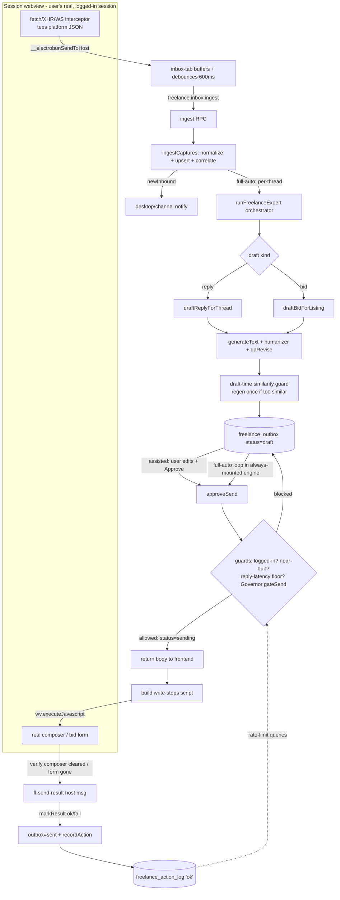

# Auto-Earn End-to-End

**This page traces a single message all the way from the platform's own network
traffic to a verified send recorded in the audit log.** It is the connective
narrative across the files documented in [[freelance-autoearn]] — the *what each
file does* lives there; *how the bytes flow between them* lives here.

The one idea that shapes the entire pipeline: **bans are behavioral, not
fingerprint-based** (`docs/auto-earn-plan.md:65`). So Bun *never* talks to the
platform — all reads are teed out of the user's real browser session, and all
writes are human-paced typing into the real composer, gated by the Behavior
Governor. The asymmetry between the two halves is the whole design: the **read
half is passive and ungated** (sync must stay current even when paused), the
**write half is active and gated by everything**.

## The full flow

## 1. READ — interceptor to DB (passive, ungated)

The interceptor is injected into the persistent session webview as a JS string
(`inbox-tab.tsx:501`, `INTERCEPTOR_SRC`). It wraps the page's own `fetch`/XHR and
tees the messaging JSON to the host via `__electrobunSendToHost`. The React side
buffers these captures and flushes a debounced batch (`inbox-tab.tsx:467`) to
`freelance.inbox.ingest` — **Bun itself never issues a network request to the
platform**, which is the entire point (`rpc/freelance-inbox.ts:5`).

`ingest` (`rpc/freelance-inbox.ts:57`) hands the raw `{url, body}[]` to
`ingestCaptures` (`session/ingest.ts:50`), which inside one transaction:
classifies each record by URL (`classifyEndpoint`), parses it with the pure
`normalizer` (`session/normalizer.ts`), and upserts users → threads → messages.
**Order matters**: `self` is processed first so `self_user_id` is known
(`ingest.ts:120`), which is what lets thread/message processing decide who the
*client* is (the member that isn't you, `ingest.ts:158`) and which inbound
messages are genuinely new (`ingest.ts:193`).

Two subtleties carried into the rest of the flow:
- **New-inbound detection** only fires for messages that didn't already exist,
  are inbound, and are recent (30-min window) — so the initial history backfill
  doesn't fire a notification storm (`ingest.ts:195`).
- **Thread↔listing correlation** matches a thread's `context.id` to a discovered
  listing by external id (`certain`) or title (`probable`), so a reply can later
  be drafted *with* job context (`ingest.ts:204`). This is why a reply draft can
  cite the job even though messages and listings arrive on different endpoints.

## 2. Trigger — notify and (full-auto) hand off

Back in the RPC handler, the `newInbound` array drives two fire-and-forget side
effects (`rpc/freelance-inbox.ts:77`): a desktop/channel notification, and — in
full-auto only — one `runFreelanceExpert` call per affected thread
(`freelance-inbox.ts:88`). The orchestrator self-gates on full-auto + risk-ack
and dedupes per job, so an assisted account simply gets the notification and the
human opens the draft themselves.

## 3. DRAFT — LLM with anti-spam variation

Both draft entry points produce a `freelance_outbox` row at `status='draft'`:
`draftReplyForThread` (`reply-pipeline.ts:121`) and `draftBidForListing`
(`bid-pipeline.ts:51`). Each calls `generateText` with a freelancer-strategist
system prompt + injected humanizer rules, then `qaRevise`. Bids first pull the
*full* page description via `ensureFullDescription` (`bid-pipeline.ts:67`) so the
proposal is written from the real listing, not the truncated RSS snippet.

The **draft-time similarity guard** runs here (`reply-pipeline.ts:142`,
`bid-pipeline.ts:83`): if the draft is too similar (trigram Dice ≥
`DRAFT_SIMILARITY_MAX`, `similarity.ts`) to recent outbox bodies, it regenerates
*once* at higher temperature with an explicit "vary the structure" instruction
and keeps whichever version is less similar. This is a soft guard; the send-time
check is the hard backstop.

## 4. APPROVE — the gate (`approveSend`)

Whether the human clicks Approve & Send (assisted) or the always-mounted engine
loops (full-auto), the path converges on `approveSend`
(`rpc/freelance-outbox.ts:236`). The distinction is one boolean: the frontend
passes `userInitiated = !autonomous` (`inbox-tab.tsx:402`). `approveSend` refuses
to proceed unless, in order:

1. **logged in** — `isConnectedPlatform` checks only the *presence* of auth-ish
   cookie names, never values (`freelance-outbox.ts:295`, `freelance-inbox.ts:45`);
2. **not a near-duplicate** of a recent *sent* body — trigram similarity ≥
   `SEND_SIMILARITY_MAX` (0.9) hard-blocks (`freelance-outbox.ts:312`);
3. **reply-latency floor** (autonomous replies only) — the inbound message must
   have aged past a per-draft 2–5 min floor, derived from a hash of the outbox id
   so retries converge instead of re-rolling (`freelance-outbox.ts:327`).
   User-initiated sends skip this — the human is acting now;
4. **Behavior Governor** allows it — `gateSend` (`freelance-outbox.ts:354`).

Only then does it flip the row to `status='sending'`, stash `final_body`, and
return the body to the frontend (`freelance-outbox.ts:359`). For bids it also
resolves the **canonical platform URL + a computed bid amount/days**
(`freelance-outbox.ts:264`) — and crucially **`autoPlace` is hard-coded `false`**
(`freelance-outbox.ts:292`): even in full-auto a bid is only *prefilled*; the
human clicks Place Bid because it moves real money.

### The Governor (`gateSend`)
`gateSend` → `evaluateSend` (`governor.ts:245`) enforces, per action stream:
global pause, active-hours (skipped for user-initiated sends,
`freelance-outbox.ts:354` → `governor.ts:264`), an in-flight-send guard, min-gap,
hourly cap, and (bids) a daily budget. Replies and bids are **separate streams**
(`governor.ts:175`) — bids get ×3 the gap and ½ the hourly cap because cold-bid
velocity is the loudest spam signal, while an active client's replies must not be
starved by bid volume. Every rate-limit query reads
`freelance_action_log` (`governor.ts:186`) — the same table the *successful send*
writes to in step 6, closing the loop.

## 5. WRITE — human-paced typing in the real session

The frontend navigates the webview to the thread (or listing for bids), builds
the appropriate write-steps script (`inbox-tab.tsx:431`), and runs it via
`wv.executeJavascript` (`inbox-tab.tsx:441`). The script
(`shared/freelance/write-steps.ts:48`) focuses the real composer, types
character-by-character with `Math.random` jitter and a randomly-placed "thinking"
pause, dispatches genuine `input` events, then clicks the real Send button. A
direct API call would itself be a ban signal (`write-steps.ts:3`), so the send
*must* originate as real user input.

## 6. VERIFY + FINALIZE — the result is observed, not assumed

After clicking, the script **verifies** the send actually happened — it polls
until the composer is cleared / re-rendered away (bid form: the textarea is gone),
and only then reports `ok=true` (`write-steps.ts:89`). A click the platform
silently rejected reports `ok=false`. The result returns as an `fl-send-result`
host message (`inbox-tab.tsx:552`), which calls `markResult`
(`freelance-outbox.ts:368`): on success the row becomes `sent` and an authoritative
`recordAction(..., 'ok', ...)` row lands in `freelance_action_log`
(`freelance-outbox.ts:377`); on failure the row becomes `failed` (retryable).

This verified-send rule is load-bearing: if a silently-rejected send were recorded
as `'ok'`, both the Governor's rate counters *and* the similarity history would be
poisoned. A frontend safety timeout (`inbox-tab.tsx:452`) marks the row failed if
no result ever arrives, and reconciles if a slow `ok` lands afterward
(`inbox-tab.tsx:564`).

## Backstops that wrap the flow

- **Anomaly breaker**: the interceptor reporting 429/403/captcha posts
  `fl-anomaly` (`inbox-tab.tsx:542`) → `freelanceReportAnomaly`, pausing all
  autonomy (sync continues).
- **Watchdog**: a Bun-side timer recovers `sending` rows stranded by a renderer
  crash and checks the full-auto engine heartbeat — see [[freelance-autoearn]].

## Key files

| File | Role in this flow |
|---|---|
| `src/mainview/components/freelance/inbox-tab.tsx` | Front door: injects interceptor, buffers captures, drives approveSend → executeJavascript → markResult |
| `src/bun/rpc/freelance-inbox.ts` | `ingest` entry; full-auto trigger; logged-in check |
| `src/bun/freelance/session/ingest.ts` | Normalize + upsert + thread↔listing correlation + new-inbound detection |
| `src/bun/freelance/reply-pipeline.ts` / `bid-pipeline.ts` | Draft generation + draft-time similarity guard |
| `src/bun/rpc/freelance-outbox.ts` | `approveSend` gate + `markResult` finalize |
| `src/bun/freelance/session/governor.ts` | Behavior Governor; `freelance_action_log` audit + rate-limit queries |
| `src/shared/freelance/write-steps.ts` | In-page human-paced typing + verified send |
| `src/bun/freelance/similarity.ts` | Trigram Dice near-duplicate detection |

## Gotchas / Constraints

- **Reads are ungated; only writes touch the Governor.** Sync must stay current
  even while autonomy is paused or the breaker has tripped (`governor.ts:113`).
- **`approveSend` is the single chokepoint.** Assisted and full-auto differ only
  by the `userInitiated` flag — there is no separate auto-send path that bypasses
  the guards.
- **Bids are never auto-submitted** (`autoPlace` hard-`false`,
  `freelance-outbox.ts:292`); the user always clicks Place Bid.
- **The send result is verified, not assumed** (`write-steps.ts:89`) — otherwise a
  rejected send would corrupt the rate counters and similarity history that the
  same flow later reads.
- **The action log is both audit and control plane** — step 6 writes the row that
  step 4's Governor reads (`governor.ts:186`).

## Related
- [[freelance-autoearn]] — the subsystem reference for each file in this flow
- [[freelance-discovery]] — the discover layer that produces the listings bids draft from
- [[freelance-expert-agent]] — the full-auto orchestrator invoked at step 2
- [[session-webview-host]] — the persistent webview the interceptor and composer live in
- [[notifications]] — where the new-inbound notification lands

## Open questions
- The interceptor source (`INTERCEPTOR_SRC`) and the full-auto loop cadence in the
  always-mounted engine were confirmed only at their injection/approve call sites
  (`inbox-tab.tsx:501`, `:725`), not read line-by-line.
- `src/bun/freelance/expert/*` (the orchestrator that decides reply vs. bid vs.
  escalate at step 2) is referenced here but documented elsewhere.
