# Context Window Management

**What and why.** Long-running agent conversations would eventually overflow any
model's context window. AgentDesk never imposes an iteration cap on agents —
they run until the task is genuinely done or context is truly full — so instead
of stopping early it **progressively reclaims context** as utilization climbs.
There are two distinct mechanisms, operating at two different layers:

1. **PM-conversation compaction** (durable, DB-backed): the persisted
   conversation is summarized and old messages are *deleted* from SQLite. See
   `summarizer.ts` + `context.ts`.
2. **Inline sub-agent compaction** (ephemeral, in-memory): a single
   `generateText` run prunes / summarizes its own message array *between steps*
   via `prepareStep`, never touching the DB. See `agent-loop.ts`.

The single most important thing to understand: the **percentages mean different
things** in each layer. The PM layer measures a *crude char-estimate* against
the configured limit; the sub-agent layer measures *real API prompt tokens*
reported by the provider.

## Key idea: where the limit comes from

`getContextLimit()` (`src/bun/providers/models.ts:32`) does **not** look at the
model. It returns a user-configurable number (**default `1_000_000`**), read from
`project:<id>:contextWindowLimit` then global `contextWindowLimit`, cached per
project in `contextLimitCache` (`models.ts:25`). The cache must be cleared via
`clearContextLimitCache()` (`models.ts:66`) when settings change.

This is now the **single** limit that governs everything: it is the meter's
denominator (frontend `ContextIndicator`), the PM conversation's compaction
trigger (engine, at 100%), **and** the inline sub-agent tiers' denominator. The
older separate `sessionSummarizationThreshold` setting is **deprecated** — no
longer read by the engine and removed from the settings UI. The default is **1M**
(generous, so the meter/compaction don't fire prematurely); the settings field
enforces a **50k minimum** (clamped on blur) because the agent's system prompt
alone (~18–20k tokens) is the irreducible base — a limit below it would pin the
bar at 100% even after compaction. Lower it per-project to match a smaller model's
real window. Set it at or below the model's true window so the turn
that reaches it doesn't itself overflow.

## How it works

```mermaid
flowchart TD
    subgraph PM["PM conversation (DB-backed)"]
        A[turn starts: user msg or agent report] --> B[buildContext: load summary + recent 50 msgs]
        B --> C{max&#40;estimate, lastRealTokens&#41;<br/>>= contextWindowLimit?}
        C -- yes --> D[summarizeConversation:<br/>merge old summary + transcript,<br/>delete compacted msgs]
        C -- no --> E[stream PM reply]
        D --> E
        E --> G[store lastPromptTokens = real last-step usage]
        G -.next turn.-> A
    end
    subgraph SUB["Inline sub-agent (in-memory)"]
        G[generateText step] --> H[onStepFinish: lastPromptTokens = step.usage.inputTokens]
        H --> I[prepareStep: contextRatio = lastPromptTokens / CONTEXT_LIMIT]
        I --> J{tier?}
        J -- ">0.90 & compacted" --> K[stop: context_full]
        J -- ">0.70 first time" --> L[rule-based summary<br/>fallback AI compaction]
        J -- ">0.85 & compacted" --> M[strip tool results + assistant text]
        J -- ">0.60" --> N[prune tool results, keep 5]
        J -- "else" --> O[prune tool results, keep COMPACT_KEEP_RECENT=5]
    end
```

### Layer 1 — PM conversation (durable)

`buildContext()` (`context.ts:28`) loads the latest stored summary plus the last
`maxRecent` (default 50) messages, builds the system string (system prompt +
constitution + previous summary, `context.ts:52-58`), and estimates tokens at a
flat **~4 chars/token** (`estimateTokens`, `context.ts:24`). It deliberately
**ignores** `messages.tokenCount` because that column stores API
prompt+completion usage which wildly overestimates content size
(`context.ts:71-79`). It returns `tokenCount`, `contextLimit`, and a rounded
`utilizationPercent` (`context.ts:86`).

The engine compacts the PM conversation at **exactly one point — the start of
each turn, before streaming** (`engine.ts` step 4.1). Compaction is therefore
always "next turn", never mid-stream. (A turn starts on a user message *or* an
agent report — including the kanban auto-execute restarts — so a tool-heavy
sequence compacts before its next PM turn.)

The trigger is `max(context.tokenCount, lastReal) >= getContextLimit(modelId, projectId)`:
- `context.tokenCount` is the ~4-char/token estimate (a floor).
- `lastReal` is the provider's **real** last-step prompt tokens from the previous
  turn, stored per conversation in `lastPromptTokens` and updated at
  `onStreamComplete` — the *exact* figure the UI context bar shows. This is what
  makes "bar at 100% ⇒ compact next turn" true: the char estimate alone
  under-counts tool-heavy turns (tool I/O lives in `message_parts`, which
  `buildContext` never loads), so the real-token signal is needed.

At/over 100% of the limit it fires `triggerSummarization`, rebuilds context, and
if it is *still* ≥ limit afterwards throws "start a new conversation". There is no
longer a post-stream fire-and-forget compaction (removed) and no separate absolute
threshold (the deprecated `sessionSummarizationThreshold` is unused).
`triggerSummarization` resets `lastPromptTokens` to the post-compaction figure so
the stale peak doesn't re-trigger.

The meter (`ContextIndicator`) reads the same `contextWindowLimit` setting as its
denominator and the real `liveContextTokens` as its numerator, so the bar shows
true utilization consistently for the PM, sub-agents, and after user messages.
`liveContextTokens` is updated **live, per step** during a run via the
`contextUsage` broadcast (`onStepUsage` in the agent loop / PM `onStepFinish` →
`onContextUsage` → `broadcastToWebview("contextUsage")` → `agentdesk:context-usage`),
so the bar climbs in real time rather than only jumping at completion. Because the
PM and each sub-agent have separate context windows, the bar reflects the
*currently active* context, not a sum across them.

`triggerSummarization` (`engine.ts:1282`) just calls `summarizeConversation` and
then recomputes remaining tokens for the UI indicator
(`onConversationCompacted`, `engine.ts:1313`).

There is also a **between-task hygiene** hook in PM tooling (`pm-tools.ts`): after
each sub-agent finishes, if `utilizationPercent >= 60` it prunes *that agent's*
verbose tool outputs in the DB (`pruneAgentToolResults`). It **no longer
summarizes** the conversation — the old `shouldSummarize` (≥80%) full-summarize
call was removed so that durable compaction happens only at the engine's
next-turn 100% check (otherwise the bar would drop before reaching the top). The
prune is non-destructive context hygiene, not conversation compaction.

### `summarizeConversation` — the durable compactor

`summarizer.ts:50`. The "Claude Code-style" compactor:

1. Loads all messages newest-first; if `<= KEEP_RECENT` (10) it no-ops
   (`summarizer.ts:69`). The most recent 10 stay verbatim; everything older is
   summarized and **deleted**.
2. Carries forward the previous summary so context accumulates
   (`summarizer.ts:78-84`).
3. **Tool-result pruning** before summarizing: for messages with parts it calls
   `buildPrunedContent` → `pruneToolResult` (`summarizer.ts:224-307`), which
   replaces verbose outputs with one-liners per tool (`read_file` over 50 lines →
   "Read X (N lines)"; `run_shell` over 20 lines → head+tail; `git_diff` → stat
   line; etc.). This is what keeps the summarizer's *own* input small.
4. Chunks the transcript at `MAX_TRANSCRIPT_CHARS` (30_000, ≈7.5k tokens) on
   message boundaries (`chunkTranscript`, `summarizer.ts:195`) and summarizes
   iteratively, each chunk merging into the running summary
   (`summarizer.ts:125-160`).
5. Deletes old summaries, writes the new merged one
   (`summarizer.ts:164-171`), then batch-deletes the compacted message rows
   (`summarizer.ts:174-179`).

A per-conversation lock (`activeSummarizations`, `summarizer.ts:11,58`) prevents
concurrent runs — important because both the pre-send path and the between-task
path can fire.

### Layer 2 — Inline sub-agent (in-memory, progressive tiers)

This is the **60/70/85/90** ladder, and it lives entirely inside the
`generateText` call in `runInlineAgent` (`agent-loop.ts:1119`; one call per
attempt of the transient-failure `retry:` loop, `MAX_RETRIES=2`,
`agent-loop.ts:1080-1083` — a retry resumes from the compacted in-memory
history). Termination is handled by `stopWhen` (no more tool calls, or a
`stopReason` is set — `agent-loop.ts:1130-1139`); there is **no max-step /
iteration cap**.

`lastPromptTokens` is updated in `onStepFinish` from the provider's *real*
`step.usage.inputTokens` (falling back to v5 `promptTokens`),
**not** accumulated — it is the current context size each step
(`agent-loop.ts:1224-1231`). `CONTEXT_LIMIT = getContextLimit(modelId, projectId)`
(`agent-loop.ts:1071`).

Each step, `prepareStep` (`agent-loop.ts:1142`) computes
`contextRatio = lastPromptTokens / CONTEXT_LIMIT` (`agent-loop.ts:1156`) and
picks a tier (`agent-loop.ts:1162-1209`):

| Ratio | Condition | Action |
|---|---|---|
| > 0.90 | AI compaction already done | Set `stopReason="context_full"`, abort, disable tools |
| > 0.70 | first time, > 5 msgs | Rule-based summary (`buildRuleBasedCompaction`); if > 8000 chars escalate to `aiCompactConversation`; replace history, set `aiCompactionDone` |
| > 0.85 | AI compaction already done | `compactToolResultsInMessages(…,5)` + `stripOldAssistantText` |
| > 0.60 | — | `compactToolResultsInMessages(…,5)` (aggressive) |
| else | — | `compactToolResultsInMessages(…, COMPACT_KEEP_RECENT=5)` |

`compactToolResultsInMessages` (`agent-loop.ts:393`) keeps the most recent
`keepRecent` tool messages verbatim and prunes older ones — but it **skips**
file read/write tools (`SKIP_PRUNE_TOOLS`, `agent-loop.ts:404`) because agents
rely on file content as working memory. `stripOldAssistantText`
(`agent-loop.ts:428`) replaces stale reasoning with a placeholder, keeping the
last 2 assistant messages intact.

The 0.70 tier is one-shot (gated by `!aiCompactionDone`): the heavy
summary-and-replace happens once; after that, 0.85/0.90 only do cheap stripping
or stop. On a fatal full context the agent ends with a "context window full"
summary (`agent-loop.ts:1448`) rather than crashing.

## Why two systems / tradeoffs

- The PM owns a **persisted** conversation visible in the UI, so its compaction
  must mutate the DB (delete + summary rows) — hence `summarizeConversation`.
  The cheap 4-chars/token estimate is acceptable because it only triggers an
  LLM summarization, and the real safety net is the 100% guard.
- Sub-agents are **ephemeral inline runs**; their messages are not the source of
  truth, so they compact in memory with zero DB cost. They use *real* token
  usage because they have it (the provider reports it each step) and need
  precision to avoid both premature stripping and overflow.
- Rule-based compaction is preferred over AI compaction in the sub-agent loop
  because it is "zero tokens, instant" (`agent-loop.ts:453`, comment) — AI
  compaction is only a fallback for unusually large conversations.

## Key files

| File | Role |
|---|---|
| `src/bun/agents/context.ts` | `buildContext` (token estimate, util%); `shouldSummarize` (≥80%) now unused |
| `src/bun/agents/summarizer.ts` | Durable PM compaction: prune → chunk → iterative summarize → delete |
| `src/bun/agents/agent-loop.ts` | Inline sub-agent 60/70/85/90 tiers, in-memory pruning, no iteration cap |
| `src/bun/agents/engine.ts` | Next-turn compaction at 100% of `getContextLimit`; `lastPromptTokens` real-usage tracking; `triggerSummarization` |
| `src/bun/agents/tools/pm-tools.ts` | Between-task tool-output pruning (≥60%) only — no longer summarizes |
| `src/bun/providers/models.ts` | `getContextLimit` (the single config knob, default 1M), per-project cache |
| `src/mainview/components/chat/context-indicator.tsx` | The meter: real `liveContextTokens` / `contextWindowLimit` |

## Gotchas / Constraints

- **The "context limit" is not auto-detected from the model.** It is the
  `contextWindowLimit` setting (default **1M**, min **50k**). It is the user's
  responsibility to set it to the model's true window — too high and the PM
  compacts only after the model has already overflowed; too low and it compacts
  more than necessary (and below ~the system-prompt base it can't help at all,
  which surfaces the "still full after compaction" error pointing the user to the
  setting).
- **One limit now governs everything.** The meter denominator, the PM next-turn
  compaction trigger, and the sub-agent tiers all use `getContextLimit`. The PM
  compacts at 100% of it; sub-agents still use *ratios* (60/70/85/90%) because an
  inline run has no "next turn" and must self-trim mid-run. The old
  `sessionSummarizationThreshold` setting is deprecated/unused.
- **PM token estimate is char-based (~4/token)** and intentionally ignores the
  stored `messages.tokenCount`. Don't "fix" it to read the DB column — the
  comment at `context.ts:71-79` explains why. The char estimate is still the
  primary measure, but the compaction *triggers* also consider the provider's real
  prompt tokens (`lastPromptTokens`) via `max(estimate, real)` so tool-heavy turns
  whose bulk lives in `message_parts` (never loaded by `buildContext`) still
  compact — the char estimate alone would leave them pinned at 100%.
- **Summarization is destructive.** `summarizeConversation` deletes old message
  rows (`summarizer.ts:174-179`); only the merged summary + last 10 messages
  survive. The per-conversation lock prevents double runs.
- **Sub-agent compaction never persists.** It mutates the in-memory
  `agentMessages` array only; the chat-visible message parts are written
  separately.
- The 0.70 rule-based tier requires `> 5` messages (`agent-loop.ts:1167`); tiny
  conversations skip straight to cheap pruning.

## Related
- [[agent-engine]]
- [[agent-tools]]
- [[providers]]

## Open questions
- `getContextLimit` is a manual setting, not auto-detected from the model. A
  per-model window table (à la OpenCode/Gemini) was considered and deferred —
  users set `contextWindowLimit` to match their model.
- `between-task` pruning in `pm-tools.ts` builds context with an empty
  system prompt, so its `utilizationPercent` omits system-prompt tokens — minor
  under-estimate; unclear if intentional.
