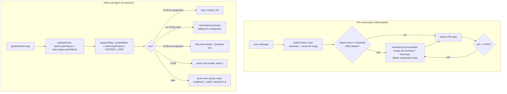

# Context Window Management

**What and why.** Long-running agent conversations would eventually overflow any
model's context window. AgentDesk never imposes an iteration cap on agents —
they run until the task is genuinely done or context is truly full — so instead
of stopping early it **progressively reclaims context** as utilization climbs.
There are two distinct mechanisms, operating at two different layers:

1. **PM-conversation compaction** (durable, DB-backed): the persisted
   conversation is summarized and old messages are *deleted* from SQLite. See
   `summarizer.ts` + `context.ts`.
2. **Inline sub-agent compaction** (ephemeral, in-memory): a single
   `generateText` run prunes / summarizes its own message array *between steps*
   via `prepareStep`, never touching the DB. See `agent-loop.ts`.

The single most important thing to understand: the **percentages mean different
things** in each layer. The PM layer measures a *crude char-estimate* against
the configured limit; the sub-agent layer measures *real API prompt tokens*
reported by the provider.

## Key idea: where the limit comes from

`getContextLimit()` (`src/bun/providers/models.ts:29`) does **not** look at the
model. It returns a user-configurable number (default `1_000_000`, see
`models.ts:5`), read from `project:<id>:contextWindowLimit` then global
`contextWindowLimit`, cached per project in `contextLimitCache`
(`models.ts:22`). So "context limit" here is an AgentDesk policy knob, not the
model's true window — by default it assumes a 1M-token budget. The cache must be
cleared via `clearContextLimitCache()` (`models.ts:63`) when settings change.

## How it works

### Layer 1 — PM conversation (durable)

`buildContext()` (`context.ts:28`) loads the latest stored summary plus the last
`maxRecent` (default 50) messages, builds the system string (system prompt +
constitution + previous summary, `context.ts:52-58`), and estimates tokens at a
flat **~4 chars/token** (`estimateTokens`, `context.ts:24`). It deliberately
**ignores** `messages.tokenCount` because that column stores API
prompt+completion usage which wildly overestimates content size
(`context.ts:71-79`). It returns `tokenCount`, `contextLimit`, and a rounded
`utilizationPercent` (`context.ts:86`).

The engine drives compaction at two points around each PM turn:

- **Pre-send compaction** (`engine.ts:257-266`): before streaming, if
  `context.tokenCount >= threshold` it fires `triggerSummarization` then rebuilds
  context. The threshold is `_loadSummarizationThreshold()`
  (`engine.ts:1097-1107`) — `project:<id>:sessionSummarizationThreshold`,
  defaulting to **200_000** and floored at 5000. Note this is a *raw token count*
  check, independent of `getContextLimit`.
- **Full-window guard** (`engine.ts:268-283`): if `utilizationPercent >= 100`,
  compact and retry once; if still 100%, throw "start a new conversation".

`triggerSummarization` (`engine.ts:1109`) just calls `summarizeConversation` and
then recomputes remaining tokens for the UI indicator
(`onConversationCompacted`, `engine.ts:1137`).

There is also a **between-task** hook in PM tooling
(`pm-tools.ts:649-666`): after each sub-agent finishes, if
`utilizationPercent >= 60` it prunes that agent's tool outputs in the DB, and if
`shouldSummarize(ctx)` (≥ 80%, `context.ts:90-92`) it summarizes.

### `summarizeConversation` — the durable compactor

`summarizer.ts:50`. The "Claude Code-style" compactor:

1. Loads all messages newest-first; if `<= KEEP_RECENT` (10) it no-ops
   (`summarizer.ts:69`). The most recent 10 stay verbatim; everything older is
   summarized and **deleted**.
2. Carries forward the previous summary so context accumulates
   (`summarizer.ts:78-84`).
3. **Tool-result pruning** before summarizing: for messages with parts it calls
   `buildPrunedContent` → `pruneToolResult` (`summarizer.ts:224-307`), which
   replaces verbose outputs with one-liners per tool (`read_file` over 50 lines →
   "Read X (N lines)"; `run_shell` over 20 lines → head+tail; `git_diff` → stat
   line; etc.). This is what keeps the summarizer's *own* input small.
4. Chunks the transcript at `MAX_TRANSCRIPT_CHARS` (30_000, ≈7.5k tokens) on
   message boundaries (`chunkTranscript`, `summarizer.ts:195`) and summarizes
   iteratively, each chunk merging into the running summary
   (`summarizer.ts:125-160`).
5. Deletes old summaries, writes the new merged one
   (`summarizer.ts:164-171`), then batch-deletes the compacted message rows
   (`summarizer.ts:174-179`).

A per-conversation lock (`activeSummarizations`, `summarizer.ts:11,58`) prevents
concurrent runs — important because both the pre-send path and the between-task
path can fire.

### Layer 2 — Inline sub-agent (in-memory, progressive tiers)

This is the **60/70/85/90** ladder, and it lives entirely inside the single
`generateText` call in `runInlineAgent` (`agent-loop.ts:1061`). Termination is
handled by `stopWhen` (no more tool calls, or a `stopReason` is set —
`agent-loop.ts:1072-1081`); there is **no max-step / iteration cap**.

`lastPromptTokens` is updated in `onStepFinish` from the provider's *real*
`step.usage.inputTokens` (falling back to v5 `promptTokens`),
**not** accumulated — it is the current context size each step
(`agent-loop.ts:1166-1171`). `CONTEXT_LIMIT = getContextLimit(modelId, projectId)`
(`agent-loop.ts:1013`).

Each step, `prepareStep` (`agent-loop.ts:1084`) computes
`contextRatio = lastPromptTokens / CONTEXT_LIMIT` (`agent-loop.ts:1098`) and
picks a tier (`agent-loop.ts:1103-1151`):

| Ratio | Condition | Action |
|---|---|---|
| > 0.90 | AI compaction already done | Set `stopReason="context_full"`, abort, disable tools |
| > 0.70 | first time, > 5 msgs | Rule-based summary (`buildRuleBasedCompaction`); if > 8000 chars escalate to `aiCompactConversation`; replace history, set `aiCompactionDone` |
| > 0.85 | AI compaction already done | `compactToolResultsInMessages(…,5)` + `stripOldAssistantText` |
| > 0.60 | — | `compactToolResultsInMessages(…,5)` (aggressive) |
| else | — | `compactToolResultsInMessages(…, COMPACT_KEEP_RECENT=5)` |

`compactToolResultsInMessages` (`agent-loop.ts:376`) keeps the most recent
`keepRecent` tool messages verbatim and prunes older ones — but it **skips**
file read/write tools (`SKIP_PRUNE_TOOLS`, `agent-loop.ts:387`) because agents
rely on file content as working memory. `stripOldAssistantText`
(`agent-loop.ts:411`) replaces stale reasoning with a placeholder, keeping the
last 2 assistant messages intact.

The 0.70 tier is one-shot (gated by `!aiCompactionDone`): the heavy
summary-and-replace happens once; after that, 0.85/0.90 only do cheap stripping
or stop. On a fatal full context the agent ends with a "context window full"
summary (`agent-loop.ts:1386`) rather than crashing.

## Why two systems / tradeoffs

- The PM owns a **persisted** conversation visible in the UI, so its compaction
  must mutate the DB (delete + summary rows) — hence `summarizeConversation`.
  The cheap 4-chars/token estimate is acceptable because it only triggers an
  LLM summarization, and the real safety net is the 100% guard.
- Sub-agents are **ephemeral inline runs**; their messages are not the source of
  truth, so they compact in memory with zero DB cost. They use *real* token
  usage because they have it (the provider reports it each step) and need
  precision to avoid both premature stripping and overflow.
- Rule-based compaction is preferred over AI compaction in the sub-agent loop
  because it is "zero tokens, instant" (`agent-loop.ts:436`, comment) — AI
  compaction is only a fallback for unusually large conversations.

## Key files

| File | Role |
|---|---|
| `src/bun/agents/context.ts` | `buildContext` (token estimate, util%), `shouldSummarize` (≥80%) |
| `src/bun/agents/summarizer.ts` | Durable PM compaction: prune → chunk → iterative summarize → delete |
| `src/bun/agents/agent-loop.ts` | Inline sub-agent 60/70/85/90 tiers, in-memory pruning, no iteration cap |
| `src/bun/agents/engine.ts` | Pre-send compaction, 100% guard, `triggerSummarization`, threshold loader |
| `src/bun/agents/tools/pm-tools.ts` | Between-task pruning (≥60%) + summarize (≥80%) after each sub-agent |
| `src/bun/providers/models.ts` | `getContextLimit` (config knob, default 1M), per-project cache |

## Gotchas / Constraints

- **The "context limit" is not the model's window.** It is a settings value
  defaulting to 1M (`models.ts:5`). Setting it wrong (too high) means agents can
  silently exceed the model's true window before the 0.90 tier fires.
- **Two different threshold systems coexist.** PM pre-send uses an absolute
  `sessionSummarizationThreshold` (default 200k, `engine.ts:1106`); sub-agents
  use *ratios* of `getContextLimit`; `shouldSummarize` uses a hard-coded 80%
  (`context.ts:91`). Changing one does not change the others.
- **PM token estimate is char-based (~4/token)** and intentionally ignores the
  stored `messages.tokenCount`. Don't "fix" it to read the DB column — the
  comment at `context.ts:71-79` explains why.
- **Summarization is destructive.** `summarizeConversation` deletes old message
  rows (`summarizer.ts:174-179`); only the merged summary + last 10 messages
  survive. The per-conversation lock prevents double runs.
- **Sub-agent compaction never persists.** It mutates the in-memory
  `agentMessages` array only; the chat-visible message parts are written
  separately.
- The 0.70 rule-based tier requires `> 5` messages (`agent-loop.ts:1109`); tiny
  conversations skip straight to cheap pruning.

## Related
- [[agent-engine]]
- [[agent-tools]]
- [[providers]]

## Open questions
- The pre-send threshold (200k) and the 1M default `getContextLimit` are
  independent; whether they are meant to be kept in a fixed ratio by the
  settings UI is not verified here.
- `between-task` pruning in `pm-tools.ts:653` builds context with an empty
  system prompt, so its `utilizationPercent` omits system-prompt tokens — minor
  under-estimate; unclear if intentional.
