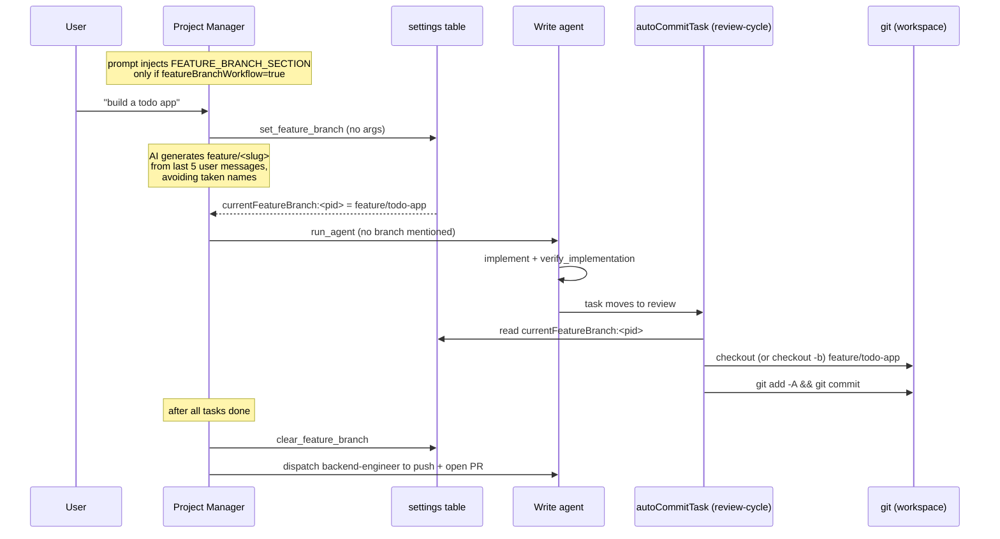

# Feature Branch Workflow

**An opt-in, per-project mode that keeps every auto-committed task on one shared
`feature/<slug>` branch instead of committing straight to `main`.** The PM
declares the branch name once at the start of a feature; thereafter the
*auto-commit* step inside the review cycle silently checks out / creates that
branch before each commit. The whole feature lands as one branch, ready for a
single PR to `main`.

The key idea: the PM only *declares intent* (a name stored in settings). The
*mechanical* branch switching happens later and elsewhere — in `autoCommitTask`,
not in the PM tool — so an agent never has to run `git checkout` itself.

## Toggle and storage

The mode is gated per project by the `featureBranchWorkflow` setting under
category `project:<projectId>`. It is toggled from the PR management UI
(`pull-requests.tsx:378` reads it, `:385` writes it via the typed RPC).

Two settings drive the whole flow, both via the generic settings store
(`rpc/settings.ts:57` `getSetting` / `:86` `saveSetting`):

- `featureBranchWorkflow` (category `project:<projectId>`) — is the mode on?
- `currentFeatureBranch:<projectId>` (category `git`) — the active branch name.

Note `saveSetting` JSON-serializes values (`settings.ts:91`) and `getSetting`
JSON-parses them back (`settings.ts:75`). That is why two readers exist with
slightly different equality checks — see [Gotchas](#gotchas--constraints).

A second, unrelated prerequisite: `autoCommitEnabled` (category `git`) must be
`"true"` or `autoCommitTask` returns immediately (`review-cycle.ts:351-353`).
Feature-branch switching is a *sub-feature of auto-commit* — no auto-commit, no
branch switching.

## How it works

### 1. Prompt-time activation

`getPMSystemPrompt` calls `isFeatureBranchWorkflowEnabled` (`prompts.ts:823`)
and, when true, appends `FEATURE_BRANCH_SECTION` (`prompts.ts:837-850`) to the
PM system prompt. That section is what *instructs* the PM to call
`set_feature_branch` exactly once before dispatching any agent, and
`clear_feature_branch` only after all tasks finish. Without the mode enabled the
section is omitted, so the PM never invokes these tools.

Write sub-agents get a much terser instruction (`prompts.ts:1212-1214`): "never
commit directly to main or master" — they are told auto-commit handles the
branch, so they should not manage it themselves.

### 2. `set_feature_branch` — AI branch naming

Defined at `pm-tools.ts:2671`. It takes **no arguments**. Steps:

1. Read the last 5 user messages of the conversation (`pm-tools.ts:2680-2690`)
   as the naming context.
2. Collect every existing git branch plus every PR source branch and keep the
   `feature/` ones as the "taken" set (`pm-tools.ts:2696-2707`) — so the model
   does not reuse a name already in flight.
3. Ask the configured provider model to emit a single `feature/<slug>` name,
   lowercase/hyphens/≤40 chars, explicitly forbidding the taken names
   (`pm-tools.ts:2712-2728`).
4. Sanitize the output (strip quotes, first line only) and validate it starts
   with `feature/` and is ≥10 chars (`pm-tools.ts:2730-2733`); otherwise it
   asks the PM to retry.
5. If the model still produced a taken name, append `-2`, `-3`, … as a
   collision suffix (`pm-tools.ts:2736-2740`).
6. Persist to `currentFeatureBranch:<projectId>` in category `git`
   (`pm-tools.ts:2742`).

Crucially this tool does **not** touch git at all — it only generates and stores
a name. No branch is created here.

### 3. `clear_feature_branch`

Defined at `pm-tools.ts:2750`. Takes `project_id` and writes an empty string to
`currentFeatureBranch:<projectId>` (`pm-tools.ts:2758`). The prompt tells the PM
to call this *after* the feature is done and before dispatching an agent to push
and open the PR.

### 4. `autoCommitTask` — where branches are actually switched

This is the mechanical half, in `review-cycle.ts:349`. It is invoked when a task
reaches "review" — from two call sites: the kanban `submit_review` path
(`kanban.ts:738`) and the PM `run_agent` completion path (`pm-tools.ts:629`).

When `featureBranchWorkflow` is `"true"` (`review-cycle.ts:368-369`):

1. Read `currentFeatureBranch:<projectId>` (`review-cycle.ts:371`).
2. Choose the branch: the stored PM name if it starts with `feature/`,
   **otherwise** a slug derived from the task title (`review-cycle.ts:372-373`).
   This fallback means the workflow still functions even if the PM forgot to
   call `set_feature_branch` — though each task then lands on its own
   title-slug branch instead of one shared branch.
3. Compare to the current branch (`review-cycle.ts:376-377`); if already there,
   do nothing.
4. Otherwise `git checkout <branch>` if it exists, else `git checkout -b
   <branch>` to create it from the current HEAD (`review-cycle.ts:384-391`).

After branch selection it stages all changes, skips if nothing is staged, builds
the commit message from the `commitMessageFormat` setting, commits as the
`AgentDesk` author, and records the commit hash so the reviewer can `git show`
the diff (`review-cycle.ts:395-433`). The whole function is wrapped to swallow
errors — branch/commit failures are logged, never thrown
(`review-cycle.ts:438-440`).

## Key files

| File | Role |
|---|---|
| `src/bun/agents/tools/pm-tools.ts:2671` | `set_feature_branch` — AI-generates and stores the branch name (no git ops) |
| `src/bun/agents/tools/pm-tools.ts:2750` | `clear_feature_branch` — empties the stored name |
| `src/bun/agents/review-cycle.ts:349` | `autoCommitTask` — checks out / creates the feature branch, then commits |
| `src/bun/agents/prompts.ts:837` | `FEATURE_BRANCH_SECTION` — PM instructions (set once → dispatch → clear) |
| `src/bun/agents/prompts.ts:823` | `isFeatureBranchWorkflowEnabled` — reads the per-project toggle |
| `src/bun/rpc/settings.ts:57` | `getSetting` / `saveSetting` — JSON-serialized settings store |
| `src/mainview/components/git/pull-requests.tsx:378` | UI toggle that reads/writes `featureBranchWorkflow` |

## Gotchas / Constraints

- **Two prerequisites, not one.** Branch switching only happens when *both*
  `autoCommitEnabled` (`review-cycle.ts:353`) **and** `featureBranchWorkflow`
  (`review-cycle.ts:369`) are `"true"`. The feature is a layer on top of
  auto-commit.
- **Inconsistent truthy checks.** `review-cycle.ts:369` matches only the literal
  string `"true"`, while `isFeatureBranchWorkflowEnabled` accepts both `"true"`
  and the double-quoted `'"true"'` (`prompts.ts:830-831`). Because `getSetting`
  already JSON-parses, the value normally arrives as `"true"`; the extra
  variant in prompts.ts guards against a raw/double-encoded row. The
  review-cycle reader does **not** have that guard — a double-encoded value
  would silently disable branch switching while still showing the PM the
  feature-branch instructions.
- **The PM tool never creates the branch.** `set_feature_branch` only writes a
  name. If `autoCommitTask` never runs (e.g. auto-commit off, or task never
  reaches review), no branch is ever created despite a name being stored.
- **Silent title-slug fallback.** If the PM skips `set_feature_branch`, each
  task auto-commits to its own `feature/<task-title-slug>` branch
  (`review-cycle.ts:373`), defeating the "one branch per feature" intent — there
  is no warning surfaced.
- **No automatic PR / push / merge.** The workflow only switches branches and
  commits. Pushing and opening the PR is a separate, PM-dispatched agent step
  driven purely by the prompt (`prompts.ts:849`), not by code.
- **`clear_feature_branch` does not delete the git branch** — it only empties the
  setting so the next feature starts fresh. The branch and its commits remain.

## Related
- [[review-cycle]]
- [[pm-tools]]
- [[agent-engine]]
- [[git-tools]]

## Open questions
- Should `review-cycle.ts:369` adopt the same `'"true"'` tolerance as
  `prompts.ts:831` to avoid the double-encoding mismatch, or is the JSON-parsing
  in `getSetting` guaranteed to normalize it?
- Is there UI surfacing the currently-stored `currentFeatureBranch:<projectId>`
  value to the user, or is it only observable via the live branch badge after
  the first commit?
