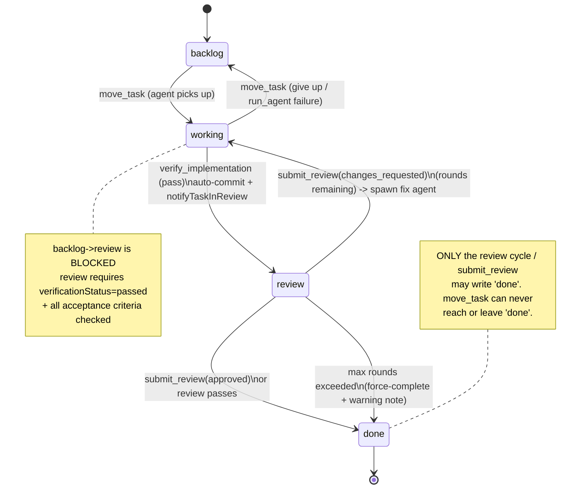

# Kanban & Auto Review Cycle

**One-paragraph what-and-why.** Every task in AgentDesk moves through a fixed
four-column lane — `backlog → working → review → done` — and the `review` →
`done` transition is **never** performed by an implementation agent or a human
drag. Instead, the moment a task lands in `review`, a standalone module
(`review-cycle.ts`) auto-spawns a `code-reviewer` agent, reads its structured
verdict, and either promotes the task to `done` or kicks it back to `working`
with a precise fix list. This gate exists so that "done" carries a guarantee:
the work was independently reviewed (or force-completed after exhausting the
configured rounds), not just self-declared complete by the author.

## Key idea — three guards, one owner of `done`

The cycle is enforced by **three independent layers**, all of which must agree:

1. **Tool-level transition rules** in the `move_task` tool — agents cannot skip
   columns, cannot move *out of* `done`, and cannot enter `review` until they
   have passed a self-check.
2. **A mandatory self-verification gate** (`verify_implementation`) — the only
   tool that legitimately puts a task into `review`, and it auto-commits first
   so the reviewer has a diff.
3. **The review cycle** (`notifyTaskInReview`) — the *sole* author of the
   `review → done` move (via the reviewer's `submit_review`, or a forced
   completion). Implementation agents are explicitly told they may move to
   `backlog`, `working`, or `review` only.

## How it works

### 1. Column-transition enforcement (the `move_task` tool)

`move_task` accepts only `backlog | working | review` as destinations —
`done` is not even in the enum (`src/bun/agents/tools/kanban.ts:262`). Inside
`execute` it:

- Rejects any move *out of* `done` (`kanban.ts:291`) — "Only the automated
  review system finalises tasks."
- No-ops if already in the target column (`kanban.ts:299`).
- Rejects the only illegal forward skip, `backlog → review`
  (`kanban.ts:314`) — you must pass through `working` first.
- Resets `verificationStatus` to null when moving *back* to `working`/`backlog`
  (`kanban.ts:324`), so a kicked-back task must re-verify before re-entering
  review.

When a `move_task` *into* `review` succeeds it calls
`notifyTaskInReviewHandler` (`kanban.ts:338`) — the bridge into the review
cycle.

### 2. The mandatory verification gate (`verify_implementation`)

A task cannot reach `review` via `move_task` unless `verificationStatus ===
"passed"` (`kanban.ts:280`). That status is only ever set by
`verify_implementation` (`kanban.ts:661`), which forces the author to answer a
honesty checklist (all criteria met, UI/logic wired, no LSP errors,
user-accessible — `kanban.ts:677`). A `pass` verdict whose checklist still has
`false` items is rejected as a `fail` (`kanban.ts:710`). On a genuine pass it:

1. Stores a JSON completion report into `importantNotes` (`kanban.ts:722`).
2. **Auto-commits** the work via `autoCommitTask` (`kanban.ts:738`) so the
   reviewer can `git show` the diff.
3. Moves the task to `review` itself (`kanban.ts:742`) and fires
   `notifyTaskInReview` (`kanban.ts:745`).

This means `verify_implementation` is the normal path into review; the raw
`move_task("review")` path is a fallback that re-checks the same
`verificationStatus` guard.

### 3. Acceptance-criteria gate

Independently of verification, `move_task("review")` also calls
`checkAllCriteriaMet` (`kanban.ts:275`), which parses the task's
`acceptanceCriteria` JSON and refuses the move if any criterion is unchecked,
naming the unmet ones (`kanban.ts:90`). Criteria are checked via `check_criteria`
/ `check_all_criteria`, which serialize through a per-task in-memory lock
(`criteriaLocks`, `kanban.ts:72`) to avoid read-modify-write races.

### 4. The auto review cycle (`notifyTaskInReview`)

`notifyTaskInReview(projectId, taskId)` (`src/bun/agents/review-cycle.ts:460`)
is fire-and-forget and idempotent: an `activeReviews` Set guards against
duplicate reviewer spawns for the same task (`review-cycle.ts:462`). It then:

1. **Spawns `code-reviewer`** via `spawnReviewAgent` (`review-cycle.ts:485`).
   The prompt injects git instructions pointing at the commit hash captured by
   `autoCommitTask` (`review-cycle.ts:481`, hash stored in the `taskCommitHashes`
   map at `review-cycle.ts:433`), tells the reviewer to fetch the authoritative
   task with `get_task`, and **mandates** a `submit_review` call.
2. **Reads the verdict.** Preference order: the structured `submit_review` tool
   call from the DB (`getSubmitReviewDetails`, `review-cycle.ts:80`), then the
   phrase heuristic `reviewSummaryHasIssues` (`review-cycle.ts:118`) as a
   fallback when the reviewer never called the tool. A *cancelled* reviewer
   (`isAgentCancelled`, `review-cycle.ts:141`) is **not** treated as a failure —
   the task is left in `review` for a later attempt (`review-cycle.ts:518`).
3. **Branches on the verdict** (see state diagram below).

> Note: `submit_review` itself (`kanban.ts:605`) already moves the task —
> `approved → done`, `changes_requested → working`. The review cycle then reads
> that recorded verdict to decide whether to spawn a fix agent. So the reviewer's
> tool call and the cycle's logic are deliberately redundant: the cycle is the
> backstop that guarantees a verdict even if the reviewer misbehaves.

### Verdict branches

- **Approved / no issues** (`review-cycle.ts:537`): move to `done` via
  `moveKanbanTask(..., "review-cycle")`, then `triggerPMAutoContinue` nudges the
  PM to dispatch the next task — **gated by the `autoExecuteNextTask` project
  setting** (see *Auto-execute next task* below).

#### Auto-execute next task (the continue gate)

Two paths can auto-continue the PM to the *next* task after one finishes, and
**both** consult `isAutoExecuteEnabled(projectId)` (`rpc/projects.ts`, raw
`project:<id>:autoExecuteNextTask` string, default `true`), read **live** on
every completion so the Project-Settings toggle applies without a restart:

1. `triggerPMAutoContinue` (`review-cycle.ts`) — fires after a task passes review
   and reaches `done`.
2. The engine's `onAgentDone` next-action injection (`engine.ts`, the
   `[Next Action] DISPATCH` branch) — fires after any PM-dispatched agent
   completes and a backlog task is ready.

When the setting is **off**, each swaps its `[Next Action] DISPATCH` hint for
`[Next Action] PAUSED`: the PM reports the task is done and stops, moving **no**
task into `working`. The current task's own lifecycle is never gated — the
reviewer dispatch (`REVIEW NEEDED`), `MOVE TO REVIEW`, `WAIT`, `ALL DONE`, and
`INVESTIGATE` hints are untouched. The gate is on *automatic* continuation only:
an explicit user message ("continue", or "work on task X") drives `get_next_task`
/ `run_agent` normally regardless of the setting, advancing one task per nudge.
The toggle persists immediately from the UI (`project-settings-tab.tsx`,
`onCheckedChange` → `rpc.saveProjectSetting`, not behind "Save Changes"); turning
it off mid-run does **not** abort the running agent, only the next auto-pick.
- **Changes requested, rounds remaining** (`review-cycle.ts:543`): increment the
  per-task round counter (`reviewRounds`, `review-cycle.ts:45`), move back to
  `working`, **wait for any running write-agents to finish** (poll up to 5 min,
  `review-cycle.ts:557`) to avoid concurrent writers, release the
  `activeReviews` guard *before* spawning the fix agent (`review-cycle.ts:564` —
  so the fix agent's eventual `verify_implementation → review` can start a fresh
  review), then spawn the task's assigned agent (default `backend-engineer`)
  with the reviewer's exact issue list as the fix prompt (`review-cycle.ts:567`).
  The fix agent is told to call `verify_implementation` (which re-enters the
  cycle) and **not** to move the task itself.
- **Max rounds exceeded** (`review-cycle.ts:605`): force-complete to `done` and
  record the unresolved issues in `importantNotes` — preventing a task from being
  stuck in review forever.

`maxReviewRounds` defaults to **2** (`DEFAULT_MAX_REVIEW_ROUNDS`,
`review-cycle.ts:54`) and is overridable per project via the
`project:<id>:maxReviewRounds` setting (`getMaxReviewRounds`,
`review-cycle.ts:57`). The "rounds remaining" test is `currentRounds < maxRounds
- 1` (`review-cycle.ts:543`).

### State diagram

## Entry points into `review`

Three code paths fire `notifyTaskInReview` — all funnel through the same cycle:

| Path | File:line |
|---|---|
| Agent calls `verify_implementation` (pass) | `kanban.ts:745` |
| Agent calls `move_task("review")` directly | `kanban.ts:338` |
| PM `run_agent` sees the result completed + `verificationStatus=passed` | `pm-tools.ts:638`, `pm-tools.ts:642` |

The PM-tools path also auto-commits and moves to `review` if the agent verified
but the task was still in `working` (`pm-tools.ts:642`), and otherwise re-prompts
the PM that the agent skipped verification (`pm-tools.ts:653`).

## Key files

| File | Role |
|---|---|
| `src/bun/agents/review-cycle.ts` | The whole auto-review cycle: spawn reviewer, read verdict, round logic, force-complete, `autoCommitTask`, PM auto-continue |
| `src/bun/agents/tools/kanban.ts` | `move_task` transition enforcement, `verify_implementation` gate, `submit_review`, `check_criteria` |
| `src/bun/rpc/kanban.ts` | `moveKanbanTask` DB write + activity log + `task:moved` event + done side effects: desktop notification, `taskCompleted` broadcast, channel notify, issue auto-close (`kanban.ts:179`) |
| `src/bun/agents/tools/pm-tools.ts` | `run_agent` post-run move-to-review path (`pm-tools.ts:634`) |
| `tests/agents/review-cycle.test.ts` | Unit tests for the verdict heuristics |

## Gotchas / Constraints

- **In-memory state is volatile.** `activeReviews`, `reviewRounds`,
  `taskCommitHashes`, and `taskConversations` (`review-cycle.ts:42-56`) are
  plain in-process maps — they reset on app restart. A restart mid-review loses
  the round count (review starts fresh at round 0), the commit hash (reviewer
  falls back to `git log`/`git diff`, `review-cycle.ts:484`), and the recorded
  task→conversation mapping (reviewer falls back to the PM's active
  conversation, see below).
- **Review activity is routed to the task's own conversation, not always the
  PM's.** `spawnReviewAgent` resolves its `conversationId` as
  `taskConversations.get(kanbanTaskId) || eng.getActiveConversationId() || ""`
  (`review-cycle.ts`). `pm-tools.ts`'s `run_agent` calls
  `setTaskConversation(taskId, agentConversationId)` right after resolving which
  conversation the implementation agent will run in — which is the per-task
  conversation created by `run_agent` when the **"New Conv. per task"** project
  setting is on (`project:<id>:newConvPerTask`) and a task moves out of
  `backlog`, or the routing conversation otherwise. Without this mapping, the
  code-reviewer (and any fix agent, since it's spawned through the same
  `spawnReviewAgent` helper) would always post into the PM's currently-active
  conversation — invisible from a per-task conversation's point of view, making
  review look like it silently never happened even though the underlying gating
  (task-in-review blocks new dispatch) was working correctly. This was a real
  bug fixed 2026-07-01. `triggerPMAutoContinue` deliberately does **not** use
  this mapping — the "next task" orchestration nudge must always reach the PM's
  live conversation, not a finished task's now-dead-end conversation.
- **The reviewer moves the task too.** `submit_review` already performs the
  `done`/`working` move (`kanban.ts:638`); the review cycle then *also* reads the
  verdict and acts. This redundancy is intentional (the cycle is the backstop)
  but means the move can happen twice — `moveKanbanTask` is a no-op when already
  in the target column (`rpc/kanban.ts:191`), which absorbs it.
- **Frontend drag does not trigger review.** Only the *tool* paths call
  `notifyTaskInReview`. A human dragging a card to `review` through the kanban UI
  hits `moveKanbanTask` in `rpc/kanban.ts`, which does **not** spawn a reviewer.
  Auto-review is an agent-flow feature, not a UI-flow one. (See Open questions.)
- **Stale tool description.** `move_task`'s description says done is reached "via
  `finalize_task_review`" (`kanban.ts:256`), but no such tool exists in the
  codebase — the real path is the reviewer's `submit_review` / the review cycle.
- **Force-completion can mark broken work `done`.** After `maxReviewRounds` the
  task is moved to `done` regardless of remaining issues (`review-cycle.ts:605`),
  with the issues only recorded as a note. "Done" is therefore not an absolute
  quality guarantee — read `importantNotes`.
- **`done` has heavy side effects.** `moveKanbanTask(..., "done")` fires a
  desktop notification, broadcasts a `taskCompleted` webview event (the in-app
  toast for completions in projects the user isn't viewing —
  `background-task-toast.tsx`, mounted in AppShell, gated on the chat store's
  `activeProjectId`), notifies all channels, and auto-closes any linked
  external issue (`rpc/kanban.ts:212`). Every done-transition funnels through
  this one function.

## Related
- [[agent-engine]]
- [[agent-tools]]
- [[backend-core]]

## Open questions
- Should a human UI drag into `review` also auto-spawn the reviewer? Currently it
  does not (only agent tool paths call `notifyTaskInReview`).
- The `finalize_task_review` tool referenced in `move_task`'s description does not
  exist — is this a leftover from a previous design, or a planned tool?
