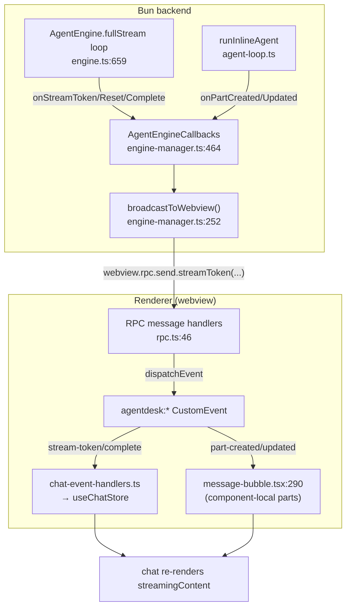

# Message Streaming & Broadcasts

**How live agent output reaches the chat UI.** The Bun backend has no socket to
the renderer — it pushes everything as **fire-and-forget RPC messages** that the
webview turns into `agentdesk:*` DOM `CustomEvent`s. Two parallel channels carry
the data: a **token stream** (the PM's plain-text reply, buffered and rendered
optimistically) and **message parts** (the structured tool-call/text/reasoning
rows that sub-agents emit, persisted to `message_parts` and rendered per-bubble).
Understanding the split — store-level for tokens, component-local for parts — is
the single most important thing here.

## Why this shape

There is no WebSocket. Electrobun gives a typed RPC bridge where Bun can call
`webview.rpc.send.<method>(payload)` and the webview's message-handler runs. The
backend never imports React; it only knows callback names. So every realtime
update is: **engine callback → `broadcastToWebview(method, payload)` → webview
RPC message handler → `window.dispatchEvent(new CustomEvent("agentdesk:...", …))`
→ a `window.addEventListener` somewhere in the renderer.** The DOM event bus is
the decoupling layer: the backend doesn't know which React component (if any) is
mounted, and the listeners filter by `activeConversationId` themselves —
conversation-*list* events (`conversationUpdated`, `switchToConversation`)
additionally gate on the chat store's `activeProjectId` (see [[frontend-stores]],
project-scoping guard).

## How it works

### 1. The PM token stream
The engine drives `result.fullStream` and, per `text-delta`, calls
`onStreamToken(conversationId, messageId, delta, null)` at `engine.ts:675`. The
callback (`engine-manager.ts:465`) forwards it to `broadcastToWebview("streamToken", …)`,
which becomes `agentdesk:stream-token`. `onStreamToken` in
`chat-event-handlers.ts:95` appends the delta to `buffers.tokenBuffer` and
schedules a flush. **Tokens are not rendered one-by-one** — `flushTokenBuffer`
(`chat-event-handlers.ts:47`) coalesces them on a 32 ms (~30 fps) timer and only
then writes `streamingContent` into the Zustand store, creating the PM placeholder
message on first flush. Because that write happens up to 32ms *after* the tokens
arrived, `flushTokenBuffer` re-validates the buffered `conversationId` against
whatever conversation is active **at flush time** — not just when the tokens
were buffered — before applying anything (see the same-project streaming-leak
gotcha below).

### 2. Stream reset & completion
`onStreamReset` (`chat-event-handlers.ts:117`) clears the token buffer and resets
`streamingContent` — the engine fires it to **retract premature PM narration**
when a step both wrote text and dispatched a wait-type sub-agent
(`engine.ts:681-700`), and on hallucination retries (`engine.ts:758`).
`onStreamComplete` (`engine-manager.ts:479`) carries the final `content`,
`metadata`, and `usage`; the handler (`chat-event-handlers.ts:160`) bails
immediately unless `activeConversationId` still matches the event, then flushes
the buffer, marks the stream completed, and commits the message in place —
bumping `createdAt` to the PM's finish time so the PM bubble sorts **below** the
sub-agents it spawned.

### 3. Late-token & stale-stream guards
A capped `completedStreamIds` set (`chat-event-handlers.ts:16`) drops
`stream-token` events that arrive after a stream finished (otherwise the bubble
sticks in a streaming state). `onStreamComplete` also handles the **stale**
case: if a newer stream is active (user sent a new message that aborted the old
PM stream), it updates only the message content and leaves streaming state alone
(`chat-event-handlers.ts:227`).

### 4. Message parts (the structured channel)
Sub-agents run via `runInlineAgent` (`agent-loop.ts`), which emits typed
`MessagePart` rows (start / text / reasoning / tool-call / end) and persists them
to `message_parts`. Each emit fires `onPartCreated`/`onPartUpdated`
(`agent-loop.ts:124`), bridged in `engine.ts:306-313` to the engine callbacks,
then broadcast as `agentdesk:part-created` / `part-updated`
(`engine-manager.ts:551,570`). Crucially these are **not** handled by the store —
each `MessageBubble` registers its own listeners (`message-bubble.tsx:290`) and
filters by `messageId === message.id`, appending/patching its local `parts` state.
On mount, a bubble with `hasParts` lazy-loads its parts via `rpc.getMessageParts`
(`message-bubble.tsx:277`).

### 5. Inline-agent lifecycle & PM "thinking"
`onAgentInlineStart`/`Complete` (`engine-manager.ts:543-550`) become
`agentdesk:agent-inline-start`/`complete`; the store handlers
(`chat-event-handlers.ts:619,639`) maintain `runningAgentCount`,
`activeInlineAgent`, and `pmPending` (with an 8 s safety-net timeout that clears a
stuck stop button). PM reasoning is streamed separately: the engine accumulates
`reasoning-delta` parts and flushes them through `onAgentActivity` (type
`thinking`) on a 300 ms timer (`engine.ts:632-668`); the manager forwards only
`thinking` events (`engine-manager.ts:611`) → `agentdesk:pm-thinking` →
`pmThinkingText` in the store, which `onStreamComplete` folds into the message's
`reasoning` metadata.

### 6. Queued-message drain (`messageQueueUpdated`)
The idle-check at the bottom of `onStreamComplete` (`engine-manager.ts:639-680`,
mirrored in `onStreamError` at `:691-699`) is also where a queued message gets
delivered: once a project's engine is truly idle it calls
`dequeueMessage(projectId, cid)` (`src/bun/message-queue-manager.ts`) and, if
one is waiting for that conversation, sends it via `e.sendMessage(cid,
queued.content, undefined)` and broadcasts `messageQueueUpdated` — skipping the
rest of the idle-check (session-complete toast/notification) because sending
continues the session rather than ending it. The RPC handlers for enqueue/
remove/clear (`src/bun/rpc-groups/conversations-control.ts`) broadcast the same
event after each mutation so any mounted frontend showing that
project+conversation stays in sync live. See [[frontend-stores]] for the
frontend mirror (`useMessageQueueStore`) this broadcast feeds.

### 7. Whole-message broadcasts
Agent messages persisted as a unit (not streamed) come through `onNewMessage`
(`engine-manager.ts:533`) → `agentdesk:new-message`. `onNewMessage`
(`chat-event-handlers.ts:478`) detects agent messages via `metadata.source ===
"agent"`, sets `hasParts: 1`, and commits any in-flight PM `streamingContent`
before appending so the agent card lands as the latest item. Plan cards
(`presentPlan` → `agentdesk:plan-presented`) arrive right after their
`new-message` and just clear busy state.

## Key files

| File | Role |
|---|---|
| `src/bun/agents/engine.ts` | PM `fullStream` loop; invokes `onStreamToken/Reset/Complete`, reasoning flush, text retraction |
| `src/bun/agents/agent-loop.ts` | Sub-agent executor; emits `MessagePart`s via `onPartCreated/Updated/onTextDelta` |
| `src/bun/agents/engine-types.ts` | `AgentEngineCallbacks` interface — the contract between engine and manager |
| `src/bun/engine-manager.ts` | Wires callbacks → `broadcastToWebview()` (the central backend→UI hub) |
| `src/mainview/lib/rpc.ts` | Webview RPC message handlers that `dispatchEvent` the `agentdesk:*` events |
| `src/mainview/stores/chat-event-handlers.ts` | Store-level listeners: token buffering, completion, agent lifecycle, thinking |
| `src/mainview/components/chat/message-bubble.tsx` | Component-local `part-created/updated` listeners + lazy part load |

## Gotchas / Constraints

- **A broadcast method name is a plain string lookup — a typo/mismatch silently
  no-ops.** `broadcastToWebview(method, payload)` does
  `mainWindowRef.webview.rpc.send[method]?.(payload)`; if `method` doesn't
  exactly match a key Electrobun generated from `WebviewSchema.messages`, the
  optional-chain swallows the miss with no error. This actually happened:
  `request_plan_approval` called `broadcastToWebview("planPresented", …)` at
  two call sites while the real schema entry is `presentPlan`
  (`pm-tools.ts:753,1709`) — the broadcast silently never reached the frontend
  until both call sites were fixed. A second, independent instance of the
  same bug was found by the regression test written for this (see below):
  `engine-manager.ts`'s per-agent `agentStatus` broadcast was never declared
  in `WebviewSchema.messages` at all — the frontend's `onAgentStatus` listener
  existed and was correctly wired, but the broadcast had no schema entry to
  route through, so it never fired. Fixed by adding the `agentStatus` schema
  entry plus `rpc.ts`/`remote-transport.ts` dispatchers. See
  [[broadcast-method-name-mismatch]] and `tests/rpc/broadcast-method-names.test.ts`
  (a structural test that parses the schema and flags any
  `broadcastToWebview("name", ...)` call site whose name isn't declared —
  this is what caught both bugs).
- **`shellApprovalRequest` and `presentPlan` both now carry `conversationId`**
  (not just `projectId`) specifically so a cross-project "needs your
  attention" toast can deep-link to the exact conversation, not just the
  project — see [[frontend-components]] (`CrossProjectApprovalToast`) and
  [[frontend-stores]] (`pendingConversationTarget`).
- **Two render paths, deliberately split.** Tokens go to the store
  (`streamingContent`); parts go to per-bubble React state. Don't try to route
  parts through the store — bubbles self-filter by `messageId`.
- **Tokens are batched at ~30 fps** (`TOKEN_FLUSH_INTERVAL = 32`). The store
  never sees per-character updates; a missing PM bubble until first flush is
  expected.
- **All broadcasts are best-effort.** `broadcastToWebview` swallows errors when
  the window is closed (`engine-manager.ts:255`) — if the user is on another page
  the events are silently lost and the DB is the source of truth on navigation
  back (`onStreamComplete` bails when a different conversation is now active,
  `chat-event-handlers.ts:192`).
- **Every store handler filters by `activeConversationId`** — broadcasts are
  global (one window, all projects), so a handler for a non-active conversation
  must early-return. Handlers that touch the conversation *list*
  (`onConversationUpdated` `:381`, `onSwitchToConversation` `:425`) must
  additionally early-return unless the event's `projectId` matches the chat
  store's `activeProjectId` — otherwise a background project's agent activity
  replaces the visible sidebar and can hijack the active conversation
  (see [[frontend-stores]]).
- **A same-project conversation switch needs the same rigor as a cross-project
  one.** `streamingContent`/`isStreaming`/`streamingMessageId` are single
  global fields, not keyed per conversation. `flushTokenBuffer`,
  `onStreamComplete`, and `onStreamError` each independently re-check
  `activeConversationId` against the event's own `conversationId` right before
  they write — checking only once, earlier (e.g. when a token was first
  buffered, ~32ms before the flush actually applies it), is not sufficient,
  because the user can switch conversations inside that window. The root fix
  is in `setActiveConversation` (`chat-store.ts:215`), which now clears the
  token buffer and streaming fields on every genuine switch, the same cleanup
  `reset()` already did for a project switch. See [[frontend-stores]].
- **`completedStreamIds` is capped at 50** — across a very long session the
  oldest entries are evicted, so a *very* late token for an ancient stream could
  theoretically slip through.
- **Listeners register once** — `initChatEventHandlers` is HMR-guarded
  (`chat-event-handlers.ts:748`) to avoid duplicate listeners; bubble listeners
  unregister on unmount.
- **PM bubble ordering depends on a `createdAt` bump** in `onStreamComplete`; the
  backend repositions the same row by rowid so live view, reload, and model
  replay agree (`chat-event-handlers.ts:260-266`).

## Related
- [[agent-engine]] — the engine that drives the `fullStream` loop and callbacks
- [[rpc-client]] — the webview RPC handlers that translate messages into DOM events
- [[rpc-layer]] — the typed RPC contract boundary
- [[frontend-stores]] — `useChatStore` shape consuming these events
- [[frontend-components]] — `CrossProjectApprovalToast`, the other consumer of `shellApprovalRequest`/`presentPlan`
- [[backend-core]] — `engine-manager` lifecycle and `broadcastToWebview`
- [[plan-approve-execute]] — plan-presented broadcast in the approval flow
- [[broadcast-method-name-mismatch]] — the silent-no-op footgun this flow's naming convention is prone to

## Open questions
- Channel-sourced conversations relay the PM reply back to Discord/WhatsApp/email
  inside `onStreamComplete` (`engine-manager.ts:494`); the chunking/ordering of
  that relay vs. the in-app stream is not covered here.
- Whether `part-updated` events can race ahead of their `part-created` over RPC
  (and whether `message-bubble` tolerates an update for an unknown partId) is
  unverified.
