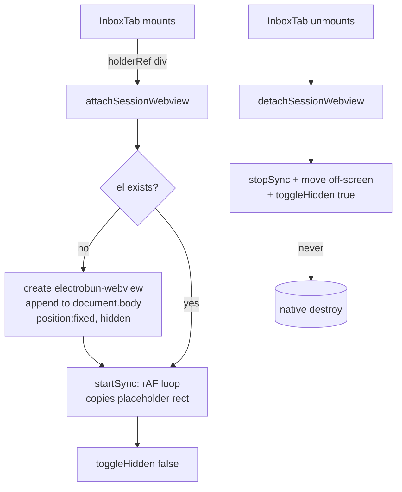

# Electrobun Webview-Tag Overlay Cleanup

**The `<electrobun-webview>` custom element is a NATIVE overlay window, not a DOM
node painted by the WebView2 compositor.** Creating and destroying it on React
mount/unmount is unreliable on Windows: the native child window can **orphan** and
float on top of unrelated pages, and React StrictMode (dev) double-invokes
lifecycle, making it worse. The fix used for the Auto-Earn Freelancer session is a
**single, app-lifetime webview created once and never destroyed** — it is only
**hidden** and **repositioned** over a placeholder `<div>`. See the rationale
comment at `src/mainview/components/freelance/session-webview-host.ts:1`.

## Key idea: native overlay ≠ regular DOM

Because the webview is a real native window layered over the app's webview, it does
not clip to React's layout, does not get garbage-collected with its React parent,
and its "destroy" path is the buggy one on Windows. So the host treats it like a
hardware resource you allocate once and merely show/hide:

- **Created once** — `getSessionWebview()` lazily builds the element, appends it to
  `document.body` (not into the React tree), and never removes it
  (`session-webview-host.ts:40`, the `appendChild` at `:56` is annotated "created
  ONCE, never removed").
- **Positioned by rect-sync, not by parenting** — it is `position:fixed`
  (`:46-55`) and its rect is copied every frame from a placeholder `<div>` the
  Inbox renders. The placeholder owns the layout; the native window just tracks it.
- **Hidden, never destroyed, on teardown** — `detachSessionWebview()` stops the
  sync loop and slides the element off-screen + `toggleHidden(true)`
  (`session-webview-host.ts:112`). The leak-prone native destroy path is never
  taken.

## How it works

```
getSessionWebview()  → create once, append to body, hidden off-screen
attachSessionWebview(holder) → remember holder, syncRect(), startSync(), show
   requestAnimationFrame loop: copy holder.getBoundingClientRect() → el.style
detachSessionWebview() → stopSync(), move off-screen, toggleHidden(true)  [NOT removed]
```



1. **Runtime guard.** `runtimeAvailable()` checks the `electrobun-webview` custom
   element is registered (`session-webview-host.ts:35`). The Inbox renders a red
   "runtime unavailable" notice otherwise (`inbox-tab.tsx:1115`).
2. **Placeholder, not child.** The Inbox renders an empty `<div ref={holderRef}>`
   whose height toggles between `80vh` and `0` — the native view is positioned
   *over* it, never parented *into* it (`inbox-tab.tsx:1110`, comment at `:1107`).
3. **Attach on mount.** A `useEffect` calls `attachSessionWebview(holderRef)`,
   then wires the fetch/XHR/WS interceptor and `dom-ready`/`did-navigate`/
   `host-message` listeners (`inbox-tab.tsx:480-601`).
4. **rect-sync loop.** `startSync()` runs a `requestAnimationFrame` loop calling
   `syncRect()` (`session-webview-host.ts:67-89`). If the holder is collapsed or
   off-screen (`width<2 || height<2`) the view is parked off-screen instead of
   painting a sliver (`:72-74`) — this is what makes the `height:0` collapse
   visually clean.
5. **Hide vs. detach.** Two separate visibility controls:
   - `detachSessionWebview()` — full teardown on unmount: hide + stop tracking,
     element survives (`inbox-tab.tsx:607`).
   - `setSessionWebviewVisible()` — show/hide without detaching, used when the
     live-session panel is collapsed or the tab is backgrounded
     (`session-webview-host.ts:126`, driven by `inbox-tab.tsx:617-619`).

## Why two "never remount" layers

The native overlay is only half the problem. The React `<InboxTab/>` itself must
also never remount, or it would re-run the attach effect and re-create the
interceptor. `always-mounted-inbox.tsx` solves the React side with the **same
trick** applied to a regular DOM node: it portals `<InboxTab/>` into a stable,
non-React `hostEl` whose identity never changes (`always-mounted-inbox.tsx:31`),
then **re-parents that `hostEl`** between the visible Inbox slot and a hidden
holder (`:57-61`). Moving a DOM node does not touch React, so the component (and
its native webview) keep running on every page.

The bridge between them is `freelance-engine-store`'s `slot` field
(`freelance-engine-store.ts:19`): the visible Inbox tab publishes its DOM node as
`slot`; `AlwaysMountedInbox` re-parents `hostEl` into it, and `InboxTab` reads
`slot != null` as its **foreground** signal to decide native visibility
(`inbox-tab.tsx:616-619`). Background ⇒ `slot` is null ⇒ the native view is hidden
so it can never flash over another page.

## Key files

| File | Role |
|---|---|
| `src/mainview/components/freelance/session-webview-host.ts` | Singleton native-webview host: create-once, rect-sync, hide-not-destroy |
| `src/mainview/components/freelance/inbox-tab.tsx` | Consumer: renders the placeholder div, attach/detach on mount, foreground visibility |
| `src/mainview/components/freelance/always-mounted-inbox.tsx` | Keeps `<InboxTab/>` itself mounted for the app lifetime via a portal into a re-parented stable node |
| `src/mainview/stores/freelance-engine-store.ts` | `slot` bridge: foreground signal + re-parent target |

## Gotchas / Constraints

- **Never call a destroy/remove on the session webview.** The whole design exists
  to avoid that path. To "close" it, hide it (`detachSessionWebview` /
  `setSessionWebviewVisible(false)`), never `el.remove()`.
- **The placeholder owns layout; the overlay does not clip.** Because the view is
  `position:fixed` over a rect, anything that scrolls or overlaps the holder will
  *not* clip the native window — it tracks the holder's bounding rect only. Modals
  over the Inbox must out-z-index it (the view uses `zIndex:30`,
  `session-webview-host.ts:53`) or hide it.
- **Collapsed = off-screen, not zero-size.** `syncRect` deliberately parks the
  view at `left:-10000px` when the holder is <2px (`session-webview-host.ts:72`);
  do not "optimize" this to a 0×0 rect — a 1px sliver was the original artifact.
- **rAF sync only runs while attached.** If you add another consumer, you must
  call `attachSessionWebview` to (re)start the loop; merely calling
  `setSessionWebviewVisible(true)` shows a possibly-stale-positioned view.
- **Single platform, single partition.** The host is hard-coded to the
  `freelancer` platform and partition `persist:freelance-freelancer`
  (`session-webview-host.ts:18-20`). It is a true singleton — not parameterised
  per account/platform.
- **StrictMode double-mount is tolerated by design.** Because create is idempotent
  (`if (!el)`) and teardown only hides, the dev double-invoke can't orphan a second
  native window.

## Related
- [[freelance-autoearn]]
- [[auto-earn-end-to-end]]
- [[frontend-components]]
- [[frontend-stores]]

## Open questions
- If Auto-Earn ever supports a second platform concurrently, the singleton
  (one `el`, one `PARTITION`) would need to become a keyed registry — currently
  unaddressed.
- Whether Electrobun's native destroy path was ever fixed upstream (the workaround
  is empirical, anchored on observed Windows orphaning, not a tracked Electrobun
  issue).
