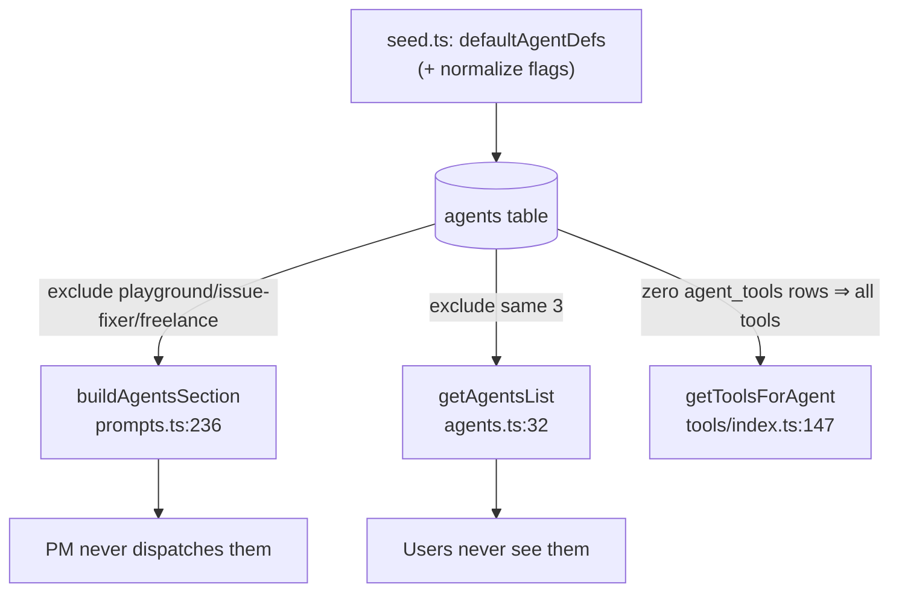

# Agent Roster Reference

**The canonical list of every built-in agent, how it is defined, and which ones
are hidden from the PM and the Agents page.** All built-in agent definitions live
in one array — `defaultAgentDefs` in `src/bun/db/seed.ts:158` — except the
**Project Manager**, which is *not* a stored agent at all (see below). The roster
is not just a lookup table: an agent's behaviour (which tools it gets, whether it
can run in parallel, whether the PM can dispatch it) is determined by three
separate mechanisms that must stay in sync. This page documents the roster and
those mechanisms.

## How an agent is defined

Each entry in `defaultAgentDefs` (`seed.ts:158`) is `{ name, displayName, color,
systemPrompt }`. On launch, `seedDatabase()` (`seed.ts:1439`) inserts all of them
on first run, or — guarded by a FNV-1a hash of the defs (`seed.ts:1569`,
`BUILTIN_PROMPTS_HASH_KEY`) — re-upserts `systemPrompt`/`color`/`displayName` only
when the bundled defs actually changed (an app upgrade). This avoids ~22 DB writes
on every unchanged launch while still delivering improved prompts to existing
users. System prompts are the **single source of truth** and must be edited in
`seed.ts`, never inline in engine code.

A built-in agent's **tool set** comes from `defaultAgentTools` (`seed.ts:1350`),
seeded into the `agent_tools` table by `seedAgentTools()` (`seed.ts:1677`). The
critical rule lives in `getToolsForAgent()` (`tools/index.ts:100`): if an agent
has **zero** `agent_tools` rows, it receives the **entire** registry
(`getAllTools()`, `tools/index.ts:169`); otherwise only its explicitly-enabled
tools. This zero-rows-means-everything rule is why some background agents get
universal access (see the table).

Every built-in in `defaultAgentTools` also auto-receives `request_human_input`,
*except* the three autonomous background agents listed in `NO_HUMAN_INPUT_AGENTS`
(`seed.ts:1397`) — they run unattended and escalate via channels instead of a
blocking dialog.

## The Project Manager is virtual

`project-manager` has **no row** in `defaultAgentDefs` and is never seeded into the
`agents` table. The engine queries `agents` for it only to read an optional
`thinkingBudget`/`color`, falling back to defaults (`engine.ts:222`,
`engine.ts:234`). Its actual system prompt is `PM_PROMPT_TEMPLATE`
(`prompts.ts:270`), assembled at runtime by `getPMSystemPrompt`. The PM is the
sole orchestrator and the only agent that talks to the user — see [[agent-engine]].

## The built-in roster

`displayName` and `color` are from `seed.ts`; the "When to use" column mirrors
`BUILTIN_AGENT_DESCRIPTIONS` (`prompts.ts:193`), which is what the PM actually
sees in its sub-agent table.

> Note: the frontend engineer's internal name is `frontend_engineer` (underscore,
> historical) while every other agent uses kebab-case.

### Orchestrated by the PM

| Internal name | Display name | Read-only | Role / when to use |
|---|---|---|---|
| `task-planner` | Task Planner | **Yes** | Task breakdown, PRD creation (`seed.ts:839`) |
| `code-explorer` | Code Explorer | **Yes** | Codebase exploration, dependency mapping (`seed.ts:633`) |
| `research-expert` | Research Expert | **Yes** | Web search, library comparisons (`seed.ts:690`) |
| `software-architect` | Software Architect | No | System design, architecture decisions (`seed.ts:160`) |
| `backend-engineer` | Backend Engineer | No | Server-side logic, APIs, database (`seed.ts:223`) |
| `frontend_engineer` | Frontend Engineer | No | UI components, React/TypeScript, styling (`seed.ts:191`) |
| `database-expert` | Database Expert | No | DB design, query optimisation (`seed.ts:527`) |
| `data-engineer` | Data Engineer | No | Data pipelines, analytics (`seed.ts:495`) |
| `api-designer` | API Designer | No | REST/GraphQL design, OpenAPI specs (`seed.ts:730`) |
| `mobile-engineer` | Mobile Engineer | No | React Native, Expo, iOS/Android (`seed.ts:766`) |
| `ml-engineer` | ML Engineer | No | LLM integration, prompt engineering (`seed.ts:801`) |
| `code-reviewer` | Code Reviewer | No | Code review, correctness (auto-spawned by review cycle) (`seed.ts:387`) |
| `qa-engineer` | QA Engineer | No | Test writing, end-to-end verification (`seed.ts:289`) |
| `devops-engineer` | Devops Engineer | No | CI/CD, infrastructure, deployment (`seed.ts:256`) |
| `documentation-expert` | Documentation Expert | No | Docs, README, API docs (`seed.ts:357`) |
| `debugging-specialist` | Debugging Specialist | No | Root-cause analysis, bug investigation (`seed.ts:427`) |
| `performance-expert` | Performance Expert | No | Profiling, optimisation (`seed.ts:461`) |
| `security-expert` | Security Expert | No | Security audits, vulnerability assessment (`seed.ts:323`) |
| `ui-ux-designer` | Ui Ux Designer | No | UX/UI design, wireframes, accessibility (`seed.ts:562`) |
| `refactoring-specialist` | Refactoring Specialist | No | Code restructuring, tech debt (`seed.ts:593`) |

### Page-exclusive (hidden from the PM **and** the Agents page)

These three are built-ins but are filtered out everywhere a user or the PM would
otherwise see them. They are driven only by their own feature pages — never
orchestrated.

| Internal name | Display name | Read-only | Role | Tool set |
|---|---|---|---|---|
| `playground-agent` | Playground Agent | No | Builds previewable artifacts in the [[playground]] page (`seed.ts:1107`) | **Focused** (~37 tools) — explicitly listed in `defaultAgentTools` (`seed.ts:1386`): file ops, shell, web, LSP, process, skills. **No** git/kanban/notes/planning. |
| `issue-fixer` | Issue Fixer | No | Autonomously resolves GitHub issues → branch/PR; never merges (`seed.ts:1190`) | **Full registry** — no `agent_tools` rows. `request_human_input`/`git_push`/`git_pr` excluded at run time. |
| `freelance-expert` | Freelance Expert | No | Auto-Earn freelancer: bids/replies/delivers under human gates (`seed.ts:1217`) | **Full registry** — no `agent_tools` rows. |

> **Drift warning:** `CLAUDE.md` and the v26 migration comment
> (`v26_remove-legacy-general-agent.ts:11`) both claim `playground-agent` has *no*
> `agent_tools` rows (full registry). That is **stale** — the current `seed.ts:1386`
> gives it a focused ~37-tool set. Only `issue-fixer` and `freelance-expert` get
> the full registry today.

## The three mechanisms that classify an agent

An agent's effective behaviour is the intersection of three independent gates.
Getting any one wrong silently breaks orchestration.

### 1. Read-only vs Write → parallelism + tool filtering

`READ_ONLY_AGENTS` (`agent-loop.ts:239`) = `{code-explorer, research-expert,
task-planner}`. Membership does two things: it lets the PM run them concurrently
via `run_agents_parallel` (write agents are serialized by the `writeAgentRunning`
guard), and `filterReadOnlyTools` (`agent-loop.ts:245`) strips mutating file
tools from their runtime tool set even if seeded.

### 2. The PM's view → which agents it can dispatch

`buildAgentsSection` (`prompts.ts:224`) builds the "Sub-Agents Available" table in
the PM prompt. It queries `agents` excluding `project-manager` (`prompts.ts:229`),
then filters out the three page-exclusive agents and any custom agent whose
`availableToPm` flag is off (`prompts.ts:236`). It labels each row Read-only vs
Write using a **second** read-only set, `READ_ONLY_AGENT_NAMES`
(`prompts.ts:216`) — which duplicates the contents of `READ_ONLY_AGENTS`. These
two sets must be kept in sync by hand.

### 3. The Agents page → which agents users manage

`getAgentsList` (`rpc/agents.ts:29`) returns all agents except the three
page-exclusive built-ins (`rpc/agents.ts:32`), so they never appear in
Settings → Agents.

### The "page-exclusive" pattern, end to end

After seeding, `seedDatabase()` *normalizes* the three page-exclusive agents'
flags — `isBuiltin:1, useSystemPromptOnly:0, chatEnabled:0, availableToPm:0` —
because the prompt upsert only touches `systemPrompt`/`color`/`displayName`
(`seed.ts:1623`, `:1630`, `:1638`).

## Legacy: `general-agent`

The Playground builder was briefly named `general-agent`, which collided with
users' own custom agents and inherited a crippled tool set. It was renamed to
`playground-agent`. Migration **v26**
(`v26_remove-legacy-general-agent.ts`) deletes any leftover `general-agent` row
plus its `agent_tools` **once** on upgrade (the version gate prevents re-deletion;
seed runs every launch and must never delete a user's agent). No-op on fresh
installs.

## Key files

| File | Role |
|---|---|
| `src/bun/db/seed.ts` | `defaultAgentDefs` (definitions), `defaultAgentTools` (per-agent tools), `seedDatabase`, `seedAgentTools`, flag normalization |
| `src/bun/agents/agent-loop.ts` | `READ_ONLY_AGENTS` set + `filterReadOnlyTools` (parallelism + tool stripping) |
| `src/bun/agents/prompts.ts` | `PM_PROMPT_TEMPLATE`, `buildAgentsSection`, `BUILTIN_AGENT_DESCRIPTIONS`, `READ_ONLY_AGENT_NAMES` |
| `src/bun/agents/tools/index.ts` | `getToolsForAgent` — zero-rows-means-full-registry rule |
| `src/bun/rpc/agents.ts` | `getAgentsList` — hides page-exclusive agents from the UI |
| `src/bun/db/migrations/v26_remove-legacy-general-agent.ts` | One-time `general-agent` cleanup |

## Gotchas / Constraints

- **Two read-only sets, kept in sync by hand.** `READ_ONLY_AGENTS`
  (agent-loop.ts) and `READ_ONLY_AGENT_NAMES` (prompts.ts) list the same three
  agents but are separate constants. Add a read-only agent and you must edit both.
- **`project-manager` is virtual** — not in `defaultAgentDefs`, not normally a
  row in `agents`. Don't expect to find/edit it like other agents; its prompt is
  `PM_PROMPT_TEMPLATE`.
- **`frontend_engineer` uses an underscore**, unlike every other kebab-case name.
- **Page-exclusive exclusion is duplicated** in three places (prompts.ts:236,
  agents.ts:32, engine `buildAgentsSection`). Adding a new page-exclusive agent
  means updating all of them.
- **Playground tool set drift** — docs say "full registry", code says ~37 tools.
  Trust `seed.ts:1386`.
- **Prompt edits need a hash change to propagate.** Because of the FNV-1a guard
  (`seed.ts:1569`), editing a `displayName`/`color`/`systemPrompt` is what changes
  the hash; existing users only re-upsert on that change.

## Related
- [[agent-engine]]
- [[playground]]
- [[database-tables]]
- [[conventions-constraints]]

## Open questions
- The v26 migration comment and `CLAUDE.md` both describe `playground-agent` as
  having the full registry. Is the focused tool set at `seed.ts:1386` the intended
  final state, or a regression? (Documented here as current reality.)
