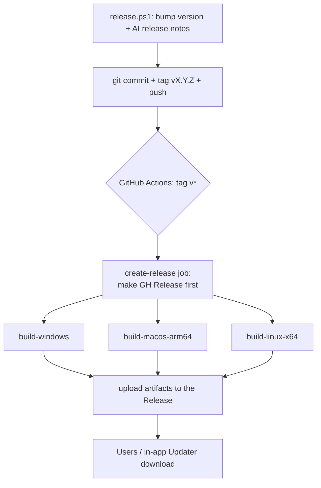

# Tech Stack, Build & Release

AgentDesk is an **Electrobun** desktop app: a Bun runtime + native OS webview, with
a React 19 frontend built by **Vite** and a Bun/TypeScript backend. There is no
Electron/Chromium baggage — the frontend HTML/JS is served into the OS webview, and
the backend is plain Bun. This page documents the two-stage build (Vite then
Electrobun), the cross-platform CI release pipeline, the updater artifact contract,
and the local dev commands — and the non-obvious *why* behind each.

## Tech stack at a glance

| Layer | Choice | Where |
|---|---|---|
| Desktop shell | Electrobun `1.18.1` (Bun + native webview) | `package.json:63` |
| Frontend | React 19, TanStack Router, Zustand, Tailwind 3, Radix UI | `package.json:48,74,89` |
| Frontend build | Vite 6 + `@vitejs/plugin-react` | `vite.config.ts:1-22` |
| Backend | Bun + TypeScript, Drizzle ORM, SQLite | `package.json:62` |
| AI | Vercel AI SDK (`ai` ^6) + per-provider `@ai-sdk/*` adapters | `package.json:24-52` |

> Note the version drift: `CLAUDE.md` says Electrobun `1.16.0`, but the actual pinned
> dep is `electrobun@1.18.1` (`package.json:63`). The pin is **exact** (no caret) — the
> launcher binary and updater protocol are version-coupled, so this must not float.

## Two-stage build — why Vite *then* Electrobun

Every build path runs the same two commands in order (`package.json:12`,
`build.ps1:14-24`):

1. `vite build` — compiles `src/mainview/` (root set at `vite.config.ts:6`) into
   `dist/` (`vite.config.ts:15-16`, `emptyOutDir: true`). The `@` / `@shared` aliases
   (`vite.config.ts:9-12`) resolve frontend imports.
2. `electrobun build` — packages the Bun backend + the webview assets into a native
   app bundle, reading `electrobun.config.ts`.

The bridge between the two stages is the **`copy` map** in `electrobun.config.ts:11-22`:
Electrobun does not know about Vite, so the config explicitly copies `dist/index.html`
and `dist/assets` into the bundle's `views/`, plus icons, `plugins/`, `skills/`, and
crucially `release-notes.json` (shipped into the bundle so the in-app "What's New"
dialog can read it — see below). `assets/icon.ico` is copied twice — once as the
bundle icon, once as `app.ico` (`electrobun.config.ts:16-17`).

### Build channels (`--env`)
Electrobun's `--env` flag names the output channel, which becomes the build-folder and
artifact prefix: `dev` (default, `bun run dev`), `stable` (CI + `build.ps1:8`), and
`canary` (`bun run build:canary`, `package.json:13`). Output lands in
`build/<channel>-<os>-<arch>/` (e.g. `build/stable-win-x64/`, `build.ps1:31`).

### CEF per-platform (`electrobun.config.ts:27-35`)
- **Windows / macOS: `bundleCEF: false`** — uses the OS webview (WebView2 / WKWebView),
  so the download stays tiny.
- **Linux: `bundleCEF: true`** — WebKitGTK has significant limitations, so Chromium
  Embedded Framework is bundled instead (larger download; see the rationale comment at
  `.github/workflows/release.yml:193-196`).

### Dev watch ignore (`electrobun.config.ts:26`)
`watchIgnore: ["dist/**", "src/mainview/**"]` stops `electrobun dev --watch` from
restarting the whole app on every React edit — Vite HMR owns `src/mainview/*`, and a
double-watch would clobber HMR.

## Dev commands

| Command | What it does | Notes |
|---|---|---|
| `bun run start` | `vite build && electrobun dev` | one-shot build + launch |
| `bun run dev` | `electrobun dev --watch` | backend watch (no Vite server) |
| `bun run dev:fast` | Vite dev server (`:5173`) + `electrobun dev` concurrently | HMR mode |
| `bun run dev:hmr` | `hmr` + `start` concurrently | alt HMR variant |
| `bun run build` / `build:canary` | production / canary bundle | |
| `bun run typecheck` / `lint` / `format` | `tsc --noEmit` / ESLint / Prettier | `package.json:17-21` |
| `bun run db:generate` / `db:migrate` / `db:studio` | Drizzle Kit | see [[database]] |

Dev port `5173` is `strictPort` (`vite.config.ts:18-21`) so a stale process fails loudly
instead of silently shifting ports.

## Release pipeline

### Step 1 — `release.ps1` (run locally by the maintainer)
1. Prompts for the new semver, validates `MAJOR.MINOR.PATCH` (`release.ps1:32`).
2. Collects commits since the last tag (`git describe` → `lastTag..HEAD`,
   `release.ps1:78-80`) and asks the **GitHub Models API** (`gpt-4o-mini`,
   `release.ps1:5-6`) to draft user-facing release notes, discarding `chore:`/`ci:`/etc.
   (`release.ps1:104-132`). Falls back gracefully if `GITHUB_TOKEN` is missing or the
   AI returns nothing (`release.ps1:92-95,160-162`). Result is prepended to
   `release-notes.json` (`release.ps1:202-216`).
3. Rewrites the version in **both** `package.json` (`release.ps1:235`) and
   `electrobun.config.ts` (`release.ps1:246`) via regex — these two must stay in lockstep.
4. Commits `chore: release vX.Y.Z`, tags `vX.Y.Z`, pushes `main` + tag
   (`release.ps1:261-284`).

### Step 2 — GitHub Actions (`.github/workflows/release.yml`)
Triggered on `push: tags: v*` (`release.yml:3-6`). The `create-release` job runs first so
the three parallel build jobs can upload into an existing Release (`release.yml:11-28`).
Each build job: checkout → `setup-bun` → `bun install --frozen-lockfile` →
`bun run vite build` → `bunx electrobun build --env=stable` → prepare artifacts → upload.

**Windows specifics (`release.yml:30-135`):** the app is built **twice**. The first
`electrobun build` downloads the `launcher.exe` into `node_modules`; `rcedit` then embeds
`assets/icon.ico` into that launcher (`release.yml:56-62`), and a second build packs the
icon-embedded launcher (`release.yml:64-66`). The installer exe also gets the icon
embedded (`release.yml:68-74`). Two user deliverables are produced: a single-zip
**Setup** installer (NSIS exe + `.installer/` payload, `release.yml:86-98`) and a
**portable** zip (extract the bundle `tar.zst`, re-zip, `release.yml:114-124`).

**macOS (`release.yml:138-186`):** arm64 only — Intel/`macos-13` runners are skipped due
to queue times (`release.yml:188-190`). Produces a drag-to-`/Applications` zip plus the
updater `.app.tar.zst`.

**Linux (`release.yml:197-281`):** the genuine runtime bundle is
`artifacts/stable-linux-x64-AgentDesk.tar.zst` (Electrobun's own `artifactFolder`), NOT
the `build/.../AgentDesk/` self-extractor — the comment at `release.yml:227-243` explains
the self-extractor must not be shipped on Linux. Ships a portable `tar.gz` of the
already-unpacked bundle so users skip self-extraction (`release.yml:255-265`).

## Updater artifact contract

The updater (`electrobun.config.ts:40-42`) fetches from
`https://github.com/sarfraznawaz2005/agentdesk/releases/latest/download`. Per OS/arch
each build job produces three updater-relevant files named with the
`<channel>-<os>-<arch>-` prefix the Electrobun `Updater` expects:

| File | Consumed by |
|---|---|
| `<chan>-<os>-<arch>-update.json` | `Updater.checkForUpdate()` — version injected from the git tag (`release.yml:103-107,168-170,248-250`) |
| `<chan>-<os>-<arch>-AgentDesk.tar.zst` | `Updater.downloadUpdate()` (non-Windows) |
| Setup zip / portable zip | the **custom Windows** update path (below) |

### Windows update is custom (not Electrobun's default)
`downloadUpdate()`/`applyUpdate()` branch on platform (`updater.ts:55-82`). On Windows
they bypass Electrobun's bspatch flow entirely because some AV engines flag
`bspatch.exe`. Instead they download the **full** zip and swap files. Which zip depends
on install mode:
- **Installed (Setup) build** → `windowsDownloadSetup`/`windowsApplySetup`
  (`updater.ts:104-284`): downloads `{name}-win-{arch}-Setup.zip`, extracts via
  `Expand-Archive`, runs the NSIS installer silently (`/S`) and relaunches.
- **Portable build** → `updater-portable.ts`: downloads `{name}-win-{arch}-portable.zip`
  and `robocopy /MIR`s it over the running folder via a detached PowerShell script
  (`updater-portable.ts:218-273`).

Install mode is inferred purely from **location** — there is no marker file. A Setup
build runs from `%LOCALAPPDATA%\<identifier>\<channel>\app\`; anything else on Windows is
portable (`install-mode.ts:19-36`). Both Windows apply paths re-create the
`freelance` / `claude` / `autoearn` feature-flag files after install, because the
installer/mirror wipes `bin/` (`updater.ts:204-218`, `updater-portable.ts:158-162`).

### "What's New" on upgrade
`release-notes.json` is bundled (`electrobun.config.ts:20`) and imported at runtime
(`whats-new.ts:2`). On launch, `getWhatsNewStatus` compares `pkg.version` against the
`lastSeenVersion` setting and shows notes for versions in between
(`whats-new.ts:33-67`). First-ever run seeds `lastSeenVersion` silently so existing users
don't get a popup (`whats-new.ts:37-40`).

## Key files

| File | Role |
|---|---|
| `package.json:6-22` | npm scripts — the source of truth for every dev/build command |
| `electrobun.config.ts` | app identity, version, the `copy` bridge, per-OS CEF, updater `baseUrl` |
| `vite.config.ts` | frontend build → `dist/`, aliases, dev port `5173` |
| `build.ps1` | local stable build helper (Vite + Electrobun) |
| `release.ps1` | version bump + AI release notes + tag/push |
| `.github/workflows/release.yml` | cross-platform CI build + artifact upload |
| `src/bun/rpc/updater.ts` | check/download/apply; Windows Setup path |
| `src/bun/rpc/updater-portable.ts` | Windows portable robocopy update |
| `src/bun/lib/install-mode.ts` | Setup-vs-portable detection by path |
| `src/bun/rpc/whats-new.ts` | post-upgrade release-notes popup logic |

## Gotchas / Constraints

- **Version lives in three places**: `package.json`, `electrobun.config.ts`, and the git
  tag. `release.ps1` keeps the first two in sync; the tag's semver is injected into the
  `update.json` at CI time (`release.yml:103-107`). Editing one by hand desyncs the updater.
- **`electrobun` is pinned exactly** (`package.json:63`) — do not let it float to a caret
  range; the launcher binary and updater protocol are version-coupled.
- **Windows builds twice on purpose** — the icon-embed step needs `launcher.exe` to exist
  in `node_modules` first (`release.yml:47-66`). Don't "optimize" it to one pass.
- **Linux must ship the `artifacts/` tarball, not `build/.../AgentDesk/`** — the latter is
  a macOS-style self-extractor that fails on Linux (`release.yml:227-243`).
- **No code signing** — `build.ps1:32-33` notes Windows users will see SmartScreen
  warnings; an EV cert + `signtool` is the documented remedy but is not wired up.
- **CLAUDE.md tech-stack table lists Electrobun 1.16.0** but the real pin is 1.18.1 —
  trust `package.json`.

## Related
- [[backend-core]]
- [[frontend-architecture]]
- [[database]]
- [[directory-map]]

## Open questions
- Is the `canary` channel ever actually released, or is `build:canary` purely a local
  smoke-test? CI only builds `--env=stable`.
- Are macOS/Linux artifacts ever signed/notarized, or is unsigned distribution the
  permanent policy?
