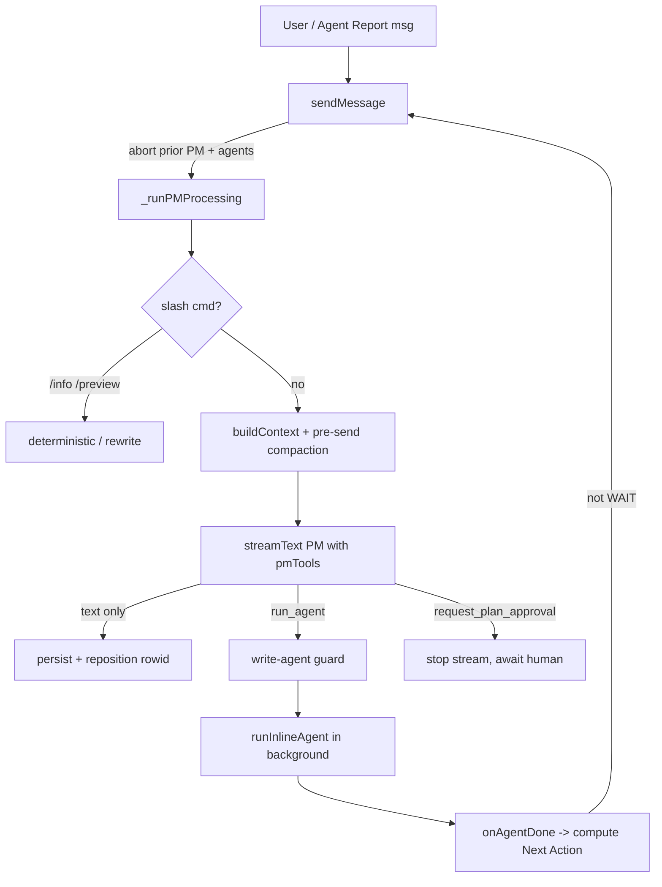

# Agent Engine

The agent engine is AgentDesk's orchestration core. There is **no separate
workflow state machine** — the Project Manager (PM) LLM *is* the orchestrator.
One `AgentEngine` instance per project (`src/bun/agents/engine.ts:47`, cached by
`EngineManager`) streams the PM's response, and the PM dispatches specialist
sub-agents **inline in the same conversation** via tools. Sub-agents get a
*fresh* context (system prompt + task only) and stream their own tool calls into
the chat as message parts (`src/bun/agents/agent-loop.ts:801`). The single most
important invariant: **the PM never re-enters while it is already running, and
only one write-agent runs at a time** — everything else (approval gate, review
cycle, handoffs, compaction) is built around keeping that serialization correct.

## Key idea: PM as a self-restarting loop

The PM does not run a fixed agent loop. Instead it streams once per "turn", and
each turn ends in one of three ways:

1. **Plain text** — answer the user, done.
2. **Dispatch a sub-agent** — the PM stream is *stopped* after the current step
   (`stopPMStream` sets `planApprovalRequested`, `engine.ts:398`,`engine.ts:705`),
   the agent runs in the background, and when it finishes the engine **restarts
   the PM** by sending itself a synthetic `[Agent Report]` message
   (`pm-tools.ts:480` → `onAgentDone`, `engine.ts:408`).
3. **Request approval** — same stop mechanism, but the PM stays paused until the
   *human* replies "approve"/"reject".

This self-restart is why the engine can drive a multi-task workflow with no state
machine: each agent completion feeds a computed `[Next Action]` hint back into
the PM (`engine.ts:423`–`engine.ts:470`) that tells it exactly what to do next
(DISPATCH / WAIT / MOVE TO REVIEW / ALL DONE / BLOCKED, or PAUSED when the
`autoExecuteNextTask` project setting is off — see [[kanban-review-cycle]]), so
the PM rarely has to reason about kanban state itself.

## How a turn works

### 1. Serialization in `sendMessage` (`engine.ts:97`)
A new message aborts the in-flight PM stream (`pmAbort.abort()`) and all running
sub-agents (`abortAgentsFn`), then **awaits the previous processing promise**
before starting — otherwise two PM streams race and the stale one overwrites the
fresh answer (`engine.ts:104`). `[Agent Report]` messages are special-cased:
they do **not** abort sub-agents, because a review-cycle agent may legitimately
be running (`engine.ts:102`,`engine.ts:107`). The processing lock
(`pmProcessingPromise`) is installed synchronously before any `await` so
back-to-back calls queue correctly (`engine.ts:130`).

### 2. Context + provider resolution (`engine.ts:231`)
The PM system prompt is built by `getPMSystemPrompt` (`prompts.ts:871`); the
provider/model is resolved from project-level `chatProviderId/chatModelId`
overrides falling back to the global default (`engine.ts:1091`). `buildContext`
(`context.ts:28`) loads the latest conversation summary + the last 50 messages,
sorted **in JS** by parsed timestamp (SQLite `CURRENT_TIMESTAMP` and JS ISO
strings don't sort lexicographically the same — `context.ts:42`).

### 3. PM streaming with retries + guards (`engine.ts:556`)
`streamText` runs with `stopWhen: stepCountIs(100)` and the assembled `pmTools`.
The fullStream loop handles several non-obvious cases:
- **Premature-text retraction** (`engine.ts:681`): if a step emits narration text
  *and* dispatches a wait-type agent (`run_agent`/`run_agents_parallel`), the
  text is retracted (it would render before the agent's own output) and re-emitted
  to the reasoning/thinking lane via `onAgentActivity` so it is not a silent
  flash-then-vanish. It is still restored to the answer lane if the model never
  regenerates (`engine.ts:722`).
- **Hallucination guard** (`engine.ts:767`): fires when the PM wrote text without
  calling `run_agent` but a dispatch was expected. Three detection vectors:
  - **A — engine-driven**: `[Next Action] DISPATCH` injected into `content`
    (auto-continue after task completion). `isDispatchExpected` flag.
  - **B — thinking-block signal** (primary for user-initiated requests): the PM's
    extended reasoning uses its trained vocabulary ("let me dispatch", "I'll call
    run_agent") far more consistently than its response prose. `THINKING_DISPATCH_RE`
    matches conclusive dispatch decisions but not deliberation ("should I dispatch?").
    Only fires when `accumulatedReasoning` is non-empty (Anthropic + some OpenRouter
    models with extended thinking; absent on other providers → falls through to C).
  - **C — response-text regex** (fallback for non-thinking providers): conservative
    `DISPATCH_CLAIM_RE` covering present-participle claims, passive voice, multi-item
    completion claims, and hand-off phrases. Will miss novel phrasing, but vector B
    covers the common cases where thinking is available.
  When any vector fires and no `run_agent` was called (`agentDispatchedThisTurn =
  false`), the engine injects an in-memory correction and re-loops (up to 2×) —
  hallucinated text is never written to DB. On each retry the tool set is narrowed
  to dispatch-only (`activeTools = { run_agent, run_agents_parallel }`) — a
  provider-agnostic substitute for `toolChoice:'required'` (Ollama/OpenRouter ignore
  it; Anthropic rejects it alongside extended thinking). Exhausted retries → sets
  `postStreamCorrectionNeeded = true` and falls through to layer D.
- **Epistemic grounding rule** (`prompts.ts`, rule 0c): system-prompt instruction requiring
  every factual claim to be backed by a tool call made in the same response. Covers
  file-state claims (requires `read_file` result this turn), dispatch claims (rule 0b),
  behavioral claims ("tests pass" — requires shell/test output), and visual claims
  (prohibited entirely — PM has no rendering tools). Safe alternative framed for the
  model: attribute claims to the agent's self-report ("the agent updated X") rather
  than asserting unverifiable personal knowledge ("X is now fixed — verified").
- **No-inline-code rule** (`prompts.ts`, rule 0d): PM is forbidden from performing
  any code work inline — checking code correctness, verifying a fix worked, describing
  implementation steps as prose, or assessing file state without `read_file`. Covers
  the case where the PM "answers" an implementation request by describing what to
  change instead of dispatching a write agent. Even a single-character fix must go
  through the appropriate write agent; even "just checking" must go through
  `code-explorer`. Supplements rule 0c (which already disallows unverified file claims)
  with an explicit ban on the "helpful description" anti-pattern.
- **No-self-verification rule** (`prompts.ts`, Decision Process classification item 4):
  "code verification / checking" is its own explicit routing category — always dispatches
  `code-explorer` or `qa-engineer`. Prevents the PM from answering "did the fix work?"
  from memory or reasoning rather than reading the actual file.
- **Post-stream ground-truth check** (`engine.ts:1042`, layer D): after all in-stream
  retries fail, verifies `getRunningAgentCount(projectId) === 0` — actual process
  state, not text inference. If confirmed, schedules a `[DISPATCH CORRECTION]`
  message via `setTimeout(150ms)` to avoid deadlocking on `pmProcessingPromise`
  (we are still inside the lock at that point). The correction message re-triggers
  the PM with the original user request embedded. Loop guard: skips if `content`
  already starts with `[DISPATCH CORRECTION]` to prevent infinite correction loops.
- **Transient-error retry** (`engine.ts:805`): up to 3 attempts with exponential
  backoff (`safety.ts:143`,`safety.ts:155`), distinguishing real aborts from
  empty/network failures.

### 4. Message repositioning (`engine.ts:904`)
The PM's placeholder row is inserted *before* streaming (so before any sub-agent
rows). The UI orders by SQLite `rowid`, so after the turn the engine bumps the
PM row's `rowid` to `MAX+1` so its final text renders *after* the sub-agents it
spawned — while the LLM-context path (`context.ts`, `summarizer.ts`) orders by
`createdAt`, which is also bumped to the finish time (`engine.ts:900`). Both
views stay chronological.

## Inline sub-agent execution (`agent-loop.ts:801`)

`runInlineAgent` is a single `generateText` call (not a manual loop) whose
behaviour is shaped by `prepareStep`/`onStepFinish`/`stopWhen`:

- **Fresh context**: the agent message array is just the task (plus optional
  `priorMessages` for the Playground) — it never sees the parent conversation
  (`agent-loop.ts:1090`). The PM's task description is therefore the agent's
  *entire* context, which is why `run_agent`'s schema demands a comprehensive
  task (`pm-tools.ts:256`).
- **Tool assembly** (`agent-loop.ts:884`–`agent-loop.ts:1005`): role tools from
  `getToolsForAgent` + tracked file tools + plugin + MCP + decisions tool, then
  workspace-cwd wrappers, optional read-only filter (`WRITE_TOOLS`,
  `agent-loop.ts:231`), `excludeTools`, and `git_commit` removal when auto-commit
  is on (the review cycle commits instead). The `run_shell` and
  `request_human_input` wrappers additionally stamp hidden `args.__projectId`/
  `args.__conversationId` fields (not part of either tool's public schema, so
  the model never sees them) before calling the original `execute()`
  (`agent-loop.ts:944`–`agent-loop.ts:976`). This runs unconditionally (not
  gated on `workspacePath`) so the shell-approval gate and
  `request_human_input`'s pending-question card always resolve the agent's
  *actual* project/conversation instead of falling back to a guess — the fix
  for a bug where a module-level "most recently touched engine" cache in
  `engine-manager.ts` could leak one project's "Always allow" shell approval
  into suppressing another project's prompt.
- **Progressive compaction** in `prepareStep` keyed on `lastPromptTokens /
  getContextLimit`: >0.60 aggressive tool-result pruning, >0.70 rule-based
  compaction (zero-token deterministic summary, `agent-loop.ts:463`) escalating
  to AI compaction if the summary is large, >0.85 strip, >0.90 hard stop
  (`agent-loop.ts:1188`–`agent-loop.ts:1237`). There is **no iteration cap** —
  only context, a 30-min timeout, stuck-loop detection (MCP tools repeated 15×,
  `agent-loop.ts:1274`), or abort can stop it.
- **Persistence toggle**: `persistToDb:false` skips all DB writes (Playground)
  while still firing callbacks (`agent-loop.ts:808`).

`READ_ONLY_AGENTS` = `{code-explorer, research-expert, task-planner}`
(`agent-loop.ts:246`) is the canonical list of agents safe to run in parallel.

## The sequential write-agent guard

Enforced in `createPMTools` (`pm-tools.ts:247`). Because the Vercel AI SDK runs
parallel tool calls from one LLM step via `Promise.all`, two `run_agent` calls
can both pass a naive check before either registers. Three layers close that gap:
1. **`dispatchingAgents` module Set** (`pm-tools.ts:241`,`pm-tools.ts:346`) —
   atomic check-and-set keyed `projectId:agent`, blocking the duplicate before it
   even registers an abort controller.
2. **`writeAgentRunning` closure boolean** (`pm-tools.ts:250`,`pm-tools.ts:370`)
   — only one write agent at a time; read-only agents bypass it.
3. **Cross-cutting checks**: global running count (`pm-tools.ts:381`), and a
   "task in review" block so new dispatch waits for code review (`pm-tools.ts:392`).
`run_agents_parallel` validates every agent is in `READ_ONLY_AGENTS`
(`pm-tools.ts:831`) and staggers starts by 1.5s to avoid provider overload.

## Soft approval gate (Plan → Approve → Execute)

There is no hard gate — approval is keyword-driven and enforced at two levels:
- The PM is *instructed* to call `request_plan_approval` as a tool, never as text
  (`prompts.ts:326`,`prompts.ts:345`).
- **Code-level enforcement** in `run_agent`'s completion handler: when
  `task-planner` finishes with pending `define_tasks` definitions and there are
  no active kanban tasks, the engine shows the approval card itself
  (`pm-tools.ts:673`–`pm-tools.ts:758`) — even if the PM forgot the tool — and
  deliberately does **not** restart the PM, so the card is visible before any
  second dispatch. On the user's "approve", `create_tasks_from_plan`
  (`pm-tools.ts:1691`) drains the stored definitions into kanban tasks
  (resolving `blocked_by` indices to real IDs). For channels the plan is sent as
  a chunked text message and the PM waits for an "approve"/"reject" reply
  (`pm-tools.ts:1604`).

## Automatic review cycle (`review-cycle.ts`)

Fully independent of the engine — no `WorkflowEngine` dependency. When a task
moves to "review", `run_agent`'s handler calls `autoCommitTask` (commits the work
so the reviewer can `git show` the diff — `review-cycle.ts:349`) then
`notifyTaskInReview` (`review-cycle.ts:460`):
1. Spawns `code-reviewer` via the self-contained `spawnReviewAgent`
   (`review-cycle.ts:224`).
2. Reads the verdict from the most recent `submit_review` tool call
   (`getSubmitReviewDetails`, `review-cycle.ts:80`), with a keyword heuristic
   fallback (`review-cycle.ts:118`).
3. **Approved** → move to "done" + `triggerPMAutoContinue` (sends the PM a
   `[Agent Report]` with the next DISPATCH hint, `review-cycle.ts:151`).
4. **Changes requested** → back to "working", spawn the original assigned agent
   with the reviewer's per-issue feedback, up to `maxReviewRounds` (default 2,
   `review-cycle.ts:54`). The `activeReviews` guard is released *before* spawning
   the fix agent so its `move_task("review")` can re-trigger a fresh review
   (`review-cycle.ts:564`).
5. **Max rounds exceeded / errors** → force "done" with a warning note so a task
   can never get stuck.
`activeReviews` (`review-cycle.ts:42`) dedups concurrent reviewer spawns;
`reviewRounds`/`taskCommitHashes` are in-memory (reset on restart).

## Handoffs between sequential tasks (`handoff.ts`)

After a write agent finishes a kanban task, `generateHandoffSummary`
(`handoff.ts`) summarizes the modified files — deterministic regex extraction
for small changes (≤3 files, <200 lines: exports, CSS classes, DOM IDs/selectors),
AI summary for larger ones (though no caller currently passes the `aiSummarise`
callback, so in practice this path is dead and always falls through to the
deterministic summary — a pre-existing gap, not something this note's redaction
work changed). Before any file content is quoted into the summary or an AI
prompt, `redactSecrets` strips credential-shaped substrings (API keys, tokens,
private-key blocks, `KEY=value` assignments) and `SENSITIVE_FILE_RE` skips
reading `.env`/`.pem`/`.key`/credential files entirely, recording only the
filename.

This is **appended** to the task's `importantNotes` as a `## Handoff Summary`
section (`pm-tools.ts`, `run_agent`'s completion handler) — never overwriting
what's already there. `verify_implementation` (`tools/kanban.ts`) writes a
`## Completion Report` (summary, decisions, API contracts, follow-up issues,
verification evidence) to `importantNotes` *before* the agent even finishes;
an earlier version of the handoff-note write clobbered that report wholesale.
A `## Suggested Next Steps` section is also appended when the Completion Report
listed `follow_up_issues` (`extractFollowUpIssues`, `handoff.ts`). The combined
notes are surfaced to the next agent via `get_next_task`'s `priorWork`, so
decisions, file/class/ID names, and open follow-ups all stay consistent across
sequential tasks — the exact problem `docs/sequential-agent-model.md` was
written to solve. See [[kanban-review-cycle]] for the full write/merge sequence
and the plan-level Final Recap doc generated when an entire plan's tasks finish.

## Conversation compaction

Two distinct mechanisms:
- **Per-conversation summarization** (`summarizer.ts:50`): keeps the most recent
  10 messages, AI-summarizes + deletes the rest, carries forward the prior
  summary. Triggered pre-send when measured tokens (real last-turn usage or char
  estimate) reach the project's Context Window Limit (`getContextLimit`, default
  1M, `engine.ts:279`) and post-turn when context ≥80% (`context.ts:90`).
- **Between-task tool-output pruning** (`pruneAgentToolResults`,
  `agent-loop.ts:336`): when context ≥60% after an agent finishes, verbose tool
  outputs are replaced with short placeholders (`pm-tools.ts:659`), preserving
  `read_file`/edit results which the agent needs as working memory.

## Key files

| File | Role |
|---|---|
| `src/bun/agents/engine.ts` | `AgentEngine` — PM streaming, serialization lock, approval gate, next-action computation, retries, message repositioning |
| `src/bun/agents/engine-types.ts` | Callback/metadata types, thinking-budget options, `applyAnthropicCaching`, `getPluginTools` |
| `src/bun/agents/agent-loop.ts` | `runInlineAgent` inline sub-agent executor; `READ_ONLY_AGENTS`, `WRITE_TOOLS`, compaction/pruning, stuck-loop + timeout guards |
| `src/bun/agents/tools/pm-tools.ts` | `run_agent`/`run_agents_parallel` dispatch + write-agent guard; `request_plan_approval`/`create_tasks_from_plan`; `get_next_task` |
| `src/bun/agents/review-cycle.ts` | Standalone auto code-review cycle, auto-commit, PM auto-continue |
| `src/bun/agents/handoff.ts` | Handoff summaries between sequential tasks |
| `src/bun/agents/context.ts` | `buildContext` (summary + recent messages, token estimate) |
| `src/bun/agents/summarizer.ts` | AI conversation compaction (keep-recent + summarize-rest) |
| `src/bun/agents/safety.ts` | Transient-error detection, exponential backoff, loop detection |
| `src/bun/agents/kanban-integration.ts` | Bridges human/agent kanban moves; blocked-task enforcement |
| `src/bun/engine-manager.ts` | One engine per project; global agent abort registry; running-agent counts |

## Agent Retry Button (UI)

When a sub-agent fails mid-execution (network error exhausting all 3 transient-error
retries), the `AgentEndBlock` component in `message-parts.tsx` renders a **Retry**
button alongside the red error text.

**Flow:**
1. User clicks **Retry** on the error card.
2. `onRetryAgent(agentName, task)` fires → `rpc.retryAgent(projectId, conversationId, agentName, task)` → `conversations-control.ts:retryAgent` handler.
3. Handler calls `engine.sendMessage(conversationId, retryMsg, { type: "agent_report" })` where `retryMsg` is `[AGENT RETRY] … Task: <original task>`.
4. Because `type: "agent_report"` is used, `sendMessage` does **not** abort running agents — it enters the normal PM dispatch pipeline including all guards (`writeAgentRunning`, kanban review block, hallucination detection).
5. The PM receives the message, reads the `[AGENT RETRY]` prefix, and dispatches the same agent with the embedded task. The task description includes a prefixed note instructing the agent to read relevant files first to avoid redoing work already on disk.

**Key design decisions:**
- `agentName` comes from `seg.start.agentName ?? seg.agentName` (already resolved in `MessageParts` segments).
- `task` comes from `seg.start.content` — the exact string `run_agent` received as the task parameter.
- The retry message goes through `engine.sendMessage` (not a direct `runInlineAgent` call) so the PM applies judgment: if a write-agent is already running it will queue correctly; if the task's kanban item moved to review it will not re-dispatch prematurely.
- The `AgentEndBlock` `onRetry` prop is only wired for grouped agent blocks (where `seg.start` is available). Orphaned `agent_end` parts (rare, from old sessions) render the error text without the button since there is no task context to retry.

## Dispatch / tool-call console logging (observability)

Every PM tool call and every `run_agent`/`run_agents_parallel` dispatch emits a
`console.log` line so scheduled/automation runs (which have no chat UI to watch
live) can be audited from the terminal for what actually happened, not just what
the PM's text claims:
- `wrapToolsWithCallLogging()` (`tool-call-logging.ts`, shared helper) wraps
  every tool in `pmTools` (applied at construction, `engine.ts:365`) and
  prints `[TOOLCALL]` before each `execute()` and `[TOOLCALL DONE]`/
  `[TOOLCALL ERROR]` after — this fires for the PM's own reads *and* for its
  `run_agent`/`run_agents_parallel` calls, since those are tools in the same
  set. The same helper also wraps the project-less `agent_task_simple` tool
  set (`task-executor.ts`) — see the gotcha in [[scheduler-automation]] about
  that mode having no `run_agent` tool at all.
- `run_agent`'s handler prints `[PM→DISPATCH]` right before launching
  `runInlineAgent` and `[PM→DISPATCH RESULT]` in its `.then()` (`pm-tools.ts:604`,
  `pm-tools.ts:606`) — confirms a sub-agent was actually spawned (agent name,
  project, kanban task, task preview) versus merely claimed in PM prose.
  `run_agents_parallel` has the equivalent `[PM→DISPATCH PARALLEL]` /
  `[PM→DISPATCH PARALLEL RESULT]` pair (`pm-tools.ts:898`, `pm-tools.ts:913`).
- Sub-agent tool calls get the same `[TOOLCALL]`/`[TOOLCALL DONE]`/
  `[TOOLCALL ERROR]` lines from the per-run `toolTimings` wrap in
  `runInlineAgent` (`agent-loop.ts:1031`, tagged with `agent=<agentName>`) —
  this fires regardless of whether the sub-agent was launched by the PM, a
  parallel dispatch, or the review cycle, since they all funnel through
  `runInlineAgent`.
- The scheduler's entry point into the PM also logs: `[SCHEDULER→PM]`
  (`task-executor.ts:134`) fires when a cron/automation `agent_task` targeting
  `project-manager` calls `engineResolver(projectId).sendMessage(...)` — the
  first hop in tracing a scheduled run end-to-end through the logs.

## Gotchas / Constraints

- **`[Agent Report]` is load-bearing.** It is both the PM-restart mechanism and
  the abort exemption that keeps review-cycle agents alive (`engine.ts:102`). Don't
  rename it or change the prefix without updating both sites.
- **`run_agent` is fire-and-forget.** It returns `"dispatched"` immediately and the
  real work + kanban moves + handoff happen in the backgrounded
  `.then()`/`.catch()`, which both release the guards (`writeAgentRunning`,
  `dispatchingAgents`). Because `.catch()` is chained *after* `.then()`, a throw
  inside the `.then()` body is also caught and cleared — that chain is robust.
  **The real deadlock risk is the *synchronous* dispatch path**, not the chain: a
  throw between `writeAgentRunning = true` and the launch of `runInlineAgent`
  (e.g. the agent-rows `db.select`, cross-project channel-conversation resolution,
  or a dynamic `import`) lands in the *outer* `catch`, where the `.then`/`.catch`
  chain was never attached. That handler now releases the guards via a captured
  `releaseGuards` closure, gated on a `dispatchInitiated` flag so it never frees
  guards a running agent still owns. Before this fix the outer catch cleared
  nothing, so a DB/import hiccup mid-dispatch permanently wedged all write dispatch
  for the engine's lifetime.
- **Only the review system moves tasks to "done".** Agents call
  `verify_implementation` (auto-moves working→review); the column flow
  backlog→working→review→done is enforced and agents cannot skip it.
- **Duplicate-dispatch races are real.** The SDK's `Promise.all` over tool calls
  is the reason `dispatchingAgents` exists alongside `writeAgentRunning`; both are
  needed (`pm-tools.ts:241`).
- **No iteration cap on sub-agents** — they run until task complete, context full
  (90%), 30-min timeout, stuck loop, or abort. A misconfigured tiny context limit
  will surface as immediate `context_full`.
- **Token counts are estimates.** Context math uses ~4 chars/token
  (`context.ts:24`), *not* `messages.tokenCount` (which stores API usage and
  overestimates).
- **Engine state is per-project and in-memory.** `pmProcessing`, the dispatch
  Set, and review round counters reset on app restart.

## Related
- [[kanban-review-cycle]]
- [[agent-tools]]
- [[pm-sole-orchestrator]]
- [[context-window-management]]
- [[backend-core]]
- [[agent-roster]]

## Open questions
- `kanban-integration.ts` (`KanbanIntegration`) is read here but its wiring point
  (which RPC/callback constructs it) was not traced — confirm where
  `handleHumanMove` is invoked from the kanban UI.
- `context-notes.ts` and `project-snapshot.ts` (listed in scope) were not opened;
  document how project notes/dir-tree are injected into agent context.
- `prompts.ts` PM-prompt assembly (`getPMSystemPrompt`, `getAgentSystemPrompt`)
  deserves its own page — only the approval-gate instructions were verified here.
