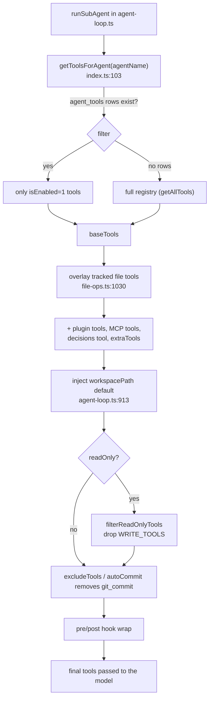

# Agent Tools

Every action an AI agent can take in AgentDesk — reading a file, running a shell
command, moving a kanban card, dispatching another agent — is a **Vercel AI SDK
`tool()`** registered in `src/bun/agents/tools/`. The subsystem has two halves:
a **static registry** of tool families assembled once at module load
(`src/bun/agents/tools/index.ts:41`), and a **per-run binding layer** in
[[agent-engine|agent-loop]] that overlays workspace-, agent-, and session-scoped versions on
top before each agent run. The single most important thing to understand: the
registry holds *placeholder* tools; the tools an agent actually receives are
filtered, workspace-injected, and identity-bound at dispatch time.

## Key idea: a static registry that nobody runs verbatim

`toolRegistry` (`index.ts:41-56`) spreads 14 family modules into one
`Record<name, {tool, category}>`. But three classes of tool in that registry are
deliberately *stubs*:

- **File tools** (`read_file`, `write_file`, `edit_file`, …) in
  `fileOpsTools` (`file-ops.ts:1738`) have no workspace boundary and no change
  tracking. The real ones are produced per-run by `createTrackedFileTools()`
  (`file-ops.ts:1030`) and **override** the registry entries
  (`agent-loop.ts:885,900`).
- **Kanban tools** carry an `actorId` for audit logging, so the registry holds a
  version built with `"unknown"` (`kanban.ts:102`); `getToolsForAgent` rebuilds
  them per agent via `createKanbanTools(agentName)` (`index.ts:111-114`).
- **`request_human_input`** must label the dialog with *who* is asking, so the
  registry holds a `("unknown","Agent")` stub (`communication.ts:60`) and the
  real one is rebuilt with the agent's display name (`index.ts:136-139`).

This is why grep-ing the registry tells you *which* tools exist but not *what an
agent gets* — the answer is computed at runtime.

## How a tool reaches an agent

### Step 1 — role-based filtering (`getToolsForAgent`)

`getToolsForAgent(agentName)` (`index.ts:103`) is the policy gate. It looks up the
agent row, then queries `agent_tools` for that agent id (`index.ts:144-147`):

- **If the agent has rows**, only tools where `isEnabled === 1` survive
  (`index.ts:150-166`).
- **If the agent has zero `agent_tools` rows**, it gets the *entire* registry
  (`index.ts:172-176`). This is the documented "full registry" rule that makes
  `playground-agent` and `issue-fixer` all-powerful — they intentionally have no
  `agent_tools` rows. (Confirmed in `[[agent-roster]]`.)

The agent-bound kanban and communication tools are always overlaid regardless of
filtering (`index.ts:160`, `index.ts:173`). Results are memoised in
`toolConfigCache` (`index.ts:74`); call `clearToolCache(agentName?)`
(`index.ts:82`) when tool assignments change.

#### `create_task` is task-planner-only

`create_task` is restricted to a single agent — the **task-planner**, the sole
author of kanban tasks. `getToolsForAgent` calls `restrictCreateTask`
(`tools/create-task-policy.ts`) on **both** return paths — the allowlist path AND
the zero-rows full-registry path — so it is stripped from every other agent,
*including* full-registry agents like `freelance-expert`, `issue-fixer`, and any
custom agent with no `agent_tools` rows. The PM is handled separately: its tool
set is built inline in `engine.ts` and simply omits `create_task` — when a task
needs creating, the PM spawns the task-planner (its prompt instructs this). The
seed reflects this: `create_task` was removed from the `KANBAN` bundle and added
only to `task-planner`'s allowlist (`seed.ts`), and `seedAgentTools` deletes any
stale `create_task` row from non-planner agents on existing installs. Because
`create_task` is in `WRITE_TOOLS` but the task-planner is read-only, a carve-out
in `agent-loop.ts` (`READ_ONLY_WRITE_EXCEPTIONS`) preserves it for the planner
through the read-only filter. The task-planner uses it for **ad-hoc** direct
creation (no approval card); full plans still go through `define_tasks` →
`create_tasks_from_plan` (the latter inserts via the `createKanbanTask` RPC, not
the `create_task` tool, so it is unaffected).

### Step 2 — per-run overlays (`agent-loop.ts`)

`getToolsForAgent` returns `baseTools` (`agent-loop.ts:873`). Then the loop
layers on the rest (`agent-loop.ts:884-900`), in this merge order (later wins):

1. `baseTools` (the filtered registry)
2. **tracked file tools** — real read/write/edit bound to a fresh `FileTracker`
   and the workspace boundary, plus the skills dir as an allowed read path
   (`agent-loop.ts:884-885`)
3. **plugin tools** + **MCP tools** (`agent-loop.ts:886-888`)
4. **decisions log tool** (only when there's a workspace) (`agent-loop.ts:892-896`)
5. **`extraTools`** — last, so callers like the Playground can override built-ins
   (e.g. swap in an auto-approved `run_shell`) (`agent-loop.ts:900`)

### Step 3 — workspace injection & boundary

Because the Bun process CWD is the Electrobun build dir (not the project),
relative paths would resolve wrong. Two mechanisms fix this:

- `validatePath()` (`file-ops.ts:124`) resolves relative paths against
  `workspacePath` and **throws if the result escapes** the workspace (or an
  allowed path) — a directory-traversal guard applied by every tracked file tool
  via the `vp()` shorthand (`file-ops.ts:1037`).
- The loop wraps `list_directory`, `search_files`, `directory_tree`,
  `search_content`, and `run_shell` to default their dir/cwd argument to the
  workspace (`agent-loop.ts:913-950`), so the model never has to guess the path.

### Step 4 — read-only & exclusion filtering

If `readOnly` (read-only agent, or Plan Mode), `filterReadOnlyTools`
(`agent-loop.ts:261`) drops everything in the `WRITE_TOOLS` set
(`agent-loop.ts:231-240`) — file writes, `run_shell`, mutating git, mutating
kanban, and memory writes. `excludeTools` then removes named tools (supports a trailing `*` prefix
wildcard, `agent-loop.ts:958-964`), and `git_commit` is deleted when auto-commit
is on (`agent-loop.ts:974-981`) since the [[kanban-review-cycle|review-cycle]] commits automatically.

## Tool families

| Family (file) | Representative tools | Category |
|---|---|---|
| `file-ops.ts` (registry `:1738`; tracked `:1030`) | `read_file`, `write_file`, `edit_file`, `multi_edit_file`, `patch_file`, `search_content`, `directory_tree`, `find_dead_code`, `archive`, `download_file` | `file` |
| `shell.ts:286` | `run_shell` (denylist + approval gate) | `shell` |
| `git.ts:728` | `git_status/diff/commit/branch/push/pull/fetch/log/pr/stash/reset/cherry_pick` | `git` |
| `kanban.ts` | `create_task`, `move_task`, `check_criteria`, `verify_implementation`, `submit_review`, `list_tasks`, `get_task` | `kanban` |
| `pm-tools.ts:246` (factory) | `run_agent`, `run_agents_parallel`, `create_project`, doc/conversation/inbox read tools (`list_docs`/`get_doc`/`search_docs`/`create_doc`/`update_doc`/`delete_doc`), `verify_project` | mixed |
| `planning.ts:118` | `define_tasks` (pre-approval definitions) | `kanban` |
| `notes.ts:42` | `create_doc`, `update_doc`, `list_docs`, `get_doc`, `delete_doc` (+ run-scoped decisions tool) | `notes` |
| `web.ts:337` | `web_search` (Tavily key → Tavily, else DuckDuckGo), `web_fetch`, `http_request` | `web` |
| `lsp.ts:275` | `lsp_diagnostics/hover/definition/references/document_symbols` | `file` |
| `skills.ts:38` | `read_skill`, `find_skills` | `skills` |
| `memory.ts` (stubs `:memoryTools`; bound `createMemoryTools`) | `save_memory`, `recall_memory`, `delete_memory` | `memory` |
| `process.ts:439` | `run_background`, `check_process`, `kill_process`, `list_background_jobs` | `process` |
| `scheduler.ts:42` | `create_cron_job` (+ schedule mgmt) | — |
| `screenshot.ts:294` | `take_screenshot`, `read_image` | `web`/`file` |
| `system.ts:189` | `environment_info`, `get_env`, `get_agentdesk_paths`, `sleep` | `system` |
| `communication.ts:13` (factory) | `request_human_input` | `communication` |

`pm-tools.ts` and `kanban`/`communication` are **factories** that close over
project/conversation deps; they are not in the static registry's spread.

## Cross-cutting mechanics worth knowing

**Output truncation (`truncation.ts`).** The single biggest token saver: any large
tool result is capped (default 500 lines / 40 KB, `truncation.ts:89-90`), the full
output written to `truncated-outputs/` on disk, and the model gets a preview plus a
hint to re-read a range (`truncation.ts:144-153`). Presets exist for shell (200
lines, *tail*), search (50), and tree (300) (`truncation.ts:161-178`).

**Encoding-robust editing (`text-edit.ts`).** `edit_file`, `multi_edit_file`,
and `patch_file` match a model-supplied `old_text` against the on-disk file — and
the model rarely reproduces the file's exact bytes. The hard cases, all handled by
the pure helpers in `text-edit.ts` (`literalReplace`, `detectEol`, `toLf`,
`fromLf`): **(1) line endings** — Windows files are CRLF but LLMs emit LF, so a
naive `content.includes(oldText)` fails with "old_text not found" (this is what
historically pushed agents into `useRegex=true` and the follow-on "invalid regex:
missing )" on unbalanced parens). `literalReplace` tries an exact match first
(byte-preserving), then retries with `old_text`/`new_text` converted to the file's
detected EOL, then a fully LF-normalised match as a last resort — and always
re-emits the edited region in the file's own EOL. **(2) BOM** — Bun's `.text()`
*strips* a leading UTF-8 BOM, so editing tools read via `readFileText`
(`file-ops.ts:23`) which re-prepends the BOM from the raw bytes; `literalReplace`
and `patch_file` then strip it for matching and restore it on write, so the BOM
survives the edit. **(3) `$` in the replacement** — `String.prototype.replace(str,
str)` still expands `$&`/`$1`/`$$`, so the helper splices with `indexOf`/`slice`
(or `split`/`join` for `replace_all`) instead, keeping `new_text` literal.
`patch_file` matches hunks in LF space (a CRLF file would otherwise leave a
trailing `\r` on every line and never match LF context) and re-joins with the
file's EOL + BOM. Covered by `tests/tools/text-edit.test.ts` (deterministic) plus
an optional, network-gated live smoke driven by the free OpenCode provider
(`tests/tools/edit-tools-smoke.test.ts`, run with `OPENCODE_SMOKE=1`). `useRegex`
remains an explicit opt-in escape hatch and is unchanged.

**File freshness tracking (`file-tracker.ts`).** One `FileTracker` per agent run
(`agent-loop.ts:884`) stores each touched file's mtime. Before an edit,
`checkFreshness()` (`file-tracker.ts:53`) compares stored vs disk mtime to detect
a concurrent external modification, and `getModifiedFiles()` (`file-tracker.ts:81`)
feeds `filesModified` (used for the [[agent-engine|handoff]] summary). Never persisted.

**Shell safety (`shell.ts`).** `run_shell` rejects a hardcoded denylist of
destructive commands (`shell.ts:12-19`) before anything else, then passes through
an approval gate (`shell.ts:185-197`) unless built with `autoApprove` — the
auto-approved variant (`autoApprovedShellTool`, `shell.ts:284`) is a *separate
tool instance* for the Playground/freelance contexts so the gate is removed at the
tool level, not via shared mutable state. The shell is resolved per-platform (Git
Bash on Windows, `shell.ts:49-103`) and killed as a process tree on abort/timeout.

**Ignore filter (`ignore.ts`).** All file-discovery tools share `ALWAYS_IGNORE`
(`ignore.ts:17-45`, e.g. `node_modules`, `dist`, `.git`) plus nested `.gitignore`
parsing, so searches/trees skip junk by default.

**`run_agent` orchestration guards (`pm-tools.ts:254`).** The PM's dispatch tool is
where the sequential-agent model is enforced: a closure `writeAgentRunning`
(`pm-tools.ts:249`), a module-level `dispatchingAgents` set that closes the
Promise.all parallel-dispatch race (`pm-tools.ts:240,346-364`), Plan-Mode
read-only enforcement (`pm-tools.ts:375-382`), and a block on dispatch while a task is
in `review` (`pm-tools.ts:405-419`). When dispatching a kanban task, `run_agent`
also records which conversation the task runs in via `setTaskConversation`
(`pm-tools.ts:522-524`) so the [[kanban-review-cycle|review cycle]] posts the
code-reviewer's activity into the task's own conversation rather than the PM's
active one. See [[agent-engine]] for the full PM loop.

**Agent memory (`memory.ts`).** `save_memory`/`recall_memory`/`delete_memory` give
each agent a durable per-(agent + project) store (table `agent_memories`),
separate from `log_decision` (project-wide architectural decisions) and `notes`
(docs). They follow the **stub-in-registry + per-run overlay** pattern (like
kanban/communication): the registry holds inert stubs (so they appear in tool
listings + the `agent_tools` allowlist + the defaults), and the agent-loop
overlays the identity/project-bound versions from `createMemoryTools(agentName,
projectId)` over them — *only for names already present after allowlist
filtering, and only when a `projectId` exists* (`agent-loop.ts`, next to the
decisions binding). `save_memory`/`delete_memory` are in `WRITE_TOOLS`, so
read-only agents keep only `recall_memory`. A bounded **index** (title +
description of the ~30 most-recent memories) is injected into the system prompt
every run by `buildMemoryIndexSection()` (`prompts.ts`), so a stateless agent
knows what it saved; full bodies are pulled on demand by `recall_memory`. Size is
guarded in `memory.ts` (2 KB content cap, dedup-by-title upsert, soft cap 50 /
hard cap 100 with cold-memory LRU eviction). Defaults wired in `seed.ts`
(`MEMORY` appended to every interactive agent; backfilled to existing installs by
`seedAgentTools`) and `rpc/agents.ts` (`DEFAULT_CUSTOM_AGENT_TOOLS`).

## Key files

| File | Role |
|---|---|
| `src/bun/agents/tools/index.ts` | Static registry assembly + `getToolsForAgent` role filter + tool cache |
| `src/bun/agents/tools/memory.ts` | Agent memory: store + caps + `save/recall/delete_memory` (stubs + `createMemoryTools` overlay) + `buildMemoryIndexSection` |
| `src/bun/agents/agent-loop.ts` | Per-run overlay, workspace injection, read-only/exclude filtering, hook wrap |
| `src/bun/agents/tools/file-ops.ts` | File tools; `validatePath` boundary + `createTrackedFileTools` factory + `readFileText` (BOM-preserving read) |
| `src/bun/agents/tools/text-edit.ts` | Pure EOL/BOM-robust literal find/replace helpers used by the edit tools (`literalReplace`, `detectEol`, `toLf`, `fromLf`) |
| `src/bun/agents/tools/file-tracker.ts` | Per-run mtime freshness tracking + modified-file list |
| `src/bun/agents/tools/truncation.ts` | Disk-overflow output capping (token control) |
| `src/bun/agents/tools/shell.ts` | `run_shell` denylist, approval gate, cross-platform shell |
| `src/bun/agents/tools/pm-tools.ts` | PM-only factory: `run_agent`, parallel dispatch, project/doc/inbox tools |
| `src/bun/agents/tools/kanban.ts` | Kanban CRUD + verification/review tools (actor-bound) |
| `src/bun/agents/tools/communication.ts` | `request_human_input` (identity-bound factory) |
| `src/bun/agents/tools/planning.ts` | `define_tasks` pre-approval store (`peek/drain/restore`) |
| `src/bun/agents/tools/ignore.ts` | Shared `.gitignore` + always-ignore filter for discovery tools |

## Gotchas / Constraints

- **Registry file/kanban/communication entries are stubs.** Do not assume the
  registry's `read_file` has a workspace boundary or that registry kanban tools
  audit correctly — only the per-run overlays do (`index.ts:111-139`,
  `agent-loop.ts:885`).
- **Zero `agent_tools` rows = full registry, not no tools.** This is intentional
  (custom agents, `playground-agent`, `issue-fixer`) but surprising
  (`index.ts:172-176`). Adding a single `agent_tools` row flips the agent into
  allowlist mode and may strip everything else.
- **Tool cache is manual.** Changing `agent_tools` requires `clearToolCache()`
  or assignments appear stale within a session (`index.ts:82`).
- **Read-only filtering is name-based.** `filterReadOnlyTools` keys off the
  `WRITE_TOOLS` set (`agent-loop.ts:231`); a new write-capable tool not added to
  that set will leak to read-only agents.
- **`run_shell` denylist is substring matching** (`shell.ts:21-24`) — it is a
  guardrail against accidents, not a sandbox. The approval gate + workspace cwd
  are the real containment.
- **`define_tasks` does not touch the board.** Definitions sit in an in-memory
  map keyed by project id (`planning.ts:69`) until the PM drains them after
  approval — they are lost on restart.
- **Doc create/update/delete is check-then-act, not atomic.** `create_doc` has
  no unique constraint on `(project_id, title)` — nothing at the tool or DB
  layer stops two agents from both calling `list_docs` (seeing no match),
  then both calling `create_doc` for the same title. This has been observed
  in practice with parallel `code-explorer` runs (`READ_ONLY_AGENTS`, run via
  `run_agents_parallel`) both writing `project-knowledge- Tech Stack` at
  once, producing duplicates. The current mitigation is prompt-level only
  (`agent-loop.ts`'s `AGENT_COMMUNICATION_PROTOCOL`/`READONLY_AGENT_COMMUNICATION_PROTOCOL`
  in `prompts.ts`, and `code-explorer`'s own instructions in `seed.ts`, all
  say: `list_docs` → `get_doc` the match → merge via `update_doc`; only
  `create_doc` when nothing matches). `delete_doc` (`notes.ts`, `pm-tools.ts`)
  exists for curating stale/duplicate/wrong docs but is not itself a race fix.
  A durable fix would need a DB-level upsert-by-title or unique index — not
  yet implemented.

## Related
- [[agent-engine]]
- [[kanban-review-cycle]]
- [[agent-roster]]

## Open questions
- Plugin/MCP tool loading (`getPluginTools`, `getMcpTools`) is overlaid here but
  documented elsewhere — needs a [[plugins]] / [[mcp]] page to cross-link.
- The full kanban verification/review state machine (`verify_implementation` →
  `submit_review` → `done`) is summarised here but belongs to [[kanban-review-cycle|review-cycle]].
