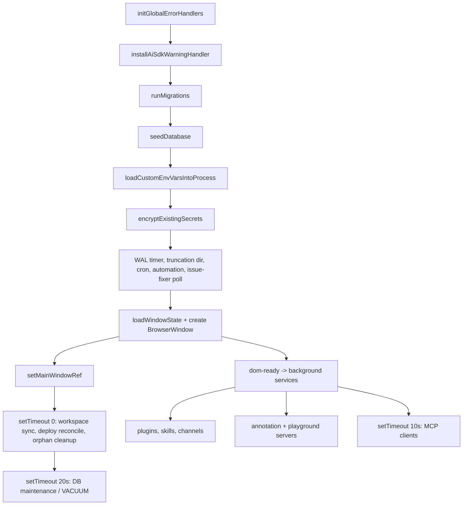

# Backend Core & Entry

This is the Bun **main process**: the single `index.ts` that boots the whole app,
the `EngineManager` that caches one [[agent-engine]] per project and owns the
global abort + human-in-the-loop plumbing, the small shared `lib/*` utilities
every feature depends on, and the in-app **annotation/preview** server. The most
important thing to understand is the **startup ordering contract**: the only work
that runs *synchronously before the window is created* is what's required for
correctness (DB migrate → seed → secret encryption → cron/automation); everything
that does network or heavy disk I/O (plugins, skills, channels, MCP, freelance,
the local servers) is deferred to the webview's `dom-ready` so the window appears
fast and nothing slow can block it.

## Startup sequence (`index.ts`)

`index.ts` is a top-level-`await` module, so its statements *are* the boot script
— order on the page is order at runtime.

### 1. Synchronous critical path (`index.ts:137`–`index.ts:182`)
Global error handlers install first (`index.ts:137`) so nothing later throws
unlogged. Immediately after, `installAiSdkWarningHandler()` (`db/error-logger.ts`)
claims the Vercel AI SDK's `globalThis.AI_SDK_LOG_WARNINGS` seam — routing every
SDK warning to the console in the `dev` channel and to `error.log` with a
`[WARNING]` prefix in production/canary — before any inference can fire with the
SDK's default logger. Then the DB pipeline runs in strict order: `runMigrations()` →
`await seedDatabase()` → `loadCustomEnvVarsIntoProcess()` → `encryptExistingSecrets()`
(`index.ts:142`–`index.ts:145`). The secret-encryption pass must run *after* seed
but *before* anything reads credentials. After that the cheap, fire-on-time
services start early so health checks pass and scheduled jobs aren't late: WAL
checkpoint timer (`index.ts:158`), truncation dir (`index.ts:161`), cron scheduler
+ automation engine (`index.ts:167`–`index.ts:170`), and Issue Fixer polling
(`index.ts:173`). `setTaskExecutorEngine(getOrCreateEngine)` (`index.ts:167`) is
the wiring point that lets the scheduler dispatch into the engine layer.

### 2. Window creation (`index.ts:185`–`index.ts:206`)
`loadWindowState()` restores the persisted frame from
`<userData>/window-state.json` (`index.ts:52`), falling back to a centered default
on the primary display. `getMainViewUrl()` (`index.ts:115`) decides between the
Vite dev server (`http://localhost:5173`, retried up to 15s in the `dev` channel)
and the bundled `views://mainview/index.html`. **`isDevMode` is derived purely
from whether that URL is localhost** (`index.ts:190`) — it gates DevTools and the
right-click context menu. Immediately after construction,
`setMainWindowRef(mainWindow)` (`index.ts:206`) hands the window to the
EngineManager so engine callbacks can broadcast RPC.

### 3. DB maintenance split (the "never block the window, never flash a modal" rule)
Maintenance is deliberately split by cost profile:
- **Incremental optimize** (`runIncrementalMaintenance` — `PRAGMA optimize` +
  passive WAL checkpoint) runs **synchronously BEFORE** `new BrowserWindow`,
  every startup. It is cheap (near-instant when nothing changed, the SQLite-
  recommended cadence), so running it pre-window keeps it **invisible** — no
  overlay, no skeletons — at the cost of a sub-second-ish delay before the window
  appears.
- **Full VACUUM** (7-day gated, `maybeVacuumInBackground` → worker thread) is
  deferred to `setTimeout(20_000)` post-window via `maybeRunStartupMaintenance()`
  so it never competes with the initial UI/agent load. It rewrites the whole DB
  file (duration scales with size) and holds a lock that stalls queries app-wide,
  so it is the one startup op that shows the overlay — but only when actually due.

A `setTimeout(0)` (`index.ts`) also pushes workspace folder sync, stuck-deploy
reconcile, and an orphaned-`workflow:%`-settings cleanup off the boot path.

**Maintenance overlay.** Because VACUUM (and the manual Settings ops) hold a DB
lock and stall queries app-wide, they drive a **global overlay** instead of bare
skeletons: `db/maintenance-state.ts` tracks an `{active,message}` flag and
broadcasts `maintenance` via `broadcastToWebview`; `MaintenanceOverlay` (mounted
in the AppShell) shows a non-closeable "please wait" panel over every page
(blocking mouse + keyboard + scroll) and syncs initial state via the
`getMaintenanceStatus` RPC (so a reload mid-maintenance still shows it). It is
shown ONLY by the rare 7-day VACUUM and by the **manual** optimize/vacuum/prune
RPCs (user-clicked in Settings); the pre-window incremental optimize and the
periodic WAL checkpoint never show it.

### 4. Background services on `dom-ready` (`index.ts:237`–`index.ts:301`)
A `backgroundServicesInitialised` boolean guards this block so it runs once. On
DOM ready the window maximizes, the Win32 titlebar icon is set via FFI
(`setWindowTitlebarIcon`, `index.ts:381` — a `user32.dll` `WM_SETICON` call), and
in production a `contextmenu` preventDefault is injected to remove Inspect Element.
Then, in order: `initPlugins()` → `skillRegistry.loadAll()` → register channel
adapters + `initChannelManager` (fire-and-forget so a slow WhatsApp reconnect
can't stall the rest) → **MCP clients delayed another 10s** (`index.ts:277`, so
spawning external servers like chrome-devtools doesn't fight the UI load) →
annotation + playground static servers → optional freelance poller + Auto-Earn
watchdog (both self-gated on the freelance flag).

### 5. Navigation lockdown (`index.ts:306`)
`setNavigationRules` blocks all navigation by default and allow-lists only
`views://*`, `http://localhost:*`, and `http://127.0.0.1:*`. This is a security
boundary: AI-generated content (preview/playground) can never redirect the main
window to an arbitrary external origin.

### 6. Shutdown (`index.ts:344`)
`before-quit` saves the final window frame, then tears down every long-lived
service (channels, cron, automation, issue-fixer, MCP, preview window, annotation
+ playground servers) and finally `closeDatabase()` so WAL is checkpointed
cleanly. Window `close` calls `Utils.quit()` (`index.ts:336`), which routes
through this handler.

## EngineManager — engine cache + control plane (`engine-manager.ts`)

`getOrCreateEngine(projectId)` (`engine-manager.ts:459`) is the single factory for
`AgentEngine` instances; they live in the module-level `engines` Map
(`engine-manager.ts:19`). On a cache miss it first calls `evictOldestIdleEngine()`
(`engine-manager.ts:215`) — when the map exceeds `ENGINE_MAP_MAX_SIZE` (50,
`engine-manager.ts:194`) it evicts the first **idle** engine (not processing, zero
running agents); if all 50 are busy the map is allowed to grow temporarily. The
factory wires the engine's huge `AgentEngineCallbacks` object (`engine-manager.ts:464`)
— every callback funnels through `broadcastToWebview` (`engine-manager.ts:252`),
and the abort hooks (`registerAgentAbort`/`unregisterAgentAbort`/`setAbortAgentsFn`,
`engine-manager.ts:625`) connect the engine to the global abort registry below.

### Global abort registry (`engine-manager.ts:30`–`engine-manager.ts:91`)
`runningAgentControllers` is a `Map<projectId, Map<AbortController, entry>>`.
`registerAgentController`/`unregisterAgentController` keep it current as agents
start/stop; `abortAllAgents` (used by stopGeneration) and `abortAgentByName` (stop
one agent) are the two cancellation entry points. `getRunningAgentCount` /
`getRunningAgentNames` / `getAllRunningAgents` / `getSystemActivity`
(`engine-manager.ts:97`) read this registry — `getSystemActivity` also asks each
live engine `isProcessing()` and `getQueuedAgentsSnapshot()` to report
PM-streaming + queued state, and `getStatusReport` (`engine-manager.ts:127`) turns
all of that into the markdown for the `/info` slash command and the dashboard
widget.

### Human-in-the-loop: shell approval + user questions
Two near-identical "broadcast a request, return a Promise, resolve from an RPC"
patterns live here:
- **Shell approval** (`engine-manager.ts:333`): `installShellApprovalHandler`
  (called at module load, `engine-manager.ts:372`) wires the shell tool. It reads
  the project's `shellApprovalMode` setting (`engine-manager.ts:315`); `"auto"`
  returns `"allow"` immediately, `"ask"` broadcasts `shellApprovalRequest` + an OS
  toast and returns a Promise that the RPC `resolveShellApproval`
  (`engine-manager.ts:299`) settles. **Auto-denies after 5 minutes** so a missed
  prompt never deadlocks an agent.
- **User questions** (`askUserQuestion`, `engine-manager.ts:416`): same shape for
  the PM/agent `request_human_input` modal. `timeoutMs` is tunable — autonomous
  background agents (freelance, issue-fixer) pass a short window so an absent user
  doesn't stall the run; on timeout it broadcasts `userQuestionCancel` to close the
  stale dialog and resolves with a "timed out" string.

### Channel relay + activity (in the `onStreamComplete` callback)
When a PM turn completes, the callback (`engine-manager.ts:479`) records chat
activity, and if the originating message came from a channel (`meta.source !==
"app"`) it chunks the reply and relays it back via `sendChannelMessage`, then
`linkAgentResponseToInbox` (`engine-manager.ts:268`) attaches the reply to the
latest unanswered inbox row using raw SQL. A `setTimeout(0)` desktop notification
fires only when everything is idle **and the app is not focused** (`appFocused`,
`engine-manager.ts:118`, toggled by the `setAppFocused` RPC) and the
`session_complete_notification` setting is on.

> `activeProjectId` (`engine-manager.ts:293`) is set on every `getOrCreateEngine`
> call and is what the shell-approval handler keys off. It is a single global, so
> it reflects whichever project most recently created/fetched an engine.

## Shared lib utilities (`lib/*`)

| Module | What it does (and the non-obvious bit) |
|---|---|
| `git-runner.ts` | `runGit(args, cwd, signal)` — the canonical `Bun.spawn(["git", …])` wrapper used by both RPC handlers and agent git tools. Reads stdout/stderr/exit in parallel and kills the process on abort (`git-runner.ts:11`). Does **not** add token auth — callers prefix `gitAuthArgs`/`githubAuthPrefix` themselves (see [[github-token-auth|github-auth]]). |
| `secret-crypto.ts` | App-wide AES-256-GCM encryption at rest. The 32-byte master key lives in `<userData>/remote-sync.key` (mode `0o600`) — **separate from the DB** so leaking `agentdesk.db` alone exposes nothing. Blob layout `[12-IV][16-tag][ciphertext]` with `enc:v1:` prefix (`secret-crypto.ts:69`). `decryptSecret` passes plaintext through unchanged so legacy/manual values still read (`secret-crypto.ts:79`). The key file is named for Remote Sync only for historical continuity (`secret-crypto.ts:11`). |
| `encrypt-existing-secrets.ts` | One-time, idempotent startup migration that encrypts any plaintext per-project GitHub tokens (`project:%:githubToken`) and issue-source configs (`issueSource:%`) still in the `settings` table (`encrypt-existing-secrets.ts:18`). Skips already-`enc:v1:` rows; best-effort, never blocks startup. |
| `install-mode.ts` | Classifies the Windows build. Setup.exe and the portable zip are byte-identical app bundles, so the **only** distinguishing signal is location: an installed build runs from `<userData>\app\` (`install-mode.ts:24`). Non-Windows always counts as "installed" (single distribution form) so the Electrobun update path is used. |
| `path-utils.ts` | `isPathAccessible(path, retries=2)` — `statSync` with retry/backoff for cloud-synced/NAS paths (OneDrive/Dropbox) that may be momentarily unavailable at startup (`path-utils.ts:15`). Uses `statSync` (readability) not `existsSync` (placeholder may exist). |

## Annotation & preview subsystem (`annotations/*`)

This is AgentDesk's in-app "comment on the running UI" loop — a self-hosted
replacement for chrome-devtools MCP previews.

- **`server.ts`** — a `Bun.serve` on port **4748** (falls back through 4749–4752
  if taken, `annotations/server.ts:23`). It serves `/toolbar.js` (IDs baked in),
  proxies the user's dev server or `file://` page through `/preview` and injects
  the toolbar so it survives refresh/navigation (`injectToolbar`,
  `server.ts:86`), serves local assets via `/file-serve/` to dodge mixed-content
  blocking, buffers runtime console errors per-conversation via `/preview-events`
  (`server.ts:209`), and on `POST /annotations` formats the batch (plus any
  buffered console events) and feeds it straight into the engine via
  `getOrCreateEngine(projectId).sendMessage(...)` (`server.ts:411`) — creating a
  conversation if needed. Idle timeout is bumped to 120s because real dev servers
  (Laravel/Django) can be slow on a cold first request (`server.ts:283`).
- **`preview-window.ts`** — a **singleton** Electrobun `BrowserWindow`
  (`previewWin`, `preview-window.ts:41`) that loads the proxy URL. Re-running
  `/preview` reuses + navigates it (`openPreviewWindow`, `preview-window.ts:309`).
  It persists its own frame, polls `document.title` every 2s to mirror it into the
  native title (`preview-window.ts:137`), re-injects a console hook after every
  `dom-ready` so errors flow back to `/preview-events` (`preview-window.ts:98`),
  and for `projectType === "static"` runs a debounced `fs.watch` reload for cheap
  HMR (`preview-window.ts:172`).
- **`toolbar-script.ts`** — the self-contained shadow-DOM toolbar string. It
  intercepts local link clicks and routes them back through the proxy so the
  toolbar persists across navigation (`toolbar-script.ts:17`).

## Gotchas / Constraints

- **Startup order is a contract, not a coincidence.** Reordering `index.ts:142`–
  `index.ts:145` (migrate → seed → env → encrypt) breaks invariants: secrets
  must encrypt after seed but before any reader, and cron must start after the DB
  exists. Anything network/disk-heavy belongs in the `dom-ready` block, not the
  synchronous path.
- **`activeProjectId` is a single global.** The shell-approval handler keys off
  whichever project last called `getOrCreateEngine` (`engine-manager.ts:460`). With
  concurrent multi-project agent runs this is the project to suspect for a
  mis-routed approval prompt.
- **Approvals + user questions auto-resolve.** Shell approval auto-*denies* after
  5 min (`engine-manager.ts:361`); user questions auto-resolve with a timeout
  message. Nothing waits forever — but a "denied" shell or "no answer" string can
  surface as a confusing agent failure if a human just didn't notice the prompt.
- **The abort registry is in-memory and per-project.** App restart clears all
  running-agent state; `engines`, the controller map, and `appFocused` are module
  globals with no persistence.
- **`broadcastToWebview` is fire-and-forget through an `any` ref.** Electrobun's
  exported types don't expose `webview.rpc.send.<method>` statically, so it's
  routed through `mainWindowRef: any` (`engine-manager.ts:230`,`engine-manager.ts:254`)
  and silently swallows errors when the window is gone. A typo in a method name
  fails silently.
- **The annotation server feeds the engine directly.** A `POST /annotations`
  bypasses the chat UI entirely and calls `sendMessage` (`server.ts:411`); it is
  CORS-open to `*` including `null` origins (`server.ts:30`) because it must accept
  `file://` pages — keep it bound to localhost only.
- **Win32 titlebar icon uses raw FFI.** `setWindowTitlebarIcon` (`index.ts:381`)
  `dlopen`s `user32.dll`; it's wrapped in try/catch and purely cosmetic, but it
  depends on `FindWindowW` matching the window title exactly ("AgentDesk").
- **The `workflow:%` settings cleanup is permanent.** `index.ts:218` deletes
  orphaned settings from the removed WorkflowEngine on every boot — don't reuse
  that key prefix.

## Related
- [[agent-engine]]
- [[database]]
- [[channels]]
- [[rpc-layer]]
- [[providers]]
- [[github-token-auth]]

## Global error & AI-SDK-warning logging (`db/error-logger.ts`)
`logError()` appends structured entries to `<userData>/logs/error.log`
(auto-rotated at 5 MB, 2 old files kept) and mirrors non-fatal errors into the
audit log for in-app visibility. `initGlobalErrorHandlers()` binds
`uncaughtException` (logs + `process.exit(1)`) and `unhandledRejection` (logs,
does not exit; suppresses the benign "Controller is already closed" abort race).
`installAiSdkWarningHandler(isDevMode)` sets `globalThis.AI_SDK_LOG_WARNINGS` to a
custom logger so AI SDK warnings are formatted identically to the SDK default
(`AI SDK Warning (provider / model): …`) but routed by channel: **dev → console**,
**prod/canary → `error.log` as `[WARNING] …`**. Installing our own function also
suppresses the SDK's one-time "To turn off warning logging…" banner.

## Open questions
- `db/maintenance.ts` (`maybeRunStartupMaintenance`) is invoked here but its
  internals weren't opened — document what maintenance actually runs.
- `windows-registry.ts` (`registerWindowsUninstaller`) is called at startup but
  not studied; pairs with `install-mode.ts` and deserves a short note on the
  uninstaller entry it writes.
- The Playground static server (`playground/server.ts`) and orchestrator are
  referenced from `index.ts` but documented elsewhere; confirm a [[playground]]
  page exists and cross-link it.
