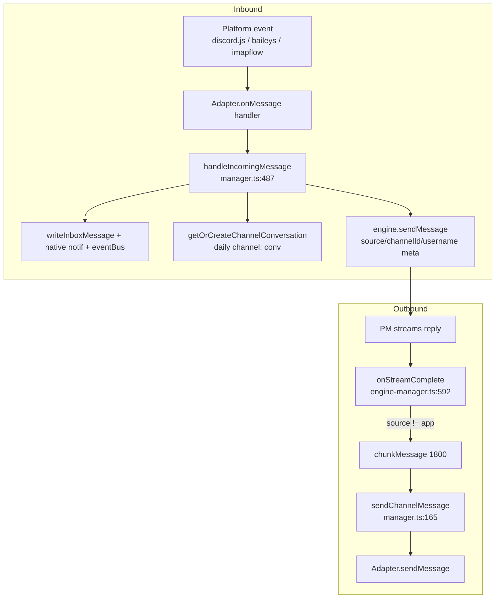

# External Channels

**What & why.** The channels subsystem lets a human talk to a project's PM agent
from outside the app — over Discord, WhatsApp, or Email — and get the agent's
reply back on the same platform. It is a thin **adapter layer** (one class per
platform behind a single `ChannelAdapter` interface) plus a **module-level
singleton manager** that owns the registry of live adapters, routes inbound
messages into the [[agent-engine]], and pushes outbound replies/notifications
back out. The single most important idea: **the manager is platform-agnostic**;
every platform quirk (Discord snowflakes vs. WhatsApp JIDs vs. email
addresses/threading) is isolated either inside the adapter or behind a handful of
explicit `platform === "..."` branches in the manager.

## Key idea: the ChannelAdapter contract

Every platform implements the same interface (`src/bun/channels/types.ts:30`):
`connect` / `disconnect` / `getStatus` / `sendMessage` / `onMessage`, plus an
**optional** `getDefaultRecipient()` (`types.ts:38`) used only for proactive
notifications when no one has messaged us yet. The manager only ever talks to an
adapter through this contract — it never imports `discord.js`, `baileys`, or
`imapflow` directly. Adapters are supplied as **factories** (`AdapterFactory`,
`manager.ts:34`) registered at startup in `src/bun/index.ts:285-287`, so the
manager can mint a fresh instance per channel row without knowing the concrete
class.

## How it works

### Startup / connect
`initChannelManager` (`manager.ts:93`) is the boot path: it loads every
`channels` row where `enabled = 1`, looks up the registered factory for that
platform, builds a `ChannelConfig` (parsing the JSON `config` column via
`parseJsonConfig`, `manager.ts:712`), calls `adapter.connect(config)`, then wires
`adapter.onMessage(...)` to the inbound pipeline. Live adapters are kept in three
module-level maps keyed by `channelId`: `activeAdapters`, `channelConfigs`, and
(for reply threading) `lastInboundContext` (`manager.ts:54-69`).
`connectSingleChannel` (`manager.ts:378`) does the same for one channel after
startup (e.g. when a user saves a new config), guarded by a `connectingChannels`
set against concurrent connects.

### Inbound routing — the heart of it
`handleIncomingMessage` (`manager.ts:487`) is the unified pipeline for all three
platforms:
1. Persist to the inbox (`writeInboxMessage`), emit a `message:received` event,
   fire a native OS notification (`manager.ts:492-509`).
2. Stash **reply context** in `lastInboundContext` — `threadId`, `subject`,
   `senderId`, and (Discord only) `msgChannelId` so outbound replies go to the
   originating channel snowflake, not the username (`manager.ts:511-519`).
3. **Resolve the target project with zero config required**: channel's own
   `projectId` (bound mode) → `default_channel_project_id` setting (explicit
   override) → a dedicated per-platform **`<Platform> Chat`** project for global-mode
   channels (`getOrCreateGlobalChannelProject`, created on first use + reused), with a
   first-project safety net only if that project can't be created (`manager.ts:521-555`).
   This is why channels "just work" out of the box.
3.5. **Pending-interaction interception** (before any engine forwarding):
   `getPendingChannelInteraction(routingProjectId)` (from [[notifications]],
   `engine-manager.ts`) checks whether an `askUserQuestion` or shell-approval
   request is currently blocked awaiting a human answer for this project — both
   were proactively pushed to every connected channel when raised, gated by the
   `question_channel_notify` setting. If one is pending (and the setting is
   still on), this inbound message is treated as the answer instead of a new
   chat turn: a question resolves via `resolveUserQuestion(requestId,
   msg.content.trim())`; a shell approval is parsed by `parseShellDecision`
   (keywords `allow`/`approve`/`yes` → allow, `deny`/`reject`/`no` → deny,
   `always` → always; unrecognized text re-prompts instead of guessing) and
   resolved via `resolveShellApproval`. Either way a short confirmation is sent
   back via `sendChannelMessage` and the function returns early — the message
   never reaches step 4/5 below. This is the **only** channel-reply round trip
   in the system; a reply to an in-app plan-approval channel push, by
   contrast, is NOT intercepted here (see [[notifications]]'s Gotchas) and
   falls through to the normal engine-forwarding path.
4. Ensure a **daily conversation** exists (`getOrCreateChannelConversation`,
   `manager.ts:653`) titled `Platform - YYYY-MM-DD` with a `channel:`-prefixed
   composite ID (`channel:{channelId}:{projectId}:{date}`) so the backend can
   detect channel-sourced conversations and so the same channel used across
   projects never collides.
5. Forward to the engine with a `[platform thread:...] sender: ` prefix prepended
   to the content (`manager.ts:560`) and `{ source, channelId, username }`
   metadata (`manager.ts:582-585`) — the `channelId` here is the **config UUID**,
   used later by the engine-manager to find the adapter for the reply.

### Outbound — replies and notifications
There is no reply call inside the manager's inbound path. Instead, when the PM
finishes streaming, `EngineManager`'s `onStreamComplete`
(`engine-manager.ts:592`) checks the active metadata: if `source !== "app"` and a
`channelId` is present, it splits the reply with `chunkMessage`
(`engine-manager.ts:611`) and calls `sendChannelMessage`. This decouples the
agent loop from any channel knowledge.

`sendChannelMessage` (`manager.ts:165`) looks up the adapter, then reconstructs
the recipient and threading from `lastInboundContext`: Discord replies to
`msgChannelId`, WhatsApp/Email reply to `senderId`; email gets a `Re:` subject and
`replyToMessageId` (`manager.ts:176-196`). WhatsApp outbound is prefixed with a
`🤖 *AgentDesk PM:*` label so AI replies are visually distinct from the user's own
green bubbles.

`broadcastTaskDoneNotification` (`manager.ts:209`) and
`broadcastSchedulerResult` (`manager.ts:250`) are the **proactive** outbound paths
(not a reply to anything): they iterate all `connected` adapters. Discord always
has a target (the configured channel snowflake in `config.channelId`); WhatsApp
uses `getDefaultRecipient()` (self JID) and Email needs a prior inbound context
(it has no standing recipient), so it silently skips if none exists.

### Per-platform specifics
- **Discord** (`discord-adapter.ts`, `discord/bot.ts`): wraps a `discord.js`
  `Client` with Guilds/GuildMessages/**MessageContent** intents (`bot.ts:21`).
  Ignores bot authors (`bot.ts:36`), passes channelId/username/content up.
  Reconnect is exponential backoff capped at 30s, recreating the client each time
  to avoid an `InvalidStateError` race (`bot.ts:68-87`).
- **WhatsApp** (`whatsapp-adapter.ts`): Baileys multi-device socket; auth state
  persisted via `useSQLiteAuthState` (`whatsapp-auth-store.ts`). Emits the
  pairing **QR** through `onQR`, which the manager renders to a PNG data URL and
  broadcasts (`broadcastQR`, `manager.ts:471`). Only processes `type === "notify"`
  (not history sync), does **echo prevention** by tracking sent message IDs
  (`whatsapp-adapter.ts:94`), and resolves `@lid` → phone JID for self-chat
  (`whatsapp-adapter.ts:108`). Reconnect: 5 attempts, exponential from 5s.
- **Email** (`email-adapter.ts`): IMAP (`imapflow`) IDLE loop + SMTP
  (`nodemailer`). Tracks `lastProcessedUid` and fetches `UID > last` so it is
  immune to another mail client marking messages seen first
  (`email-adapter.ts:89-106`). A 60s timer breaks IDLE as a polling fallback
  (`email-adapter.ts:114-119`). Bodies are parsed straight from the raw source
  with a regex for the `text/plain` part, handling base64/quoted-printable
  (`email-adapter.ts:147-168`). Threading via `inReplyTo`/`messageId`.

## Key files

| File | Role |
|---|---|
| `src/bun/channels/manager.ts` | Singleton: adapter registry, connect lifecycle, inbound routing, outbound + broadcast |
| `src/bun/channels/types.ts` | `ChannelAdapter` interface + `IncomingMessage`/`SendOptions`/`ChannelConfig` |
| `src/bun/channels/discord-adapter.ts` | Discord adapter wrapping `DiscordBot` |
| `src/bun/discord/bot.ts` | `discord.js` client wrapper (intents, reconnect, send) |
| `src/bun/channels/whatsapp-adapter.ts` | Baileys socket, QR, echo prevention, JID resolution |
| `src/bun/channels/email-adapter.ts` | IMAP IDLE inbound + SMTP outbound, UID watermark |
| `src/bun/channels/chunker.ts` | `chunkMessage` — natural-boundary split (default 1800 chars) |
| `src/bun/channels/index.ts` | Public barrel (register/init/send/status/shutdown) |
| `src/bun/index.ts:285` | Registers the three adapter factories at boot |
| `src/bun/engine-manager.ts:592` | Relays PM stream-complete back to source channel |

## Gotchas / Constraints

- **Replies are not sent by the manager's inbound path.** The return trip lives in
  `EngineManager.onStreamComplete` (`engine-manager.ts:592`). If a message is
  routed into the engine but `getActiveMetadata().source === "app"` or the
  `channelId` is missing, nothing goes back out the channel.
- **`channelId` is overloaded.** In `IncomingMessage` from WhatsApp/Email it is
  the sender JID/address; from Discord it is the originating snowflake; but in the
  engine metadata it is the **config row UUID**. The recipient for outbound is
  re-derived from `lastInboundContext`, not from the engine's `channelId`.
- **Global-mode routing creates a dedicated project.** An inbound message on an
  unbound (global) channel routes to `default_channel_project_id` if set, else to a
  per-platform **`<Platform> Chat`** project that is auto-created on first use and
  reused thereafter (`getOrCreateGlobalChannelProject`). All global channels of the
  same platform share that one project. The old "first project ever created" path is
  now only a safety net for when the chat project can't be created (e.g. no
  `global_workspace_path` set), so a message is never dropped.
- **Deleting a channel config must tear down its live adapter.** The inbound handler
  is a closure over the in-memory `ChannelConfig` and outbound replies use the live
  adapter in `activeAdapters`, so deleting only the DB row leaves the socket running —
  the user could still chat after "disconnecting". Every delete RPC
  (`deleteWhatsAppConfig`/`deleteDiscordConfig`/`deleteEmailConfig`) therefore calls
  `disconnectChannel(id)` first, which closes the adapter and clears `activeAdapters`,
  `channelConfigs`, and `lastInboundContext`. WhatsApp delete passes
  `disconnectChannel(id, { logout: true })` so the optional `adapter.logout()` runs a
  real Baileys `sock.logout()` (device disappears from the phone's Linked Devices),
  bounded by a 4s timeout that falls back to a local close. Transient teardown
  (reconnect, `shutdownChannelManager`) calls plain `disconnect()` so the session
  survives for re-use — logout is delete-only.
- **Email has no standing recipient.** `broadcastTaskDoneNotification` /
  `broadcastSchedulerResult` skip email entirely unless someone has emailed in
  first this session (no `getDefaultRecipient` on `EmailAdapter`).
- **WhatsApp self-messages.** The feature is designed around messaging your own
  number; `getDefaultRecipient` normalizes the device-suffixed JID
  (`whatsapp-adapter.ts:24-29`) and echo-prevention keeps the bot's own replies
  from re-triggering it.
- **Chunking is for Discord's 2000-char limit** but applied to all channels via a
  1800 default (`chunker.ts:7`); long email/WhatsApp replies arrive as multiple
  messages.
- **`task_done_channel_notify` setting** gates done notifications (default on;
  only `"false"` disables) — `manager.ts:210`.
- **A channel with a pending question/shell-approval can't have a normal chat
  turn until it's answered.** While `getPendingChannelInteraction` returns a
  match for a project, every inbound message on any channel routing to that
  project is consumed as the answer (or re-prompted for a shell approval),
  never reaching the PM — see step 3.5 above. This only affects
  `question_channel_notify`-pushed requests, not plain chat.

## Related
- [[agent-engine]]
- [[backend-core]]
- [[scheduler-automation]]
- [[notifications]] — the three channel-push toggles (`error_channel_notify`,
  `question_channel_notify`, `plan_approval_channel_notify`) and the
  `getPendingChannelInteraction`/`resolveUserQuestion`/`resolveShellApproval`
  reply-resolution mechanism this page's step 3.5 consumes

## Open questions
- WhatsApp `threadId` is captured but `SendOptions` threading is ignored by the
  adapter's `sendMessage` (`whatsapp-adapter.ts:170`) — replies are flat. Is
  quoted-reply support intended?
- The `"chat"` platform in `ChannelPlatform` (`types.ts:3`) has no adapter or
  factory; appears to be a placeholder.
