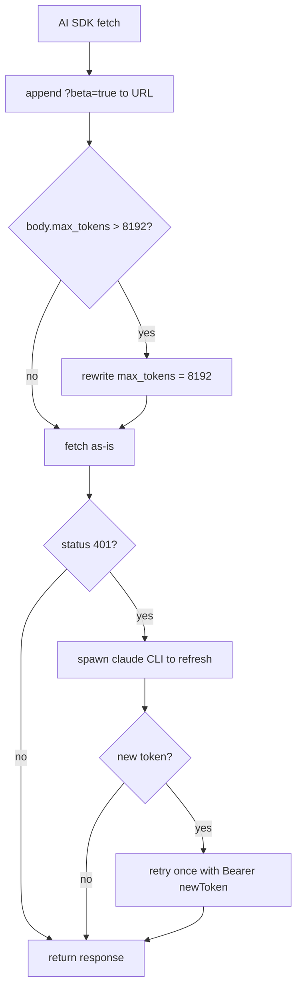

# Claude Subscription / OAuth

**What and why.** The `claude-subscription` provider lets AgentDesk call the
Anthropic API using the **OAuth credentials that the Claude Code CLI already
stores on disk** — so a user with a Claude Pro/Max subscription pays for agent
runs through that subscription instead of supplying a separate pay-per-token API
key. The single most important idea: AgentDesk **never speaks OAuth itself**. It
reads the access token from the CLI's credentials file, impersonates the CLI's
HTTP headers, and delegates the entire token-refresh flow (including the
Cloudflare-protected auth endpoints) back to the `claude` binary by spawning it.

## Responsibilities / Key idea

- **Read** the existing access token from `~/.claude/.credentials.json`
  (`claude-subscription.ts:9,44-47,94-110`).
- **Impersonate** the Claude Code CLI so the API applies the correct OAuth
  rate-limit tier rather than rejecting the call (`claude-subscription.ts:170-179`).
- **Refresh** the token transparently on a `401` by spawning `claude -p hi` and
  re-reading the file the CLI rewrites (`claude-subscription.ts:55-92,157-165`).
- **Cap** per-request output tokens so a single request doesn't drain the
  subscription's output-token-per-minute quota (`claude-subscription.ts:135,144-153`).
- Be **invisible unless explicitly enabled** via a local feature-flag file
  (`claude/feature-flag.ts:4-10`).

## How it works

### Enabling the provider (feature flag)

`isClaudeSubscriptionEnabled()` returns true only if a file literally named
`claude` exists next to the app executable (`dirname(process.execPath)`) or in the
cwd (`feature-flag.ts:4-10`). This is a marker file, not the CLI — its mere
presence flips the feature on. The frontend asks the backend at dialog mount via
the `getClaudeSubscriptionEnabled` RPC (`rpc/providers.ts:372-374`), and only then
does the provider-type dropdown gain a "Claude Subscription" option
(`providers.tsx:347-357,349-351`). When picked, the UI shows "No API key needed"
because the type is in `NO_KEY_PROVIDERS` (`providers.tsx:87,595-599`).

### Creating a model call

The provider factory maps `"claude-subscription"` to `ClaudeSubscriptionAdapter`
(`providers/index.ts:54-55`), which is a normal `ProviderAdapter`. `createModel`
(`claude-subscription.ts:127-180`):

1. Loads the token synchronously via `loadOAuthToken()` — throws a
   user-actionable error if the file or token is missing
   (`claude-subscription.ts:94-110`).
2. Builds an `@ai-sdk/anthropic` client with `authToken` (→ `Authorization:
   Bearer <token>`) plus a header set that mirrors Claude Code:
   `anthropic-beta` carrying `oauth-2025-04-20` (without it the API returns
   generic 429s), `claude-code-20250219`, interleaved/redact-thinking betas,
   `x-app: cli`, and a pinned `user-agent: claude-cli/...`
   (`claude-subscription.ts:170-179`).
3. Installs a custom `fetch` (`interceptFetch`, `claude-subscription.ts:137-168`)
   that does two things on every request — see below.

### The fetch interceptor (the load-bearing part)

- **`?beta=true`** is appended to the request path (Claude Code does this too)
  (`claude-subscription.ts:141-142`).
- **Output-token cap.** The body's `max_tokens` is clamped to
  `MAX_OUTPUT_TOKENS = 8192` (`claude-subscription.ts:135,144-153`). Rationale in
  the code comment: the Max subscription quota is measured in *output* tokens per
  minute, so a 128K `max_tokens` request would exhaust it instantly. (Note: the
  comment text says "Cap … at 32000" but the constant is actually 8192 — see
  Gotchas.)
- **401 → refresh-and-retry-once.** If the API returns 401 the stored token is
  treated as expired; `tryRefreshOAuthToken()` runs, and on success the request is
  retried exactly once with the new bearer token (`claude-subscription.ts:157-165`).

### CLI-based token refresh

`tryRefreshOAuthToken()` (`claude-subscription.ts:55-92`) is the only refresh
mechanism — AgentDesk deliberately does **not** call Anthropic's OAuth token
endpoint. It iterates `CLAUDE_CLI_CANDIDATES` (the `claude`/`claude.exe` binary
next to the app exe, then bare `claude` on `PATH` — `claude-subscription.ts:11-16`),
spawns `claude -p hi` (a trivial non-interactive prompt) with stdio ignored, and
waits up to 30 s, killing the process on timeout
(`claude-subscription.ts:58-74`). Running the CLI causes *it* to perform the full
OAuth refresh and rewrite `~/.claude/.credentials.json`; AgentDesk then re-reads
the file and returns the fresh `accessToken`
(`claude-subscription.ts:76-83`). If no candidate binary is found, it returns
`null` and the original 401 propagates (`claude-subscription.ts:90-91`).

### Listing models / testing the connection

`listModels()` hits `GET /v1/models?beta=true` with the same impersonation
headers and falls back to a hardcoded `CLAUDE_MODELS` list on any failure
(`claude-subscription.ts:18-29,182-202`). `testConnection()` does a 5-token
`generateText` against the default (or Haiku) model (`claude-subscription.ts:204-218`).

### Thinking / extended reasoning

Both the PM engine and inline sub-agent loop treat `claude-subscription`
identically to `anthropic` when building extended-thinking options, emitting
`providerOptions.anthropic.thinking` (`engine-types.ts:39-46`,
`agent-loop.ts:205-212`). This works because the underlying client is the real
`@ai-sdk/anthropic` adapter.

### Surviving updates

The Windows NSIS installer wipes `bin/` during an update, which would delete the
`claude` marker file. `rpc/updater.ts` snapshots whether the flag existed
(`updater.ts:210-213`) and, if so, recreates it after the silent install via an
inline PowerShell `New-Item` step (`updater.ts:250-252`). The freelance and
Auto-Earn flags are preserved the same way.

## Key files

| File | Role |
|---|---|
| `src/bun/providers/claude-subscription.ts` | The adapter: read token, impersonate CLI headers, beta-path + max_tokens fetch interceptor, 401 refresh, listModels/testConnection |
| `src/bun/claude/feature-flag.ts` | `isClaudeSubscriptionEnabled()` — true iff a `claude` marker file sits beside the exe or in cwd |
| `src/bun/providers/index.ts` | Factory mapping `"claude-subscription"` → `ClaudeSubscriptionAdapter` (`:54-55`); type in `SUPPORTED_TYPES` (`:17`) |
| `src/bun/rpc/providers.ts` | `getClaudeSubscriptionEnabledHandler` (`:372-374`) exposes the flag to the UI |
| `src/bun/rpc/updater.ts` | Preserves the `claude` marker file across NSIS reinstalls (`:210-213,250-252`) |
| `src/bun/agents/engine-types.ts` / `agent-loop.ts` | Treat the provider as `anthropic` for thinking options |
| `src/mainview/pages/settings/providers.tsx` | Conditionally shows the "Claude Subscription" option + "no API key" notice |

## Gotchas / Constraints

- **Requires the Claude Code CLI installed and already logged in.** AgentDesk
  performs no login. If `~/.claude/.credentials.json` is missing or has no
  `accessToken`, `loadOAuthToken()` throws telling the user to run `claude`
  (`claude-subscription.ts:98-108`).
- **The feature flag is a *marker file named `claude`*, not the CLI binary.**
  `feature-flag.ts:9` checks `existsSync(dir + "/claude")`. On a dev run, dropping
  an empty file named `claude` in the cwd enables the dropdown.
- **Comment/constant mismatch.** The header comment says "Cap max_tokens at 32000"
  but `MAX_OUTPUT_TOKENS` is `8192` and the comment block above it also mentions
  128K (`claude-subscription.ts:131-135`). The effective cap is **8192**.
- **Header impersonation is brittle.** The pinned `user-agent`
  (`claude-cli/2.1.158`) and `anthropic-beta` list are copied from a specific CLI
  build (`claude-subscription.ts:176,173`). Anthropic could change required betas
  or reject stale UAs, breaking the provider with opaque 4xx errors.
- **Refresh is best-effort and single-shot.** Only one retry after a 401; a slow
  CLI refresh (>30 s) is killed and the call fails (`claude-subscription.ts:64-74`).
- **`?beta=true` is appended only if the URL has no existing query string**
  (`claude-subscription.ts:142`).
- **ToS surface.** Driving subscription OAuth tokens from a non-CLI app is an
  unofficial path; it relies on undocumented headers and may violate Anthropic's
  consumer-subscription terms. That is presumably why it ships behind an
  off-by-default local marker file.

## Related
- [[providers]]
- [[agent-engine]]

## Open questions
- Is the `MAX_OUTPUT_TOKENS = 8192` value (vs. the comment's 32000) intentional, or
  a stale constant that should match the comment?
- How is the `claude` marker file created for end users in a shipped build (no
  in-app toggle was found — it appears to be manually placed / preserved only by
  the updater)?
