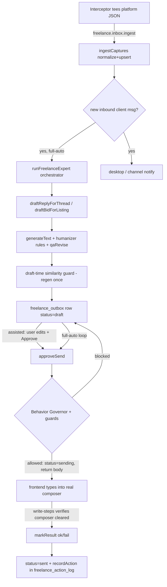

# Freelance Auto-Earn

**Auto-Earn is the opt-in "act" layer bolted onto the existing freelance discovery
feature: it reads a freelancer's real platform inbox in-app and drafts/sends
replies + bids WITHOUT being flagged as a bot.** The single load-bearing idea
(`docs/auto-earn-plan.md:52`) is that **bans are behavioral, not
fingerprint-based** — so the system *reuses the user's real, trusted browser
session* (never a spoofed fingerprint) and shapes the *behavior* (timing,
velocity, template variety, working hours) of everything it sends. The whole
feature is double-gated: a `freelance_autoearn_enabled` setting (default off,
`auto-earn-settings.ts:39`) on top of an `autoearn` flag-file next to the exe
(`feature-flag.ts:17`).

## Key idea: read vs. write are asymmetric

- **READ** is passive. A fetch/XHR/WebSocket interceptor injected into the
  embedded session webview *tees the platform's own messaging JSON* out to the
  host — Bun never makes a network call to the platform itself
  (`rpc/freelance-inbox.ts:5`). The captured payloads are normalized
  (`session/normalizer.ts`) and upserted into the inbox tables
  (`session/ingest.ts:50`).
- **WRITE** is active and dangerous. A send is *human-paced typing into the real
  composer*, never a direct API call (a non-browser API call is a documented ban
  signal, `shared/freelance/write-steps.ts:3`). Every write must pass the
  **Behavior Governor** before it is allowed to happen.

This asymmetry is why **sync never calls the governor** but **every send does** —
so even while autonomy is paused or an anomaly breaker has tripped, the inbox
keeps refreshing (`session/governor.ts:113`).

## How it works — the send pipeline

### 1. Drafting
`draftReplyForThread` (`reply-pipeline.ts:121`) and `draftBidForListing`
(`bid-pipeline.ts:51`) both: pick the freelance analysis provider (else the
default, `reply-pipeline.ts:28`), call `generateText` with an
"experienced freelancer" system prompt + the injected humanizer rules
(`humanizer-prompt.ts:23`, sourced from the `humanizer` + `freelance-writing`
skills), then run `qaRevise`, then enqueue a `freelance_outbox` row at
`status='draft'`. Bids first pull the *full* listing description via
`ensureFullDescription` (`description.ts:75`) so the proposal is written from the
real page, not the truncated RSS snippet.

### 2. Approval / autonomy
Autonomy is **per-account** (`autonomy_mode` on `freelance_accounts`): *Assisted*
(user edits the draft then clicks Approve & Send) or *Full-auto* (the always-
mounted frontend engine loops). Full-auto is structurally impossible without an
explicit risk ack: `saveAutoEarnSettings` downgrades `full_auto` → `assisted`
whenever `fullautoAck` is false (`auto-earn-settings.ts:138`).

### 3. The gate — `approveSend`
`approveSend` (`rpc/freelance-outbox.ts:236`) is where a draft becomes a `sending`
row. In order, it refuses to proceed unless:
1. the session is logged in (`isConnectedPlatform`, `freelance-inbox.ts:35` — auth
   cookie *presence* only, values never read);
2. the body is not near-identical to a recent *sent* body (trigram similarity ≥
   `SEND_SIMILARITY_MAX` 0.9, `freelance-outbox.ts:312`);
3. for autonomous replies, the inbound message has aged past a per-draft
   humanized floor of 2–5 min (a deterministic hash of the outbox id, so retries
   converge instead of re-rolling, `freelance-outbox.ts:337`);
4. `gateSend` (the Behavior Governor) allows it.

Only then does it set `status='sending'`, stash `final_body`, and return the body
to the frontend to type. **Bids are never auto-placed** — even in full-auto the
form is only prefilled and the user clicks Place Bid (`freelance-outbox.ts:292`),
because a bid moves real money.

### 4. Verified send + finalize
The frontend runs the `write-steps` script in the webview: it types
character-by-character with jitter and a random "thinking" pause, clicks Send,
then **verifies** the send actually happened (composer cleared / form gone) before
reporting `ok` (`shared/freelance/write-steps.ts:39`). The result comes back via
`markResult` (`freelance-outbox.ts:368`) which flips the row to `sent` (or
`failed`) and writes the authoritative `'ok'` row to `freelance_action_log` — the
same log the governor queries for its rate limits.

## The Behavior Governor (the anti-ban core)

`session/governor.ts` is the single gate every outbound action passes through. It
enforces (`governor.ts:245`, `evaluateSend`):

| Rule | Reply | Bid | Why |
|---|---|---|---|
| min gap | `minGapSeconds` (90s) | ×3 | sub-4s/velocity is the kill signal |
| hourly cap | `maxSendsPerHour` (4) | ½ (min 1) | cold-bid velocity is the loudest spam signal |
| daily cap | — | `bidDailyCap` (10) | hard daily budget for cold outreach |
| active hours | enforced for autonomous | same | no machine-gun sending at 4am |
| in-flight guard | yes | yes | a `sending` row occupies the gate before its log row lands |

Replies and bids are **separate streams** — both `secondsSinceLastSend` and
`sendsInLastHour` are scoped by action type (`governor.ts:175`,`:186`) so an
active paying client's replies are never throttled by cold-bid volume. The
in-flight guard (`governor.ts:213`) is subtle: a send currently typing in the
webview hasn't written its `'ok'` log row yet (that happens at `markResult`,
30s+ later), so a fresh `sending` outbox row of the same kind is treated as
occupying the gate, with a 10-min age bound so a crash-zombie row doesn't wedge it.

Crucial nuance: **active-hours is skipped for user-initiated (assisted) sends**
(`governor.ts:264`, `approveSend` passes `skipActiveHours: !!userInitiated`) — a
human deliberately clicking Approve at 3am is genuinely human; min-gap + hourly
cap still apply. Jitter is genuinely random (`Math.random`, not a `Date.now()`
recurrence) because a deterministic cadence is exactly the pattern pacing exists
to defeat (`governor.ts:347`).

### Global pause
A user-set "pause autonomy for X hours" (`freelance_pause_until`,
`governor.ts:118`) blocks every send AND the freelance-expert agent, but not sync.

## Template-variation guard (similarity)

Near-identical templates (same skeleton, a few words swapped) are the real spam
signal — byte-identical comparison almost never fires against LLM output. So
`similarity.ts` uses **Dice coefficient over character trigrams**
(`similarity.ts:30`), applied at two thresholds:
- **draft time** (`DRAFT_SIMILARITY_MAX` 0.85): if a fresh draft reads like a
  recent one, regenerate *once* with an explicit variation instruction and keep
  the less-similar version (`reply-pipeline.ts:142`, `bid-pipeline.ts:83`);
- **send time** (`SEND_SIMILARITY_MAX` 0.9): a hard block in `approveSend`.

`recentOutboxBodies` compares against *sent + pending* bodies (two pending
near-identical bids are as bad as two sent ones, `similarity.ts:62`).

## Anomaly circuit breaker + watchdog (backstops for full-auto)

Full-auto is risky because the loop lives in an always-mounted React component —
a renderer crash silently stops it. Two backstops:

- **Anomaly breaker** (`reportAnomaly`, `freelance-outbox.ts:513`): the live-
  session interceptor reports 429 / 403 / captcha. A soft platform flag becomes a
  ban precisely when automation keeps sending through it, so the breaker *pauses
  all autonomy* for a kind-scaled window (rate_limit 2h / forbidden 6h /
  captcha 12h) and escalates to the human. Sync keeps running.
- **Bun-side watchdog** (`watchdog.ts:29`): runs on a 10-min `setInterval` in the
  Bun process (survives a renderer crash). Each tick it recovers `sending` rows
  stranded by a mid-type crash (`recoverInterruptedSends`), runs the stuck-queue
  check, and — only in full-auto — compares the frontend engine heartbeat
  (`freelance_engine_heartbeat_at`, stamped by `checkStuck`,
  `freelance-outbox.ts:493`) against a 30-min staleness bound, escalating "engine
  not running" with a 6h cooldown.

## Correlation cascade (threads → listings)

`ingestCaptures` correlates inbox threads to discovered listings so a reply can
be written with job context (`session/ingest.ts:204`). It matches a thread's
`context.id` to a listing by external id (`confidence='certain'`) or by title
(`probable`), caching project titles from intercepted `projects` payloads. Profile
skills only arrive on a `self?jobs=true` call and are persisted but never
overwritten with an empty set (`ingest.ts:131`) because the bid shortlist pre-
filter depends on that cache.

## Key files

| File | Role |
|---|---|
| `src/bun/freelance/session/governor.ts` | Behavior Governor: min-gap / hourly+daily caps / active-hours / in-flight guard / pause; `freelance_action_log` audit |
| `src/bun/freelance/session/ingest.ts` | Normalize + upsert intercepted captures; thread↔listing correlation; new-inbound detection |
| `src/bun/freelance/session/normalizer.ts` | Pure parser for Freelancer SPA JSON (threads/messages/users/self/projects), field whitelist |
| `src/bun/freelance/session/humanize.ts` | Server-side jittered pacing helpers for the Bun governor loop |
| `src/bun/freelance/reply-pipeline.ts` | Draft a reply to a thread → outbox `draft` |
| `src/bun/freelance/bid-pipeline.ts` | Draft a proposal (using full description) → outbox `draft` |
| `src/bun/freelance/similarity.ts` | Trigram Dice near-duplicate detection (draft regen + send block) |
| `src/bun/freelance/watchdog.ts` | Bun-side timer: recover stuck sends, engine heartbeat / stuck-queue escalation |
| `src/bun/freelance/description.ts` | `ensureFullDescription` — fetch + AI-extract + cache full listing text |
| `src/bun/freelance/auto-earn-settings.ts` | Master switch + governor knobs in `settings` (category `freelance`); full-auto ack enforcement |
| `tests/freelance/governor.test.ts` | Behavior Governor unit tests — pause/active-hours/min-gap/hourly-cap/daily-bid-budget/in-flight-send gates, `getGovernorState` snapshot consistency; the first test coverage anywhere in `freelance/` |
| `src/bun/freelance/feature-flag.ts` | `autoearn` flag-file gate (preserved across updates) |
| `src/bun/rpc/freelance-outbox.ts` | Approval queue: draft/update/approveSend(gate)/markResult/killSwitch/pause/anomaly; `getSentBid`/`getSentReply` read back the submitted body (final_body) for the "Bid Placed" / "View sent reply" viewers |
| `src/bun/rpc/freelance-inbox.ts` | `ingest` entry, account status (cookie presence), autonomy mode, thread/message reads |
| `src/shared/freelance/platforms.ts` | Per-platform descriptor (URLs, endpoint rules, composer selectors) — the extension seam |
| `src/shared/freelance/write-steps.ts` | In-page human-paced typing + verified send script |

## Gotchas / Constraints

- **Sync intentionally bypasses the governor.** Only sends are gated; the inbox
  must stay current even while paused / breaker-tripped (`governor.ts:113`).
- **`ingestCaptures` is async + chunked, not one monolithic transaction.** Parsing
  happens outside the lock and the upserts run in PHASE transactions
  (self→users→threads→messages→last-msg refresh→correlation), chunked at 150 with a
  macrotask yield between chunks (`session/ingest.ts:50`). A large capture batch
  (interceptor cap ~800 records) therefore can't hold the single Bun thread — and
  all other RPC replies — for its full duration. Each `await` falls BETWEEN committed
  transactions, never inside an open write lock, so a concurrent writer can't hit
  SQLITE_BUSY. Per-phase commits mean a mid-batch crash leaves earlier phases
  persisted — safe, because every upsert is idempotent and the next sync re-runs.
- **`maxSendsPerHour` is the REPLY cap, not a global cap.** Bids derive their own
  (½ + a daily budget). A flat global cap would make the freelancer look
  unresponsive to active clients while doing nothing about bid-spam velocity
  (`governor.ts:34`).
- **Bids are never auto-submitted, ever** — full-auto only prefills; the user
  clicks Place Bid (`freelance-outbox.ts:292`).
- **A `sending` row that never finalizes wedges the in-flight guard.** Both the
  lazy sweep on `list()` and the watchdog fail rows older than 10 min back to
  `failed` so the user can Retry (`freelance-outbox.ts:133`).
- **The send result is verified, not assumed.** A click the platform silently
  rejected must report `ok=false`, or a near-duplicate would be recorded as sent
  and skew the similarity history (`write-steps.ts:39`).
- **Profile-skill cache must never be wiped by an empty `self` response**
  (`ingest.ts:131`).
- **Cookie values are never read** — only the presence of auth-ish cookie *names*
  signals "logged in" (`freelance-inbox.ts:45`).
- **Freelancer.com only.** PeoplePerHour was removed; the descriptor seam
  (`platforms.ts`) makes re-adding a platform a one-file change.

## Related
- [[freelance-discovery]] — the RSS/wizard/shortlist "discover" layer Auto-Earn builds on
- [[electrobun-webview-overlay]] — the persistent embedded webview the interceptor runs in

## Open questions
- The frontend always-mounted engine (`AlwaysMountedInbox` + `freelance-engine-store`)
  and the interceptor injection were not read in this pass — the *frontend* loop
  cadence and exact `executeJavascript` injection point are described from the
  plan/comments, not verified against the React source.
- `src/bun/freelance/expert/*` (orchestrator, jobs state machine, vault) is
  referenced but only skimmed here; it deserves its own page.
