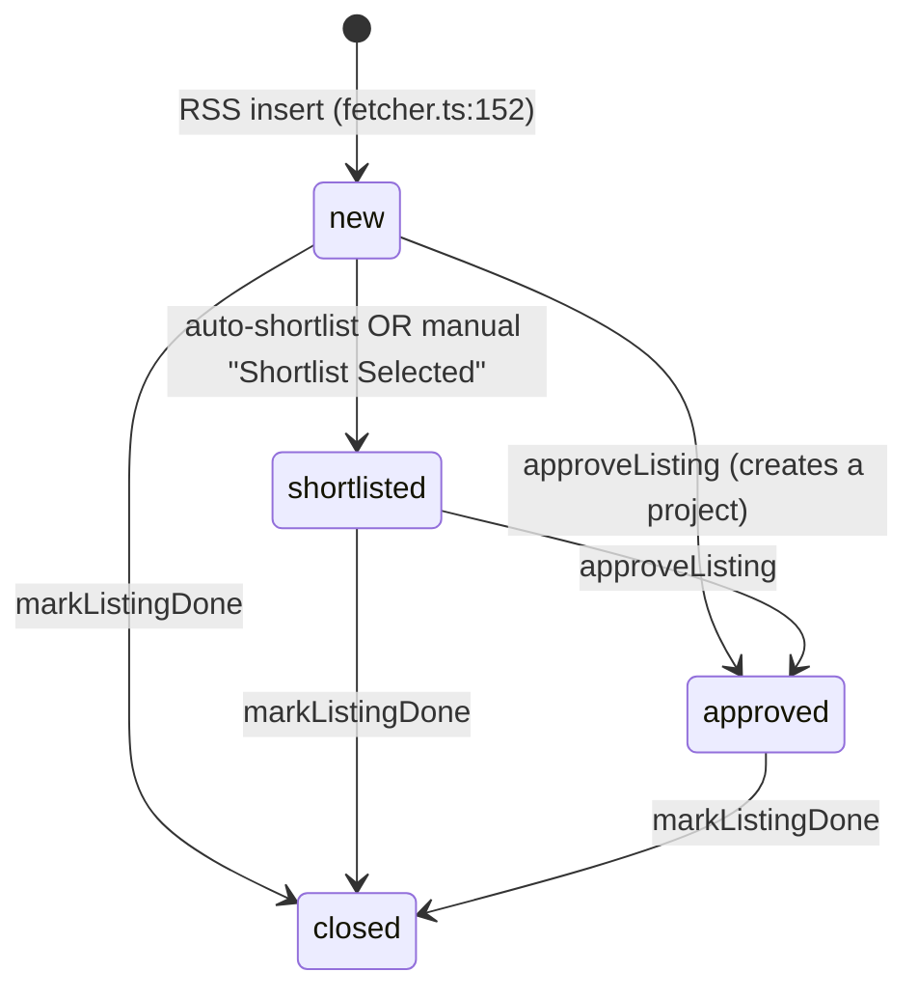

# Freelance Discovery

**The "discover" layer that sits *below* [[freelance-autoearn]]: it pulls
listings from RSS, judges each one for AI-workability, and routes the workable
ones into a shortlist the user (or Auto-Earn) can bid on.** Auto-Earn is the
*act* layer; this is the *find + filter* layer it builds on.

A listing moves through a small, enforced status lifecycle. The single
load-bearing invariant of this subsystem is that **automatic status promotion is
guarded against the user's concurrent manual moves** — the analysis phase is slow
(per-listing page fetch + AI calls), so any write that promotes a row must
re-verify the row is still where it was when the run started.

## The status lifecycle

`FreelanceListingStatus = "new" | "shortlisted" | "approved" | "closed"`
(`shared/rpc/freelance.ts:1`). Soft-delete (`is_deleted = 1`) is orthogonal to
status. The UI "Done" tab maps to `closed`; a virtual "Bids" tab is *not* a status
— it's `new`/`shortlisted` rows that have a sent bid (`rpc/freelance.ts:139`).



| Transition | Handler | Notes |
|---|---|---|
| RSS → `new` | `fetchAllPlatforms` (`fetcher.ts:114`) | `onConflictDoNothing` on `(platform, external_id)` (`:167`) |
| `new` → `shortlisted` | `runAutoShortlist` (`freelance-wizard.ts:1280`) / `shortlistListings` (`:1668`) | auto = workable verdict; manual = user picks in modal |
| → `approved` | `approveListing` (`rpc/freelance.ts:384`) | also spins up a project + PM conversation |
| → `closed` | `markListingDone` (`rpc/freelance.ts:265`) | guarded: only `new`/`shortlisted`/`approved` may close (`:275`) |
| → soft-deleted | `deleteListing` (`:293`) / `deleteListings` (`:320`) | batch delete works on any status |
| any → hard-deleted (all rows) | `cleanUpAllListings` (`:352`, wired to Settings tab → Danger Zone → "Clean Up") | real `DELETE`, not `is_deleted=1`; no WHERE clause at all, so it also sweeps up rows already soft-deleted by `deleteListing(s)`/`trimListingsToMax`/`purgeBlockedCountryListings` that haven't hit the 30-day purge yet — the one bulk action that clears every freelance entry, not just a status tab's worth; deletes `freelance_chat_messages` first in the same `sqlite.transaction` so the FK to `freelance_listings` (`PRAGMA foreign_keys = ON`) doesn't reject the parent delete; irreversible |

## Stage 1 — Fetch (the poller)

`startFreelancePoller` (`fetcher.ts:252`) schedules `fetchAllPlatforms` on the
configured interval (`scheduleNextPoll`, `:277`; `pollingInterval=0` disables it).
The startup fetch is deliberately deferred 30s (`STARTUP_FETCH_DELAY_MS`, `:242`)
so the synchronous `bun:sqlite` insert burst doesn't stall the launch/navigation
window. Each run, in order:

1. `purgeOldDeletedListings` — hard-delete soft-deleted rows older than 30 days (`:51`).
   Deletes their `freelance_chat_messages` first (`:59`) — those never got cleaned up
   at soft-delete time (steps 2/4 below only flip `is_deleted=1`), so skipping this
   would trip the `freelance_chat_messages -> freelance_listings` FK.
2. `purgeBlockedCountryListings` — soft-delete `new`/`shortlisted` rows from blocked
   countries (only those two statuses; committed work is never touched, `:34`).
3. Per enabled RSS source: fetch → `normalizeRssItem` → insert `new` with
   `onConflictDoNothing` (`:167`, soft-deleted rows are never re-imported).
4. `trimListingsToMax` — reclaim room by soft-deleting **only `new`-column** rows,
   *junk-first* (`wizard_verdict='not_workable'` / gated) then oldest-first; a row
   with a sent bid is never trimmed (`:88`).
5. **Only for non-manual fetches** (`scheduled`/`startup`), fire-and-forget
   `runAutoShortlist` (`:233`). A manual fetch never auto-shortlists.

## Stage 2 — Analyze (workability verdict)

Three callers share the same analysis core (`analyzeListingWorkability`,
`freelance-wizard.ts:819`) and the same deterministic pre-filters, applied in
this order *before* any AI spend:

1. **Non-software keyword filter** (`isObviouslyNonSoftware`, `:88`) → `non_software`.
2. **Skill gate** (`skillGateBlocks`, `:149`) — no overlap between the user's
   profile skills and the project's required skills ⇒ Freelancer would block the
   bid. Fail-open when profile skills are unknown. → `skill_gate`.
3. **Client-quality gate** (`clientQualityGate`, `:415`) — blocked country / too few
   reviews / brand-new client. Fail-open on missing data. → `client_quality`.
4. **AI Condition A/B analysis** — A: required runtimes/tools are installed
   (verified by real `run_shell`/`environment_info` tool calls); B: the agent
   system can fully build it. → `analysis` (the only red/green verdict; the three
   gates render yellow).

Results persist to `wizard_verdict` + `wizard_block_kind` + `wizard_analysis_text`
(+ reason/blockers). A 24h cache (`VERDICT_TTL_MS`, `:961`) short-circuits re-analysis,
**except** for skill-gate / client-quality verdicts, which are recomputed live every
run so a profile/threshold change takes effect immediately (`isStaleGateVerdict`,
`:132`; `LIVE_RECOMPUTED_BLOCK_KINDS`, `:361`).

## Stage 3 — Shortlist (the three entry points)

This is the part most prone to confusion. The three triggers differ sharply in
**what they scan** and **whether they write `status`**:

| Trigger | Code | Candidate scope | Writes `status`? |
|---|---|---|---|
| **Background auto-shortlist** | `runAutoShortlist` (`:1280`) | `status='new'` **AND** `wizard_verdict IS NULL` (`:1318`) | **Yes** → `shortlisted` (guarded) |
| **"Find Workable" modal** | `runWizard` (`:973`) | same filter (`:1002`) | **No** by itself — surfaces workable rows; user clicks "Shortlist Selected" → `shortlistListings` |
| **Per-card "Analyze" button** | `analyzeListing` (`:1542`) | one listing by id, **no** status filter | **No** — only writes the verdict |

Consequences that follow directly from the candidate scope:

- **Neither auto-shortlist nor Find Workable can pull an `approved`/`closed`/
  `shortlisted` listing back to `shortlisted`** — those statuses are excluded
  by `notInArray(status, ["approved","closed","shortlisted"])` before analysis.
- **An already-analyzed listing (`wizard_verdict` set) is excluded** from both —
  re-analysis is a deliberate single-listing act via the Analyze button only.
  (The in-loop `isCacheValid` branch at `:1360`/`:1144` is therefore effectively
  dead for these two runners, since every candidate has `wizard_verdict IS NULL`.)
- **The Analyze button never changes a column.** It's also UI-gated to
  `new`/`shortlisted` cards that aren't yet analysis-verdicted
  (`listing-card.tsx:851`), so it can't even be invoked on `approved`/`closed`.

### The TOCTOU guard (why the promote re-checks status)

`runAutoShortlist` selects its candidates as `new` at the top of the run, then
spends seconds-to-minutes per listing on page fetch + AI analysis. During that
window the user may manually move a candidate to `approved`/`closed`. The promote
write therefore **re-verifies the row is still `new`** rather than updating by id
alone (`:1474`):

```js
.where(and(
  eq(freelanceListings.id, listing.id),
  eq(freelanceListings.status, "new"),   // ← no-op if the user moved it mid-run
))
.returning({ id: freelanceListings.id })  // ← which rows actually moved
```

`.returning()` yields the real `movedListings` set, which is what the desktop
notification, the auto-bid drafting loop (`:1501`), and `autoShortlistLastCount`
(`:1543`) all read — never the optimistic candidate set. Without the
`status='new'` clause, a committed/closed listing would be silently reverted to
`shortlisted` (the bug fixed 2026-06-27). This mirrors the guard already present in
`softDeleteCountryBlockedListing` (`:521`, `AND status IN ('new','shortlisted')`).

> **The manual `shortlistListings` RPC (`:1668`) is intentionally unguarded** — it's
> a synchronous user action on a freshly-rendered selection, so the TOCTOU window
> is negligible and an unconditional move is the expected behavior there.

### Auto-bid hand-off

After a successful auto-shortlist, if Auto-Earn is enabled with
`autoBidShortlisted` (and the `autoearn` flag-file is present), `runAutoShortlist`
drafts a proposal for each **moved** listing (capped at 5/run, skips listings that
already have a non-rejected bid). Bids are drafted only — **never auto-placed**
(`:1479`). See [[freelance-autoearn]] for the send pipeline.

## Settings

All discovery knobs live in `settings` under category `freelance`
(`freelance/settings.ts:11`, keys `:49`). Auto-shortlist defaults **off**:
`autoShortlistEnabled=false`, `autoShortlistCount=10` (clamped 1–25),
`autoShortlistOnStartup=false` (`:39`). The wizard's count mode clamps 1–25
(`freelance-wizard.ts:1260`); the hours mode clamps 1–5 (`:1256`).

## RPC surface

Wired in `rpc-groups/features.ts`: `freelance.wizard.start` (`:91`),
`freelance.wizard.stop` (`:92`), `freelance.wizard.analyzeListing` (`:93`),
`freelance.shortlistListings` (`:94`), `freelance.triggerFetch` (`:84`),
`freelance.approveListing` (`:82`), `freelance.markListingDone` (`:95`),
`freelance.getListings` / `getListingCounts` (`:80`,`:81`). Auto-shortlist has **no
RPC** — it's only ever triggered internally by the fetcher.

## Key files

| File | Role |
|---|---|
| `src/bun/freelance/fetcher.ts` | RSS poll loop, purge/trim, fires `runAutoShortlist` after non-manual fetches |
| `src/bun/freelance/settings.ts` | `freelance`-category settings incl. the auto-shortlist knobs |
| `src/bun/rpc/freelance-wizard.ts` | Analysis core, pre-filters, `runWizard` / `runAutoShortlist` / `analyzeListing` / `shortlistListings` |
| `src/bun/rpc/freelance.ts` | Listing CRUD + status transitions (`approveListing`/`markListingDone`/delete), tab/count queries |
| `src/mainview/components/freelance/find-workable-modal.tsx` | Wizard UI: progress, workable/failed lists, user-selected shortlist |
| `src/mainview/components/freelance/listing-card.tsx` | Per-card Analyze button (gated to non-analyzed new/shortlisted) |

## Gotchas / Constraints

- **Auto status promotion must re-check current status.** The candidate snapshot
  goes stale during the slow analysis phase; promote/soft-delete writes carry a
  `status` guard so concurrent manual moves are never clobbered
  (`freelance-wizard.ts:1474`, `:521`).
- **Auto-shortlist and Find Workable only ever see `new` + never-analyzed rows.**
  They can neither resurrect `approved`/`closed`/`shortlisted` listings nor
  re-judge an already-analyzed one (`:1002`, `:1318`).
- **Find Workable does not change status.** It labels workability and lists
  workable rows; the user's "Shortlist Selected" click is the only state change.
- **The Analyze button only writes a verdict**, never a column, and always re-runs
  (no cache) — it's the deliberate single-listing re-analysis path.
- **Manual fetch never auto-shortlists** (`fetcher.ts:223`) — only `scheduled`/
  `startup` runs do.
- **Trim/purge only touch `new` rows** (plus blocked-country purge on
  `new`/`shortlisted`); shortlisted/approved/closed and any row with a sent bid are
  preserved (`fetcher.ts:62`).

## Related

- [[freelance-autoearn]] — the act layer (inbox sync, drafting, Behavior Governor, send)
- [[bid-feasibility-buildability]] — why the AI verdict judges only code-buildability
- [[database-tables]] — the `freelance_listings` schema (status + wizard_* columns)
</content>
</invoke>
