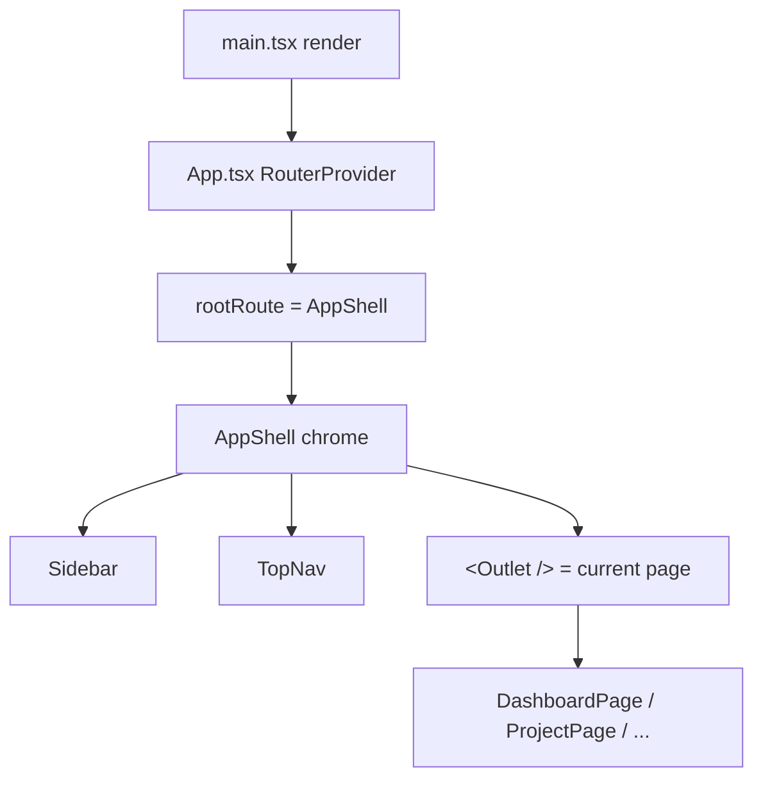

# Frontend Architecture

The renderer (`src/mainview/`) is a **React 19 single-page app rendered inside
Electrobun's native webview**. There is no HTTP server behind it: navigation is
hash-based and every backend call goes over Electrobun's typed RPC bridge to the
Bun main process. The mental model is a single persistent `AppShell` chrome
(sidebar + top nav) wrapping a swappable `<Outlet />`, with state split between
**TanStack Router** (the URL is the source of truth for *which page*), **Zustand
stores** (live/streaming domain state), and **React context** (cross-component
UI wiring like the top-nav action slot). The "why" that grep can't show: most
cross-cutting coordination happens through **`window` CustomEvents**, not React
props — the Bun backend broadcasts over RPC and the renderer fans those out as
DOM events that any component can subscribe to.

## Boot sequence

1. `src/mainview/main.tsx:13` installs global error handlers, then strips `href`
   from every `<a>` (and observes new ones via `MutationObserver`,
   `main.tsx:26-43`) — this is a deliberate hack to suppress the WebView2 status
   bar that pops up on link hover. TanStack navigates via `onClick`, so the
   `href` is dead weight anyway.
2. It mounts `<App />` inside `<StrictMode>` (`main.tsx:86-97`). (In web mode
   the same `root.render` may instead show the `PairingScreen` — see
   [[remote-access]].)
3. `src/mainview/App.tsx` calls `initTheme()` **and** `initBackground()`
   **synchronously at module load** (before first paint) so the dark/light class
   and the `appbg-<id>` background-preset class are on `<html>` with no flash;
   `syncThemeFromDB()` + `syncBackgroundFromDB()` then run in an effect to
   reconcile localStorage with the persisted DB values. See [[#Theming]].
4. `App` renders `<RouterProvider router={router} />` — that is the entire app.

## Routing

`src/mainview/router.tsx` builds a flat route tree under one root route whose
component is `AppShell` (`router.tsx:28-30`). Key decisions:

- **Hash history** (`createHashHistory()`, `router.tsx:25`) — chosen so the
  webview never needs a server for navigation; URLs look like
  `app://index.html#/settings`. The RPC layer reports the current route to Bun
  by reading `window.location.hash` (`rpc.ts:39-44`).
- All ~15 pages are siblings registered on the root route
  (`router.tsx:116-132`); only `/project/$projectId` is parameterised
  (`router.tsx:50-54`).
- The router instance is registered into TanStack's `Register` interface
  (`router.tsx:140-144`) for end-to-end type-safe navigation.

## The AppShell — persistent chrome

`AppShellContent` (`app-shell.tsx:111`) is the heart of the layout. It is
wrapped by `HeaderProvider` (`app-shell.tsx:105-107`) and `TooltipProvider`
(`app-shell.tsx:320`), and lays out a flex row of `<Sidebar>` + a `<main>`
column containing `<TopNav>` and a scrollable `<Outlet>` wrapped in an
`ErrorBoundary` (`app-shell.tsx:319-352`).

What the shell owns (and why it lives here, above the router outlet):

- **Page title / workspace path resolution** — an effect keyed on
  `projectId` + `location.pathname` maps the route to a human title via
  `PAGE_TITLES` (`app-shell.tsx:87-103`), or fetches the project name for
  `/project/$projectId` (`app-shell.tsx:216-221`). Uses an `ignore` flag to
  discard stale async results when the user navigates away mid-fetch.
- **First-launch gate** — redirects to `/onboarding` when no providers exist
  (`app-shell.tsx:234-248`); the onboarding route renders bare, without chrome
  (`app-shell.tsx:302-308`).
- **Sidebar collapse state**, including a `sidebarDefaultRef` that preserves the
  user's saved preference while "focus mode" transiently collapses it
  (`app-shell.tsx:118-152`). Toggling persists `sidebar_default` back to settings.
- **Session-wide effects**: toast relay (`agentdesk:show-toast`), What's New
  dialog, silent update check, and window focus → `setAppFocused` so the backend
  can suppress desktop notifications while the app is focused
  (`app-shell.tsx:250-299`).
- **Always-mounted singletons** that must outlive page changes: the Auto-Earn
  background engine `<AlwaysMountedInbox>` (`app-shell.tsx:375`), the floating
  PM / custom-agent chat widgets (only visible on `/`, `app-shell.tsx:383-384`),
  and side-effect store imports for the issue-fixer and unread stores
  (`app-shell.tsx:21-26`).

### Top-nav action slot (header context)

Pages need to inject buttons into the shared top bar without prop-drilling.
`header-context.tsx` solves this: `useHeaderActions(factory, deps)` stores the
JSX factory in a ref (so handlers never go stale) and registers/clears it on
mount/unmount (`header-context.tsx:65-77`). The shell reads `headerActions` from
context and renders them inside `<TopNav>` (`app-shell.tsx:125`, `:346`). The
documented rule: only put **primitive** values in `deps` — passing a fresh
function reference causes an infinite update loop through the context
(`header-context.tsx:52-63`).

`TopNav` itself is presentational (`topnav.tsx:23`): title + optional
"open workspace/data folder in explorer" buttons, an animated dashboard phrase,
and a children slot for the header actions + `ProjectSwitcher`.

## Sidebar

`Sidebar` (`sidebar.tsx:146`) derives the active item from the router pathname
(`useRouterState`, `sidebar.tsx:148`) rather than tracking it in state. The nav
list is assembled dynamically (`sidebar.tsx:342-347`):
`BASE_NAV_ITEMS` (`sidebar.tsx:57-67`) + plugin-contributed items + a
conditional Freelance entry, with **Settings always pinned last**. Badges and a
red "needs attention" dot are layered on per-item (inbox unread, freelance new
listings/escalations). It also hosts the entire **auto-update UI** (version
button → check → download → restart, `sidebar.tsx:438-560`), driven by relayed
`agentdesk:update-status` events (`sidebar.tsx:252-278`).

## State management — three layers

| Layer | Holds | Example |
|---|---|---|
| **TanStack Router (URL)** | which page, which project | `/project/$projectId` |
| **Zustand stores** | live/streaming domain data | `chat-store.ts:25` (streaming, active agents, shell approvals) |
| **React context** | cross-tree UI wiring | `header-context.tsx`, `TooltipProvider`, `MessageActionsProvider` |
| **`window` CustomEvents** | backend → renderer fan-out | `agentdesk:*` events |

The Zustand stores (`src/mainview/stores/`) are plain `create()` stores
(`chat-store.ts:1`). The critical pattern: **the backend never pushes into a
store directly**. Bun fires RPC messages, the RPC client (`rpc.ts`) re-dispatches
them as `window` CustomEvents (e.g. `agentdesk:navigate`, `agentdesk:show-toast`,
documented at `rpc.ts:9-12`), and `chat-event-handlers.ts` (imported by
`chat-store.ts:10`) subscribes and mutates the store. This is why side-effect
imports like `import "@/stores/issue-fixer-store"` exist in the shell — they
attach those event listeners at app startup so live runs stream in regardless of
the current page (`app-shell.tsx:21-26`).

## RPC bridge

All frontend → backend traffic goes through one typed client,
`src/mainview/lib/rpc.ts`. It builds an `Electroview.defineRPC<AgentDeskRPC>`
with `maxRequestTime: Infinity` because agent runs take minutes
(`rpc.ts:29-31`), exposes incoming `requests`/`messages` handlers (e.g.
`getViewState`, `navigateTo`), and re-exports a thin typed `rpc` object so
callers never touch raw primitives (`rpc.ts:369`). Full detail lives in
[[rpc-layer]].

## Styling & primitives

Tailwind CSS utility classes throughout, with semantic tokens
(`bg-background`, `text-foreground`, `border-border`) that flip via the `dark`
class on `<html>`. UI primitives in `src/mainview/components/ui/` wrap **Radix
UI** (dialog, dropdown-menu, popover, select, tabs, tooltip, etc.) and use
`cn()` (`lib/utils.ts:4`) for class merging. Tabbed pages (project view, git,
settings) compose the Radix `Tabs` primitive (`ui/tabs.tsx`).

### Theming

`theme.ts` keeps theme in localStorage (`agentdesk_theme`) as the fast path and
the DB (`appearance/theme_mode`) as the durable store. `initTheme()` runs
synchronously pre-render (`theme.ts:15-17`); `setTheme()` writes both stores and
fires `agentdesk:theme-changed` (`theme.ts:19-24`). Only `light`/`dark` are
supported.

**App background presets** (`lib/app-background.ts`) follow the same dual-store
pattern: localStorage (`agentdesk_app_bg`) + DB (`appearance/app_background`),
with `initBackground()` pre-render. A preset is a `.appbg-<id>` class applied to
`<html>`; the app-shell `<main>` carries `.app-background`, which paints the
content-area canvas from `--app-bg-color`/`--app-bg-image`/`--app-bg-size` (all
defined per-preset in `index.css`, with light values + a `.dark` override so each
preset adapts to the active theme). Each preset has a **scope**: `full` (solid
colors + gradients — no lines) also adds an `appbg-full` marker so the app-shell
root (`.app-background-root`) paints too, extending the canvas behind the
translucent sidebar; `content` (line/mark patterns) omits the marker so the root
stays solid `bg-background` and patterns never bleed through the sidebar. Cards/nav
keep their solid `bg-card`/`bg-background` and float over the canvas. The Appearance settings tab previews presets via `.app-bg-swatch`
(which resets the vars locally so the active background doesn't leak into the
preview). `APP_BACKGROUNDS` is the registry; the empty id = default theme bg.

## Key files

| File | Role |
|---|---|
| `src/mainview/main.tsx` | Entry: error handlers, href-strip hack, React root |
| `src/mainview/App.tsx` | `RouterProvider` + theme init |
| `src/mainview/router.tsx` | Hash-history route tree under `AppShell` |
| `src/mainview/components/layout/app-shell.tsx` | Persistent chrome, title resolution, session effects, singletons |
| `src/mainview/components/layout/sidebar.tsx` | Nav (dynamic), badges, auto-update UI |
| `src/mainview/components/layout/topnav.tsx` | Presentational top bar + action slot |
| `src/mainview/lib/header-context.tsx` | `useHeaderActions` — inject buttons into TopNav |
| `src/mainview/lib/theme.ts` | Dual-store (localStorage + DB) theming |
| `src/mainview/lib/rpc.ts` | Typed Electroview RPC client |
| `src/mainview/lib/utils.ts` | `cn()` class merge, `displayAgentName` |
| `src/mainview/stores/*.ts` | Zustand stores fed by `agentdesk:*` events |
| `src/mainview/components/ui/*` | Radix-wrapped Tailwind primitives |

## Gotchas / Constraints

- **`href` is stripped from all anchors** (`main.tsx:26-43`) to kill the WebView2
  hover status bar. Never rely on `<a href>` for navigation — use TanStack `Link`
  / `navigate`.
- **`useHeaderActions` deps must be primitives only** — a function reference in
  `deps` causes an infinite render loop via the header context
  (`header-context.tsx:52-63`).
- **Hash routing**: the route lives in `window.location.hash`. Bun reads it via
  the `getViewState` RPC handler (`rpc.ts:39-44`); deep-link/path assumptions
  that ignore the `#` will break.
- **Backend state never pushes into Zustand directly** — it arrives as
  `agentdesk:*` `window` CustomEvents. Listeners must be attached at startup
  (hence the side-effect store imports in the shell), or a page that isn't
  mounted yet will miss live events.
- **Async-in-effect staleness**: title/project effects use an `ignore` flag to
  discard results from a navigation the user already left (`app-shell.tsx:166`,
  `:216-221`). Copy this pattern for any project-keyed fetch.
- **Singletons must be mounted in `AppShell`, not a page** — anything that must
  survive navigation (Auto-Earn engine, dialogs, event listeners) goes in the
  shell; mounting it in a page kills it on route change.
- **Theme flash**: changing theme init from synchronous (`App.tsx:6`) to an
  effect reintroduces a flash-of-wrong-theme on launch.

## Related
- [[rpc-layer]]
- [[agent-engine]]
- [[freelance-autoearn]]
- [[issue-fixer]]

## Open questions
- The plugin sidebar-extension contract (`getPluginExtensions` →
  `sidebarItems`, `sidebar.tsx:209-211`) is consumed here but its producer side
  (plugin manifest → extension registration) is not documented in this page; a
  dedicated `[[plugins]]` page should own it.
- `command-palette.tsx` (Cmd/Ctrl-K) is mounted in the shell
  (`app-shell.tsx:356`) but `paletteOpen` is never set to `true` in
  `app-shell.tsx` — the open trigger (keyboard shortcut handler) was not located
  during this pass and should be verified.
