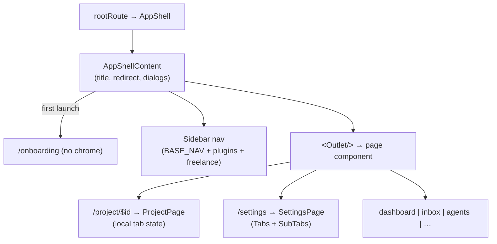

# Frontend Pages & Routing

**The React frontend is a single-page app rendered inside Electrobun's webview, navigated with TanStack Router over a *hash* history.** A flat route tree mounts one page component per top-level path under a shared `AppShell` chrome (sidebar + top-nav + global dialogs). Hash routing is the load-bearing decision: it lets the webview navigate with URLs like `app://index.html#/settings` without needing an HTTP server for client-side routes (`router.tsx:23`). Most "navigation" inside a feature is *not* routing at all — it is local tab state (Settings, Project) — so the route map is small and the real complexity lives inside a handful of pages.

## Route map

All routes are children of one root route whose component is the `AppShell` layout wrapper (`router.tsx:28-30`). The tree is assembled in `router.tsx:116-132`:

| Path | Component | Page file | Notes |
|---|---|---|---|
| `/` | `DashboardPage` | `pages/dashboard.tsx` | project list + "new project" |
| `/onboarding` | `OnboardingPage` | `pages/onboarding.tsx` | first-run provider wizard; rendered chrome-less |
| `/project/$projectId` | `ProjectPage` | `pages/project.tsx` | the workhorse — chat/kanban/git/etc. tabs |
| `/inbox` | `InboxPage` | `pages/inbox.tsx` | cross-channel message inbox |
| `/agents` | `AgentsPage` | `pages/agents.tsx` | agent roster + custom-agent editor |
| `/skills` | `SkillsPage` | `pages/skills.tsx` | skills browser |
| `/prompts` | `PromptsPage` | `pages/prompts.tsx` | reusable prompt library |
| `/scheduler` | `SchedulerPage` | `pages/scheduler.tsx` | cron jobs + automation rules |
| `/council` | `CouncilPage` | `pages/council.tsx` | multi-model deliberation page |
| `/analytics` | `AnalyticsPage` | `pages/analytics.tsx` | usage/cost stats |
| `/freelance` | `FreelancePage` | `pages/freelance.tsx` | Auto-Earn (feature-flagged) |
| `/playground` | `PlaygroundPage` | `pages/playground.tsx` | artifact builder |
| `/settings` | `SettingsPage` | `pages/settings.tsx` | tabbed settings hub |
| `/plugin/db-viewer` | `DbViewerPage` | `pages/plugin-db-viewer.tsx` | built-in DB viewer plugin |

There is **no** `/plugins` route in the tree — `PluginsPage` is imported *into* the Settings page as its "Plugins" tab (`settings.tsx:20,106-108`), even though `app-shell.tsx:93` still maps `/plugins` to a title string. The route param `$projectId` is the only dynamic segment; every other page is parameterless and reads its own data via RPC.

## How navigation actually works

### Three layers of "where am I"

1. **The router** decides which page component fills the `<Outlet />` (`app-shell.tsx:328`).
2. **The sidebar** (`sidebar.tsx`) is the primary nav surface. Its items are a static `BASE_NAV_ITEMS` array (`sidebar.tsx:49-60`) merged at render time with plugin-contributed items and the conditional Freelance item (`sidebar.tsx:328-333`). Active highlighting is derived from `useRouterState`'s pathname via a `startsWith` match, with `/` special-cased so it doesn't match everything (`sidebar.tsx:335-337`).
3. **In-page tab state** carries the user *within* a page. Neither the Project page nor the Settings page encodes its active tab in the URL — both use `useState`. So a deep-link to a specific project tab or settings sub-tab is not possible; refreshing always returns to the default tab.

### The AppShell orchestrates everything around the page

`AppShellContent` (`app-shell.tsx:105`) is where the cross-cutting frontend behavior lives, independent of which page is showing:

- **First-launch redirect.** On every navigation it calls `rpc.isFirstLaunch()` and, if no providers exist, redirects to `/onboarding` (`app-shell.tsx:217-231`). The onboarding route is the one page rendered *without* shell chrome — `app-shell.tsx:283-290` returns just the `<Outlet />` + `<Toaster />` early.
- **Dynamic page title.** A pathname→title map (`app-shell.tsx:81-95`) feeds the top-nav, but when on a `/project/$projectId` route it instead fetches the project and shows its *name* (`app-shell.tsx:206-211`). The title effect also drives per-page header extras: a random motivational phrase on the Dashboard (gated by an appearance setting), and a folder icon that opens the workspace (Dashboard) or playground temp dir (`app-shell.tsx:155-214`).
- **Sidebar collapse** is persisted to the `appearance` settings category and additionally toggled transiently by `focus-mode-enter/exit` window events without overwriting the saved default (`app-shell.tsx:128-152`).
- **Global singletons** mounted once here regardless of page: `CommandPalette`, `StartupHealthDialog`, `UserQuestionDialog`, `WhatsNewDialog`, the always-mounted Auto-Earn engine (`AlwaysMountedInbox`), and the Dashboard-only floating PM chat widgets (`app-shell.tsx:333-358`). Two side-effect store imports (`issue-fixer-store`, `unread-store`) attach live broadcast listeners at app start so unread dots update on any page (`app-shell.tsx:21-26`).

## The two genuinely complex pages

**`ProjectPage`** (`project.tsx:31`) is the heart of the app. It is a tab host (chat, kanban, docs, git, issue-tracker, remote, deploy, settings, plus plugin tabs) where `activeTab` is local state (`project.tsx:33`), and each tab lazily renders a heavy component (`project.tsx:352-367`). Its hard part is *data lifecycle on project switch*: a project-scoped `conversationsLoadedForProject` marker (not a boolean) guards a chained pair of effects so a late-resolving `loadConversations` from the previous project can't auto-select the wrong conversation (`project.tsx:99-162`). It coordinates the chat store and kanban store, resets both on unmount, and defers kanban load to idle time so chat is the critical path (`project.tsx:116-120`). It also bridges `agentdesk:switch-tab` window events from child components into tab changes (`project.tsx:76-83`) and manages per-tab unread dots via the unread store (`project.tsx:37-96`).

**`SettingsPage`** (`settings.tsx:47`) is a two-level tab hub: top-level Radix `Tabs` (General / AI / Channels / Integrations / Notifications / System / Plugins) each containing a hand-rolled `SubTabs` component (`settings.tsx:22-45`) that fans out to the leaf editors under `pages/settings/*`. The Plugins top-level tab simply embeds the `PluginsPage` component (`settings.tsx:106-108`). All of this is local state — no settings sub-page has its own route.

**`OnboardingPage`** (`onboarding.tsx`) is a six-step provider wizard (`onboarding.tsx:30,52`) that the shell force-routes to on first launch; on completion the user navigates back to `/`.

## Key files

| File | Role |
|---|---|
| `src/mainview/router.tsx` | Flat route tree + hash history + router instance |
| `src/mainview/components/layout/app-shell.tsx` | Root layout: title, first-launch redirect, sidebar state, global dialogs/singletons |
| `src/mainview/components/layout/sidebar.tsx` | Primary nav; static items + plugin/freelance items; active-route highlighting; update panel |
| `src/mainview/pages/project.tsx` | `/project/$projectId` tab host; chat/kanban store lifecycle |
| `src/mainview/pages/settings.tsx` | Tabbed settings hub embedding `pages/settings/*` leaves + Plugins |
| `src/mainview/pages/dashboard.tsx` | Project list, filters, live agent/task badges |
| `src/mainview/pages/onboarding.tsx` | First-run provider setup wizard |

## Gotchas / Constraints

- **Hash routing, not browser routing.** Routes are `#/...` paths so the webview needs no server (`router.tsx:23-25`). Don't assume real URLs or server-side routing.
- **In-page tabs are not routable.** Project tabs and Settings sub-tabs live in `useState`, so they can't be deep-linked and reset to default on reload (`project.tsx:33`, `settings.tsx:50`).
- **`/plugins` is a phantom route.** It has a title entry (`app-shell.tsx:93`) but no route; the actual Plugins UI is a Settings tab (`settings.tsx:106`). The only `/plugin/*` route is the DB viewer.
- **Onboarding bypasses shell chrome.** `AppShell` returns early for `/onboarding` (`app-shell.tsx:283`), so anything added to the shell (top-nav, sidebar) is invisible there.
- **First-launch redirect runs on every navigation.** The `isFirstLaunch` check fires in an effect keyed on pathname (`app-shell.tsx:217-231`); a slow RPC briefly shows a "Loading…" gate (`app-shell.tsx:292-298`).
- **Sidebar items are partly dynamic.** Plugin sidebar items and the Freelance entry are injected at runtime (`sidebar.tsx:328-333`); the Freelance entry only appears when the feature flag RPC returns enabled (`sidebar.tsx:212-224`).
- **Project-switch race is deliberately guarded.** The `conversationsLoadedForProject` string marker (not a boolean) exists specifically to stop stale async loads from clobbering the new project's chat state (`project.tsx:44-46,138-162`) — don't "simplify" it to a boolean.

## Related
- [[frontend-architecture]]
- [[rpc-layer]]
- [[agent-engine]]
- [[playground]]
- [[freelance-autoearn]]
- [[plugins]]
- [[issue-sources]]
- [[notifications]]

## Open questions
- The dashboard floating PM chat widgets and `CustomAgentChatLauncher` are visibility-gated to `/` (`app-shell.tsx:356-357`) but always mounted — their internal state behavior across navigation is not documented here.
- `pages/inbox.tsx`, `agents.tsx`, `analytics.tsx`, `scheduler.tsx`, `skills.tsx`, `council.tsx` were only inspected at a header level; their internal sub-structure may warrant their own pages.
