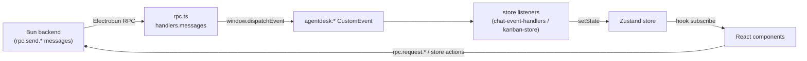

# Frontend State Stores

**What & why.** The renderer keeps live UI state in [Zustand](https://github.com/pmndrs/zustand)
stores. The two central ones are the **chat store** (`useChatStore`) and the
**kanban store** (`useKanbanStore`). The non-obvious thing to understand: the
stores are *not* updated directly by the backend. Bun cannot mutate a Zustand
store across the process boundary, so every server-pushed update arrives as an
Electrobun RPC **message**, is re-broadcast as a `window` **DOM CustomEvent** by
`rpc.ts`, and a module-level listener in the store translates that event into a
`setState`. This DOM-event indirection is the spine of all real-time UI.

## Key idea: RPC message → DOM event → setState

The backend has no handle on React state. The bridge is one-directional fan-out:

1. Bun calls a webview-side RPC *message* handler (fire-and-forget). These are
   registered in `src/mainview/lib/rpc.ts:46` under `handlers.messages`.
2. Each handler does nothing but re-emit a `CustomEvent` on `window`, e.g.
   `streamToken` → `agentdesk:stream-token` (`src/mainview/lib/rpc.ts:82`),
   `kanbanTaskUpdated` → `agentdesk:kanban-task-updated`
   (`src/mainview/lib/rpc.ts:112`).
3. Stores register listeners *once at module-load time* and call `setState`
   inside them — `chat-store.ts` calls `initChatEventHandlers()` at the bottom
   (`src/mainview/stores/chat-store.ts:434`); the kanban store registers its
   single listener inline (`src/mainview/stores/kanban-store.ts:184`).

The reverse path (UI → backend) is plain: store **actions** call typed wrappers
in `rpc.ts` (e.g. `sendMessage` → `rpc.sendMessage`,
`src/mainview/stores/chat-store.ts:333`) and then optimistically update local
state.

## Chat store

`useChatStore` (`src/mainview/stores/chat-store.ts:134`) holds conversations,
the active conversation's messages, and a large amount of *transient* status
(`isStreaming`, `activeInlineAgent`, `runningAgentCount`, `pmThinkingText`,
`shellApprovalRequests`, `isCompacting`, live context-token gauges). Domain
types live in `chat-types.ts` (`Conversation`, `Message`, `ActiveInlineAgent`,
`ShellApprovalRequest`).

### Streaming lifecycle (the heart of it)

PM token streaming is handled entirely in `chat-event-handlers.ts`, not in
action methods:

- **Tokens are buffered, not applied per-token.** `onStreamToken` appends to a
  shared `buffers.tokenBuffer` and schedules a flush every ~32 ms (≈30 fps,
  `TOKEN_FLUSH_INTERVAL`) — see `src/mainview/stores/chat-event-handlers.ts:102`.
  `flushTokenBuffer` (`:47`) lazily inserts an empty assistant placeholder
  message on the first flush so `onStreamComplete` can later update it in place.
- **A completed-stream guard** drops late tokens. `completedStreamIds` is a
  capped (50-entry) `Set`; `onStreamToken` early-returns for any id already in
  it (`:92`), preventing a PM bubble from getting stuck streaming after a stale
  token arrives.
- **`onStreamComplete`** (`:148`) flushes the buffer, marks the stream complete,
  and writes the final message — preferring backend content but falling back to
  accumulated `streamingContent`. It also handles the **stale-completion** case:
  if a *newer* stream is already active it updates only the message content and
  leaves streaming flags alone (`:206`).
- **`createdAt` is the ordering lever.** On completion the PM message's
  `createdAt` is bumped to its finish time so it sorts *below* the sub-agents it
  spawned (which carry earlier timestamps) — see the comment at
  `src/mainview/stores/chat-event-handlers.ts:247`. The message list mirrors
  this: it sorts by the DB `seq` (rowid) when present and falls back to
  `createdAt` for live/optimistic rows (`src/mainview/components/chat/message-list.tsx:115`).

### Conversation-scoping guard

Almost every handler early-returns unless the event's `conversationId` matches
`activeConversationId` (e.g. `onStreamToken` `:95`, `onNewMessage`
`chat-event-handlers.ts:452`). This keeps background activity in other
conversations from polluting the visible message list — when the user navigates
back, `loadMessages` re-fetches from the DB the backend already updated
(`onStreamComplete` returns early if the conversation isn't loaded, `:226`).

### Inline-agent & busy-state tracking

`onAgentInlineStart`/`onAgentInlineComplete` (`:593`/`:613`) maintain
`runningAgentCount` and the `activeInlineAgent` badge. `pmPending` bridges the
gap between an agent finishing and the PM restarting its stream so the stop
button stays live; a **safety-net `setTimeout(…, 8000)`** clears `pmPending` if
the PM's first token never arrives (crash/early-return), `:649`.
`syncRunningAgents` (`chat-store.ts:380`) rebuilds all of this from the backend
after navigation, using a synthetic `sync-*` messageId so the
count-drops-to-zero clear path works.

### Optimistic IDs

`sendMessage` inserts a `temp-…` user message, then swaps its id for the real DB
id once `rpc.sendMessage` returns (`chat-store.ts:341`) so later delete/branch
operations target the persisted row. `reset()` also clears the module-level
token buffers/timers to stop stale tokens leaking into the next conversation
(`chat-store.ts:420`).

### Unsent-message drafts

A typed-but-unsent chat-input message survives navigation, tab switches, and a
full app restart. The store holds `drafts: Record<conversationId, string>`,
hydrated at module load from `localStorage` (`agentdesk:chat-drafts`) by
`loadDrafts()` and mirrored back on every write by `saveDrafts()` —
all `localStorage` access is wrapped in `try/catch` because a draft must never
break the chat. `setDraft(conversationId, value)` writes the draft, and
**deletes the key when `value` is empty** so the map (and localStorage payload)
stays bounded; `clearDraft` is the empty-value shorthand. `deleteConversation`
calls `clearDraft(id)`, and `reset()` deliberately **preserves** the live
`drafts` (`set({ ...initialState, …, drafts: get().drafts })`) because
`initialState` only carries the app-launch snapshot — a bare spread would wipe
drafts created during the session.

The `ChatInput` component (`src/mainview/components/chat/chat-input.tsx`) keeps
the textarea `value` as **local** state (popover/slash detection needs it
synchronously) and bridges to the store at three points: it **seeds** `value`
from the stored draft via a lazy `useState` initializer; a single effect
**persists** `value` to `setDraft(draftConv, value)` on every change (covering
typing, slash resets, enhance, imperative `setValue`, and clear-on-send);
and on a **conversation switch** it swaps in the new conversation's draft
*during render* (React's "adjust state when a prop changes" pattern, guarded by
a `draftConv` state) — not in an effect, both to satisfy
`react-hooks/set-state-in-effect` and to avoid a stale-value window where the
outgoing text could be written under the incoming conversation's key.

## Kanban store

`useKanbanStore` (`src/mainview/stores/kanban-store.ts:93`) is far simpler. It
holds the active project's `tasks` plus derived getters (`getTasksByColumn`,
`getColumnCount`). Mutations are **optimistic** — `moveTask` and `updateTask`
patch local state *before* awaiting the RPC (`:139`, `:127`). Real-time sync is
coarse-grained: a single `agentdesk:kanban-task-updated` listener
(`:184`) just calls `loadTasks(projectId)` to refetch the whole board — but only
when the event's `projectId` matches `activeProjectId`. This is the channel by
which agent-driven kanban moves (PM/review-cycle) appear live in the UI.

`useMessageQueueStore` (`src/mainview/stores/message-queue.ts`) holds messages
the user sends while the chat is busy (streaming/agent running), up to
`MESSAGE_QUEUE_MAX`; `ChatLayout` dequeues and sends the oldest one once
`isBusy` flips false. Being a module-level Zustand store, `queue` survives
`ChatLayout` unmounting/remounting (e.g. navigating away from and back to the
chat page) — the array isn't reset just because the component was removed
from the tree. The only intended reset is a genuine conversation switch. That
guard must live *in the store*, not in a component `useEffect`/`ref`, because
a ref resets to its initial value on every remount and can't distinguish
"remounted, same conversation" from "switched conversation" — a `useEffect`
keyed on `activeConversationId` alone fires on mount either way. The store
tracks its own `activeConversationId` and exposes `syncActiveConversation(id)`,
which clears `queue` only when `id` differs from what the store last saw;
`ChatLayout` calls it on every render instead of calling `clear()` directly.
**`syncActiveConversation` ignores a falsy `id` entirely** rather than
treating it as "switched away" — `ProjectPage`'s project-load effect
(`src/mainview/pages/project.tsx:99-133`) calls `useChatStore.reset()` on
unmount (leaving the project) and again defensively on mount, so
`activeConversationId` is briefly `undefined` while conversations reload
before the same conversation gets re-selected. Clearing on that transient
falsy value would reproduce the exact bug this store exists to prevent —
so only a transition between two *concrete, different* ids counts as a
switch.

## Key files

| File | Role |
|---|---|
| `src/mainview/stores/chat-store.ts` | `useChatStore` — conversations, messages, streaming/agent status, unsent-message `drafts`; actions call RPC then setState |
| `src/mainview/components/chat/chat-input.tsx` | Consumer; local textarea `value` bridged to the store's `drafts` (seed on mount, persist on change, swap-during-render on conversation switch) |
| `src/mainview/stores/chat-types.ts` | `Conversation`, `Message`, `ActiveInlineAgent`, `AgentStatusValue`, `ShellApprovalRequest` |
| `src/mainview/stores/chat-event-handlers.ts` | All `agentdesk:*` DOM listeners; token buffering, completed-stream guard, busy-state logic |
| `src/mainview/stores/kanban-store.ts` | `useKanbanStore` — board tasks, optimistic mutations, refetch-on-event |
| `src/mainview/stores/message-queue.ts` | `useMessageQueueStore` — send-while-busy queue; self-tracks `activeConversationId` so remounts don't drop it |
| `src/mainview/lib/rpc.ts` | Bridges Electrobun RPC messages → `window` CustomEvents (the fan-out point) |
| `src/mainview/components/chat/message-list.tsx` | Consumer; final `seq`/`createdAt` sort that the store's ordering is designed for |

## Gotchas / Constraints

- **Listeners are registered at module load, not in React.** `chat-store.ts`
  imports trigger `initChatEventHandlers()`; a `handlersInitialized` guard
  (`chat-event-handlers.ts:722`) makes it idempotent so HMR re-evaluation
  doesn't double-register. The kanban listener has **no such guard** —
  acceptable because it only refetches, but HMR can leave duplicate listeners.
- **Token buffers are module-level singletons** (`buffers`,
  `chat-event-handlers.ts:34`), exported as an object specifically so
  `chat-store.reset()` can clear them by reference (plain `let` exports are
  bound by value).
- **Everything is keyed on `activeConversationId`/`activeProjectId`.** If those
  drift from what the backend thinks is active, real-time updates silently
  vanish until a navigation/refetch.
- **PM message ordering relies on `createdAt` finish-time bumping** matching the
  backend rowid repositioning. If one side changes without the other, live view
  and reload disagree on PM-vs-subagent order.
- **Optimistic kanban moves can briefly diverge** from the server if the RPC
  fails (no rollback on `moveTask`/`updateTask`).

## Related

- [[rpc-layer]] — the message/request transport these events ride on
- [[agent-engine]] — emits the stream/agent/plan events the chat store consumes
- [[database]] — `conversations`/`messages`/`kanban_tasks` rows these stores mirror

## Open questions

- Other stores in `src/mainview/stores/` (playground, unread, issue-fixer,
  remote-sync, freelance-engine) follow the same pattern but are out of scope
  here — each could get its own short section if they grow.
- No automatic rollback exists for failed optimistic kanban mutations; unclear
  whether this has caused visible drift in practice.
