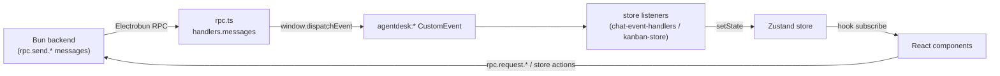

# Frontend State Stores

**What & why.** The renderer keeps live UI state in [Zustand](https://github.com/pmndrs/zustand)
stores. The two central ones are the **chat store** (`useChatStore`) and the
**kanban store** (`useKanbanStore`). The non-obvious thing to understand: the
stores are *not* updated directly by the backend. Bun cannot mutate a Zustand
store across the process boundary, so every server-pushed update arrives as an
Electrobun RPC **message**, is re-broadcast as a `window` **DOM CustomEvent** by
`rpc.ts`, and a module-level listener in the store translates that event into a
`setState`. This DOM-event indirection is the spine of all real-time UI.

## Key idea: RPC message → DOM event → setState

The backend has no handle on React state. The bridge is one-directional fan-out:

1. Bun calls a webview-side RPC *message* handler (fire-and-forget). These are
   registered in `src/mainview/lib/rpc.ts:46` under `handlers.messages`.
2. Each handler does nothing but re-emit a `CustomEvent` on `window`, e.g.
   `streamToken` → `agentdesk:stream-token` (`src/mainview/lib/rpc.ts:82`),
   `kanbanTaskUpdated` → `agentdesk:kanban-task-updated`
   (`src/mainview/lib/rpc.ts:112`).
3. Stores register listeners *once at module-load time* and call `setState`
   inside them — `chat-store.ts` calls `initChatEventHandlers()` at the bottom
   (`src/mainview/stores/chat-store.ts:540`); the kanban store registers its
   single listener inline (`src/mainview/stores/kanban-store.ts:184`).

The reverse path (UI → backend) is plain: store **actions** call typed wrappers
in `rpc.ts` (e.g. `sendMessage` → `rpc.sendMessage`,
`src/mainview/stores/chat-store.ts:392`) and then optimistically update local
state.

## Chat store

`useChatStore` (`src/mainview/stores/chat-store.ts:189`) holds the
`activeProjectId` (which project ProjectPage is showing — see the
project-scoping section below), conversations, the active conversation's
messages, and a large amount of *transient* status
(`isStreaming`, `activeInlineAgent`, `runningAgentCount`, `pmThinkingText`,
`shellApprovalRequests`, `isCompacting`, live context-token gauges). Domain
types live in `chat-types.ts` (`Conversation`, `Message`, `ActiveInlineAgent`,
`ShellApprovalRequest`).

### Streaming lifecycle (the heart of it)

PM token streaming is handled entirely in `chat-event-handlers.ts`, not in
action methods:

- **Tokens are buffered, not applied per-token.** `onStreamToken` appends to a
  shared `buffers.tokenBuffer` and schedules a flush every ~32 ms (≈30 fps,
  `TOKEN_FLUSH_INTERVAL`) — see `src/mainview/stores/chat-event-handlers.ts:41`.
  `flushTokenBuffer` (`:47`) lazily inserts an empty assistant placeholder
  message on the first flush so `onStreamComplete` can later update it in place.
- **A completed-stream guard** drops late tokens. `completedStreamIds` is a
  capped (50-entry) `Set`; `onStreamToken` early-returns for any id already in
  it (`:104`), preventing a PM bubble from getting stuck streaming after a stale
  token arrives.
- **`onStreamComplete`** (`:160`) bails immediately unless `activeConversationId`
  still matches the event, then flushes the buffer, marks the stream complete,
  and writes the final message — preferring backend content but falling back to
  accumulated `streamingContent`. It also handles the **stale-completion** case:
  if a *newer* stream is already active it updates only the message content and
  leaves streaming flags alone (`:227`).
- **`createdAt` is the ordering lever.** On completion the PM message's
  `createdAt` is bumped to its finish time so it sorts *below* the sub-agents it
  spawned (which carry earlier timestamps) — see the comment at
  `src/mainview/stores/chat-event-handlers.ts:260`. The message list mirrors
  this: it sorts by the DB `seq` (rowid) when present and falls back to
  `createdAt` for live/optimistic rows (`src/mainview/components/chat/message-list.tsx:115`).

### Conversation-scoping guard

Almost every handler early-returns unless the event's `conversationId` matches
`activeConversationId` (e.g. `onStreamToken` `:107`, `onNewMessage`
`chat-event-handlers.ts:491`). This keeps background activity in other
conversations from polluting the visible message list — when the user navigates
back, `loadMessages` re-fetches from the DB the backend already updated
(`onStreamComplete` returns early if a different conversation is now active,
`:192`).

### Same-project conversation-switch streaming leak (fixed)

The per-handler `activeConversationId` guard above protects against *events*
arriving for the wrong conversation, but it doesn't protect the streaming
*state itself* from surviving a switch. `streamingContent`, `isStreaming`, and
`streamingMessageId` are single global fields — not keyed per conversation —
and until this fix, switching conversations (sidebar click, the
`switchToConversation` broadcast, or the mount-time auto-select) never cleared
them. Two ways this leaked one conversation's live-streaming text into
another's view, both requiring no cross-*project* involvement at all — this is
why the `activeProjectId` fix above didn't fully resolve user reports of
"messages/last prompt vanish" after that fix shipped:

- **`flushTokenBuffer`** (`:47`) buffers PM tokens and applies them up to
  `TOKEN_FLUSH_INTERVAL` (32ms) later, via a captured `meta.conversationId`
  from *when the tokens arrived*. If the user switched to a different
  conversation inside that window, the flush used to tag the buffered content
  with `prev.activeConversationId` (the conversation active **by the time the
  timer fired**, not the one the tokens were for) — mixing one conversation's
  partial reply into whichever conversation the user had switched to.
- **`onStreamError`** (`:285`) used to unconditionally clear
  `isStreaming`/`streamingMessageId`/`streamingContent` for *any* errored
  stream, regardless of which conversation it belonged to — a background
  conversation erroring out would silently kill the currently-viewed
  conversation's own, unrelated, still-live streaming bubble.

**The fix has two layers.** The root fix is in `setActiveConversation`
(`chat-store.ts:215`): on a genuine switch (`id !== previous
activeConversationId`) it now synchronously clears the pending token buffer
(`buffers.tokenFlushTimer`/`tokenBuffer`/`tokenStreamMeta`) and the streaming
fields — the same cleanup `reset()` already did for a *project* switch,
extended to conversation switches within the same project (which never routed
through `reset()`). Because this is the *only* place `activeConversationId` is
ever set, fixing it here closes the gap for every switch path at once. On top
of that, three handlers got defensive re-checks so no single choke point is
load-bearing alone: `flushTokenBuffer` re-validates
`useChatStore.getState().activeConversationId === meta.conversationId` right
before applying: buffer state, `onStreamComplete` gates its entire body on
`state.activeConversationId === conversationId` (replacing a weaker proxy that
checked whether `messages` happened to contain a row for that conversation —
true mid-switch, before `loadMessages` has replaced the array), and
`onStreamError` gates both the `markStreamCompleted` call and the state clear
on the same check.

### Async-fetch staleness guards (`loadMessages`, kanban `loadTasks`/`createTask`)

A stress-test pass (multiple projects with agents active, user rapidly
switching both projects and conversations) surfaced the same missing-guard
pattern in two more places — both fixed the identical way `loadConversations`
already was: **whichever fetch resolves last for the CURRENT id wins,
regardless of call order**, by re-checking the relevant active-id *after* the
`await`, not just trusting the closure-captured parameter.

- **`loadMessages`** (`chat-store.ts:407`) previously applied its result
  unconditionally. Rapidly clicking through conversations X → Y → Z (in the
  same or different projects) fires three `loadMessages` calls; without a
  guard, whichever one's network round-trip happened to finish *last* — not
  necessarily Z's — would win, showing a stale conversation's messages even
  though `activeConversationId` correctly says Z. Now gated on
  `get().activeConversationId === conversationId`, and `messagesLoading` is
  cleared in a `finally` gated the same way, so a stale call's cleanup can't
  hide a still-in-flight, currently-relevant fetch's loading overlay early.
- **`kanban-store.ts`'s `loadTasks`** had the identical gap — it fires
  automatically (not just on manual clicks) via `ProjectPage`'s deferred
  `requestIdleCallback` on every project visit, making it the more likely of
  the two to actually hit in practice. `createTask`'s follow-up
  `getKanbanTasks` refetch had the same gap one level in. Both now re-check
  `get().activeProjectId` after their `await`.

### Shell-approval cards leaking across projects (fixed)

`shellApprovalRequests` is a flat, store-wide array with **no project scoping
at all** in `onShellApprovalRequest` — every pending approval from every
project lands in the same list, and `ChatLayout` rendered it unfiltered. A
background project's agent requesting shell approval would render its card
inline in whichever *other* project's chat happened to be open, with nothing
in the UI distinguishing it — a user could approve or deny a command without
realizing it belonged to a different project than the one they were looking
at. The type didn't even carry a `projectId` to filter by, even though the
backend broadcast always included one (`engine-manager.ts`'s
`askUserQuestion`-style payload construction).

Fixed by threading `projectId` through: `ShellApprovalRequest` now has a
required `projectId` field, `onShellApprovalRequest`
(`chat-event-handlers.ts:540`) captures it from the event, and `ChatLayout`
filters to its own `projectId` before rendering — via a `useMemo`, not an
inline selector filter, so an unrelated store update elsewhere doesn't force a
re-render through a fresh array reference every time. The store itself still
holds *all* projects' pending approvals (unfiltered) so navigating to the
project a request actually belongs to still shows it without a reload — only
the *render* is scoped, not the data.

`ShellApprovalRequest` also now carries a required `conversationId`
(`chat-types.ts:59`), previously absent — the backend broadcast
(`shellApprovalRequest`, `src/shared/rpc/webview.ts`) always included one, but
the frontend type didn't. This is what lets the cross-project "needs your
attention" toast (see [[frontend-components]]) deep-link to the *exact*
conversation waiting for approval instead of just the project — the same
capability the `presentPlan` broadcast already had via its own
`conversationId`.

### Cross-project deep-link target (`pendingConversationTarget`)

The chat store gained a `pendingConversationTarget: {projectId, conversationId}
| null` field + `setPendingConversationTarget` action
(`chat-store.ts:42,90,210-212`), consumed by `ProjectPage`'s conversation
auto-select effect (see [[frontend-pages]]) to jump straight to a specific
conversation once that project's conversations finish loading, instead of
falling back to "most recent conversation" or "create a new one." It exists
so the cross-project shell-approval/plan-approval toast can navigate to a
project *and* land on the exact conversation that raised the request.
Critically, `reset()` (called on every project-switch mount/unmount in
`project.tsx`) **preserves** this field the same way it already preserves
`activeProjectId`/`drafts` (`chat-store.ts:596`) — a bare spread would wipe it
before the newly-navigated-to project's conversations ever finish loading and
get a chance to consume it.

**Not fixed, flagged as a separate design question**: `UserQuestionDialog`
(`components/modals/user-question-dialog.tsx`) is a single global blocking
modal — by design, any project's pending question interrupts whatever the
user is doing, since the agent is stuck waiting either way. Unlike the shell
card, this is arguably correct behavior, not a bug — but the dialog doesn't
display which project is asking, so a user deep in project B could answer
project A's question without realizing it's not about B. Worth a UX pass if
this proves confusing in practice.

### Project-scoping guard (cross-project broadcast gate)

Conversation-**list** events need a second gate: broadcasts are global (one
window, all projects), and agents working in a *background* project emit
`conversationUpdated` on every sub-agent start/completion
(`src/bun/agents/agent-loop.ts:1035,1419,1510`, `src/bun/agents/engine.ts:1343`)
and `switchToConversation` when dispatching a task with new-conversation-per-task
on (`src/bun/agents/tools/pm-tools.ts:486`). The store therefore tracks an
explicit `activeProjectId`, set only by `ProjectPage` via `setActiveProject`
(`src/mainview/stores/chat-store.ts:194`) — on mount/project-change before
`loadConversations`, nulled on unmount (`src/mainview/pages/project.tsx:99-141`).
`reset()` deliberately *preserves* it (like `drafts`) since reset clears
conversation data, not which project is open.

Three places enforce the gate:
- `onConversationUpdated` (`chat-event-handlers.ts:361`) only re-fetches the
  conversation list for an unknown conversation when the event's `projectId`
  equals `activeProjectId`.
- `onSwitchToConversation` (`chat-event-handlers.ts:405`) compares the event's
  `projectId` against `activeProjectId` — it must NOT derive "am I on this
  project?" from the loaded conversations, because a cross-project reload could
  have replaced that list.
- `loadConversations` itself (`chat-store.ts:198`) drops its result if
  `activeProjectId` has moved on by the time the RPC resolves (belt-and-braces
  against slow fetches from a previous project).

Without this gate, a background project's agent completing a step would replace
the visible sidebar with that project's conversations, and a subsequent
`switchToConversation` would then pass the (list-derived) project check and load
the wrong project's messages into the main chat area — while the Files tab
(keyed on the route param) stayed correct.

### Inline-agent & busy-state tracking

`onAgentInlineStart`/`onAgentInlineComplete` (`:619`/`:639`) maintain
`runningAgentCount` and the `activeInlineAgent` badge. `pmPending` bridges the
gap between an agent finishing and the PM restarting its stream so the stop
button stays live; a **safety-net `setTimeout(…, 8000)`** clears `pmPending` if
the PM's first token never arrives (crash/early-return), `:675`.
`syncRunningAgents` (`chat-store.ts:503`) rebuilds all of this from the backend
after navigation, using a synthetic `sync-*` messageId so the
count-drops-to-zero clear path works.

### Optimistic IDs

`sendMessage` inserts a `temp-…` user message, then swaps its id for the real DB
id once `rpc.sendMessage` returns (`chat-store.ts:420`) so later delete/branch
operations target the persisted row. `reset()` also clears the module-level
token buffers/timers to stop stale tokens leaking into the next conversation
(`chat-store.ts:546`) — the same cleanup `setActiveConversation` now does for a
same-project conversation switch (`chat-store.ts:233`, see above).

### Unsent-message drafts

A typed-but-unsent chat-input message survives navigation, tab switches, and a
full app restart. The store holds `drafts: Record<conversationId, string>`,
hydrated at module load from `localStorage` (`agentdesk:chat-drafts`) by
`loadDrafts()` and mirrored back on every write by `saveDrafts()` —
all `localStorage` access is wrapped in `try/catch` because a draft must never
break the chat. `setDraft(conversationId, value)` writes the draft, and
**deletes the key when `value` is empty** so the map (and localStorage payload)
stays bounded; `clearDraft` is the empty-value shorthand. `deleteConversation`
calls `clearDraft(id)`, and `reset()` deliberately **preserves** the live
`drafts` (`set({ ...initialState, …, drafts: get().drafts })`) because
`initialState` only carries the app-launch snapshot — a bare spread would wipe
drafts created during the session.

The `ChatInput` component (`src/mainview/components/chat/chat-input.tsx`) keeps
the textarea `value` as **local** state (popover/slash detection needs it
synchronously) and bridges to the store at three points: it **seeds** `value`
from the stored draft via a lazy `useState` initializer; a single effect
**persists** `value` to `setDraft(draftConv, value)` on every change (covering
typing, slash resets, enhance, imperative `setValue`, and clear-on-send);
and on a **conversation switch** it swaps in the new conversation's draft
*during render* (React's "adjust state when a prop changes" pattern, guarded by
a `draftConv` state) — not in an effect, both to satisfy
`react-hooks/set-state-in-effect` and to avoid a stale-value window where the
outgoing text could be written under the incoming conversation's key.

## Kanban store

`useKanbanStore` (`src/mainview/stores/kanban-store.ts:94`) is far simpler. It
holds the active project's `tasks` plus derived getters (`getTasksByColumn`,
`getColumnCount`). Mutations aren't uniformly optimistic — `moveTask` (`:151`)
patches local state *before* awaiting the RPC, but `updateTask` (`:139`) awaits
first and only patches once the RPC resolves. `loadTasks` (`:107`) and
`createTask`'s (`:124`) follow-up refetch both carry the same staleness guard
as `loadMessages` above — the user may have switched to a different project
while either fetch was in flight. Real-time sync is coarse-grained: a single
`agentdesk:kanban-task-updated` listener (`:195`) just calls
`loadTasks(projectId)` to refetch the whole board — but only when the event's
`projectId` matches `activeProjectId`. This is the channel by which
agent-driven kanban moves (PM/review-cycle) appear live in the UI.

### Message queue — backend-driven, not a frontend-only mirror

`useMessageQueueStore` (`src/mainview/stores/message-queue.ts`) used to be the
*entire* implementation of "send while busy": a plain Zustand array with no
project/conversation tag, drained locally by a `ChatLayout` effect watching
`isBusy`. That design silently **discarded** whatever was queued the moment
the user switched projects or conversations, because nothing about the queue
was tied to a specific project+conversation — a real user-facing bug ("my
follow-up message vanished").

The queue now lives **server-side**, in `src/bun/message-queue-manager.ts` — an
in-memory `Map<projectId, Map<conversationId, QueuedMessage[]>>` (capped at
`MESSAGE_QUEUE_MAX = 3` per conversation) with `enqueueMessage`/`dequeueMessage`/
`removeQueuedMessage`/`getQueuedMessages`/`clearQueueForConversation`/
`clearQueueForProject`. Draining is driven entirely from
`src/bun/engine-manager.ts`'s existing idle-check inside `onStreamComplete`
(mirrored in `onStreamError`): once a project's engine goes truly idle
(`!e.isProcessing() && getRunningAgentCount(projectId)===0 &&
e.getQueuedAgentsSnapshot().length===0`), it calls `dequeueMessage(projectId,
cid)` — if a message is waiting for *that* conversation it calls
`e.sendMessage(cid, queued.content, undefined)` and broadcasts
`messageQueueUpdated`, **skipping** the session-complete toast/notification
logic since sending continues the session rather than ending it
(`engine-manager.ts:643-653`, error-path mirror at `:688-699`). Because this
runs from the engine's own completion callback — not from any mounted
component — a queued message now reaches the right project+conversation the
moment it goes idle, regardless of what the frontend happens to be showing.
`removeEngine()` also calls `clearQueueForProject(projectId)` so an evicted/
removed project's queue doesn't linger.

The frontend store is now a **thin, staleness-guarded mirror** of that server
state, not the source of truth. It tracks `activeProjectId`/
`activeConversationId` (whichever project+conversation it's currently
displaying); `enqueue`/`remove`/`clear` are async RPC calls
(`rpc.enqueueMessage`/`removeQueuedMessage`/`clearQueuedMessages`) that only
apply the RPC's returned queue to local state if it still matches what's
displayed; `loadQueue(projectId, conversationId)` fetches the current
server-side queue on mount and on every conversation switch (a falsy
`conversationId` just shows an empty queue rather than erroring); and
`applyBroadcast(projectId, conversationId, queue)` applies a
`messageQueueUpdated` broadcast only if it matches what's currently displayed
— everything else is ignored as stale. `ChatLayout` wires this up with a
`loadQueue(projectId, activeConversationId)` effect on every project/
conversation switch and a `window.addEventListener("agentdesk:message-queue-updated", …)`
listener that calls `applyBroadcast`; `handleStop` now calls the async
`clearQueueRaw(projectId, activeConversationId)` instead of a synchronous local
clear. The old local "drain on `isBusy` transition" effect and the
`syncActiveConversation`-based reset-on-switch guard are gone — there is
nothing left to drain client-side, since delivery is entirely backend-driven.

RPC surface: `enqueueMessage`/`removeQueuedMessage`/`getQueuedMessages`/
`clearQueuedMessages` (contracts in `src/shared/rpc/conversations.ts`,
`QueuedMessageRow` type; handlers in
`src/bun/rpc-groups/conversations-control.ts`), and the new
`messageQueueUpdated` broadcast (`{projectId, conversationId, queue}`,
`src/shared/rpc/webview.ts`) — see [[rpc-layer]] and
[[message-streaming-broadcasts]].

## Key files

| File | Role |
|---|---|
| `src/mainview/stores/chat-store.ts` | `useChatStore` — conversations, messages, streaming/agent status, unsent-message `drafts`; actions call RPC then setState; `loadMessages`/`setActiveConversation` carry the staleness/streaming-leak guards above |
| `src/mainview/components/chat/chat-input.tsx` | Consumer; local textarea `value` bridged to the store's `drafts` (seed on mount, persist on change, swap-during-render on conversation switch) |
| `src/mainview/components/chat/chat-layout.tsx` | Consumer; filters the store's project-wide `shellApprovalRequests` down to its own `projectId` before rendering |
| `src/mainview/stores/chat-types.ts` | `Conversation`, `Message`, `ActiveInlineAgent`, `AgentStatusValue`, `ShellApprovalRequest` (carries `projectId`) |
| `src/mainview/stores/chat-event-handlers.ts` | All `agentdesk:*` DOM listeners; token buffering, completed-stream guard, busy-state logic |
| `src/mainview/stores/kanban-store.ts` | `useKanbanStore` — board tasks, optimistic mutations (not uniformly — see above), refetch-on-event, staleness-guarded `loadTasks`/`createTask` |
| `src/mainview/stores/message-queue.ts` | `useMessageQueueStore` — thin staleness-guarded mirror of the server-side queue (`src/bun/message-queue-manager.ts`); `loadQueue`/`applyBroadcast` sync it to whatever project+conversation is displayed |
| `src/mainview/lib/rpc.ts` | Bridges Electrobun RPC messages → `window` CustomEvents (the fan-out point) |
| `src/mainview/components/chat/message-list.tsx` | Consumer; final `seq`/`createdAt` sort that the store's ordering is designed for |

## Gotchas / Constraints

- **Listeners are registered at module load, not in React.** `chat-store.ts`
  imports trigger `initChatEventHandlers()`; a `handlersInitialized` guard
  (`chat-event-handlers.ts:748`) makes it idempotent so HMR re-evaluation
  doesn't double-register. The kanban listener has **no such guard** —
  acceptable because it only refetches, but HMR can leave duplicate listeners.
- **Token buffers are module-level singletons** (`buffers`,
  `chat-event-handlers.ts:35`), exported as an object specifically so
  `chat-store.reset()` — and now `setActiveConversation` too — can clear them
  by reference (plain `let` exports are bound by value).
- **Everything is keyed on `activeConversationId`/`activeProjectId`.** If those
  drift from what the backend thinks is active, real-time updates silently
  vanish until a navigation/refetch. The chat store's `activeProjectId` is the
  *only* legitimate "which project am I on?" signal for its handlers — never
  derive it from `conversations[…].projectId` (see the project-scoping guard
  above for the cross-project sidebar-corruption bug that pattern caused). A
  matching same-project pitfall: `streamingContent`/`isStreaming`/
  `streamingMessageId` are global, not per-conversation, so any code path that
  mutates them must itself re-check `activeConversationId` against the event's
  own `conversationId` at the moment it writes — checking once earlier (e.g.
  when tokens were first buffered) isn't enough if a switch can happen before
  the write actually applies (see the same-project streaming-leak fix above).
- **PM message ordering relies on `createdAt` finish-time bumping** matching the
  backend rowid repositioning. If one side changes without the other, live view
  and reload disagree on PM-vs-subagent order.
- **Optimistic kanban moves can briefly diverge** from the server if the RPC
  fails (no rollback on `moveTask`/`updateTask`).

## Related

- [[rpc-layer]] — the message/request transport these events ride on
- [[agent-engine]] — emits the stream/agent/plan events the chat store consumes
- [[database]] — `conversations`/`messages`/`kanban_tasks` rows these stores mirror

## Open questions

- Other stores in `src/mainview/stores/` (playground, unread, issue-fixer,
  remote-sync, freelance-engine) follow the same pattern but are out of scope
  here — each could get its own short section if they grow.
- No automatic rollback exists for failed optimistic kanban mutations; unclear
  whether this has caused visible drift in practice.
