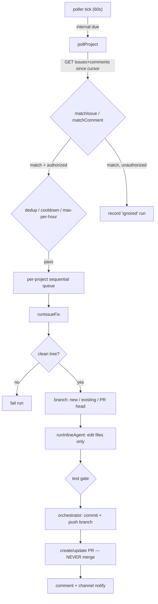

# Issue Fixer

**Autonomous GitHub-issue → branch/PR resolution that never merges.** When an
authorized collaborator opens an issue (or comments) whose title/comment carries
an `agentdesk-*` keyword, or applies an `agentdesk-*` label, AgentDesk detects it
by **outbound polling** (no inbound webhook — NAT-safe and private), runs the
hidden `issue-fixer` agent against the project's local git clone, then
**deterministically** commits, pushes (token-authenticated), and opens a PR for
human review. The single most important invariant: **humans merge, the agent
never does** — enforced in three independent layers.

## Key idea / why this shape

The feature deliberately reuses the [[playground]] hidden-agent pattern
(`runInlineAgent` directly, *not* the [[agent-engine]] PM path) so it
automatically bypasses planning, the approval card, kanban tasks, and the
review-cycle. That isolation is the whole point: an autonomous, repo-triggered
run has no human watching mid-flight, so it must never raise an approval dialog
or block on input. See `docs/issue-fixer-plan.md` §2.2 for the rationale.

The agent is treated as **untrusted with respect to git history**: it only edits
files. The orchestrator — not the agent — owns the entire git lifecycle (branch,
commit, push, PR). This keeps the "no merge / no force-push / stay on branch"
guarantees enforceable in code rather than relying on the model to behave.

## How it works

### 1. Polling (outbound, restart-safe)

`startIssueFixerPolling()` (`poller.ts:36`) is called once at app init
(`src/bun/index.ts:189`). It installs a **60-second tick** (`poller.ts:40`) and
fires `pollAllEnabledOnce()` immediately on startup (`poller.ts:47`) so pending
`agentdesk-*` issues are picked up without waiting for the interval. Each
project's own `pollIntervalMin` gates whether the tick actually polls it
(`poller.ts:85-87`); a `ticking` flag prevents a slow poll from overlapping the
next tick (`poller.ts:79`). On startup, `failInterruptedRuns()` (`config.ts:260`)
marks any run left `queued`/`fixing`/`testing`/`pushing` by a crash as `failed`.

`pollProject()` (`poller.ts:108`) is the core. The **first poll after enabling**
just sets the cursor to "now" (`poller.ts:123-127`) so old issues are never
retroactively processed. Thereafter it fetches, in parallel, open issues and all
issue/PR comments updated since the cursor (`poller.ts:137-140`,
`github.ts:88,104`). GitHub's issues endpoint also returns PRs, filtered out via
`isPullRequest`; PR-conversation comments come through the same comments endpoint
and are distinguished by `html_url.includes("/pull/")` (`github.ts:120`).

### 2. Trigger + authorization gate

`matchIssue` / `matchComment` (`triggers.ts:67,113`) decide if a trigger fires.
Critical security rule: a run fires only when **(keyword/label matches) AND
(actor is authorized)**:

- **Keywords** match the issue **TITLE** or an authorized **COMMENT** — *never*
  the issue body (`triggers.ts:5-6,67`). Gated on author association being
  `OWNER`/`MEMBER`/`COLLABORATOR` (`isAuthorizedActor`, `triggers.ts:36`).
- **Labels** (`agentdesk-*`) are authorized **by definition** — only users with
  write access can add labels — so a label match needs no further check
  (`triggers.ts:71-85`).
- `authMode` (`collab` / `label` / `both`) selects which sources are active
  (`triggers.ts:41-48`).

Unauthorized keyword matches are not silently dropped: `handleMatch` records an
`ignored` run row for visibility, then stops (`poller.ts:217-233`).

### 3. Anti-runaway gates

Three DB-backed gates stop runaway loops:

- **Dedup** (`alreadyProcessed`, `triggers.ts:136`): comment triggers are keyed
  on `triggerCommentId`; title/label triggers are processed once per issue
  *unless* the prior run was `ignored` (so an authorization fix re-triggers).
- **Max-per-hour** (`runsInLastHour`, `triggers.ts:186`) plus a **per-poll
  enqueue budget** (`poller.ts:144-146`) — needed because runs enqueued this poll
  have no DB rows yet, so the hourly count alone can't see them.
- **Cooldown** is *not* a drop. It's enforced as a pre-run **pacing delay** in
  the orchestrator (`orchestrator.ts:189-195`, `mostRecentFinishedAt` in
  `config.ts:243`), so a burst of matches in one poll is never lost.

### 4. Orchestrated run (the git lifecycle the agent never touches)

`enqueueIssueFix` chains runs onto a **per-project sequential queue**
(`orchestrator.ts:71-76`) to avoid concurrent git ops on the same workspace.
`runIssueFix` (`orchestrator.ts:135`) then:

1. Creates an `issue_fix_runs` row, registers the abort controller via
   `registerAgentController(projectId, abort, "issue-fixer")` so the run counts
   toward the dashboard's active-agent badge (`orchestrator.ts:161`), and seeds a
   `liveRuns` in-memory snapshot so the Activity tab can hydrate on mount
   (`orchestrator.ts:52-69,169`).
2. **Requires a clean working tree** (`orchestrator.ts:206-210`) — it refuses to
   stash/lose the user's uncommitted changes — and records the user's current
   branch for later restoration.
3. Authenticates *all* remote git ops with `gitAuthArgs(token)` (inline header,
   **no** credential helper) so Git Credential Manager never pops a GUI mid-run
   (`orchestrator.ts:216-217`). Resolves base branch: project setting →
   `origin/HEAD` → `main` (`orchestrator.ts:218-222`).
4. Picks the branch: PR head (PR-feedback), an existing `issue-fix/*` branch
   (re-trigger — continue, never `checkout -B`/reset), or a fresh
   `issue-fix/<n>-<slug>` (`orchestrator.ts:226-249`).
5. Posts a best-effort "🤖 working on this…" comment (`orchestrator.ts:253`).
6. Runs `runInlineAgent` with the hidden `issue-fixer` agent, `persistToDb:false`,
   the guarded shell injected as `extraTools.run_shell`, and a hard
   `excludeTools` list — `git_push`, `git_pr`, `git_reset`, `git_cherry_pick`,
   `git_branch`, `request_human_input`, and all kanban/review tools
   (`orchestrator.ts:309-341`). The agent **edits files only**.
7. **Test gate** (`orchestrator.ts:344-348`): if a `testCommand` is configured it
   runs it; a failure forces a **draft** PR (`orchestrator.ts:396`).
8. Stages + commits any uncommitted agent changes as `AgentDesk` author
   (`orchestrator.ts:351-367`). On a fresh branch with zero commits ahead of
   base it throws "Agent made no changes" rather than open an empty PR
   (`orchestrator.ts:372-377`).
9. Pushes the feature branch via `pushBranchAuthenticated` (never the base
   branch), then **creates a PR** ("Fixes #N") or adopts the pre-existing open PR
   on a 422 "already exists" (`orchestrator.ts:380-426`).
10. Posts a "✅ Done" comment, records the run (`pr_created`/`pr_updated`),
    broadcasts completion, flags Activity, and notifies channels
    (`orchestrator.ts:429-477`).

### 5. The "never merge" enforcement (three layers)

1. **System prompt** (`seed.ts:1210-1214`): explicit absolute rules — never merge,
   never push, never use `gh`, never force-push, no human input.
2. **Toolset**: `git_push`/`git_pr` and branch-mutating git tools are in
   `excludeTools` (`orchestrator.ts:326-339`); there is no merge tool in the
   registry at all.
3. **Guarded shell** (`shell-guard.ts`): the auto-approved shell is the one escape
   hatch, so `findShellViolation` (`shell-guard.ts:62`) rejects `git merge`,
   `rebase`, `gh pr merge`, `git push`, any `gh` invocation, `reset`/`clean`/
   `restore`/`checkout`/`switch`, history rewrites, `rm -rf`, and any push to the
   base branch (`shell-guard.ts:19-72`) before delegating to the real shell.

### 6. Cleanup & cancellation

The `finally` block (`orchestrator.ts:515-546`) restores the user's original
branch. On a **failed** run, the agent's partial uncommitted edits (guaranteed to
be from this run because a clean tree was required at start) are stashed with a
recoverable label before switching back, so they never leak onto the user's
branch. A user-initiated Stop surfaces as an `AbortError` and is recorded as
`cancelled` (not `failed`) with no failure notification (`orchestrator.ts:478-498`).

## Key files

| File | Role |
|---|---|
| `src/bun/issue-fixer/poller.ts` | 60s tick; per-project interval poll; trigger/auth/budget gates; enqueue |
| `src/bun/issue-fixer/triggers.ts` | Keyword/label/author matching + intent + dedup/cooldown/max-per-hour |
| `src/bun/issue-fixer/orchestrator.ts` | Per-project queue; branch → agent → test → commit → push → PR; never merges |
| `src/bun/issue-fixer/prompts.ts` | Intent keywords (`agentdesk-*`) + per-run task block builder |
| `src/bun/issue-fixer/shell-guard.ts` | Denylist wrapper around the auto-approved shell |
| `src/bun/issue-fixer/github.ts` | Outbound GitHub REST client (issues/comments/PR create/comment) |
| `src/bun/issue-fixer/config.ts` | `issue_fixer_config` + `issue_fix_runs` persistence |
| `src/bun/issue-fixer/notify.ts` | Success/failure summary to all connected channels |
| `src/bun/db/seed.ts:1198-1224` | Hidden `issue-fixer` agent definition + system prompt |
| `src/bun/db/schema.ts:582,614` | `issueFixerConfig` / `issueFixRuns` tables |

## Gotchas / Constraints

- **One project = one repo = one config.** A project has exactly one `githubUrl`;
  to watch multiple repos, create multiple projects.
- **Cursor priming:** enabling does nothing on the first poll — it only sets the
  cursor. Issues created *before* enabling are never processed.
- **Keywords never match the issue body** — only title, authorized comment, or
  label. A keyword buried in the body is intentionally ignored (`triggers.ts:5-6`).
- **Custom `agentdesk-*` keywords default to intent `fix`** (`triggers.ts:60`).
  All keywords/labels must be `agentdesk-`-prefixed; the prefix is enforced
  server-side in `sanitizeAgentdesk` (`config.ts:12`) as well as in the UI.
- **Clean-tree requirement:** the run aborts if the workspace has uncommitted
  changes — it will not stash the user's work to make room.
- **The agent must NOT push or open PRs itself.** Doing so races the
  orchestrator's authenticated push/PR and can create duplicate/mis-attributed
  PRs — hence the shell denylist blocks `git push` and any `gh` (`shell-guard.ts:33-36`).
- **No-op runs throw** on a fresh branch (`orchestrator.ts:372-377`) to avoid a
  GitHub 422 from an empty PR; PR-feedback runs skip this (a no-op push is harmless).
- **Token auth uses an inline header with the credential helper disabled** — never
  embed the token in the remote URL (would trigger Git Credential Manager account
  prompts on the user's own pushes). See [[github-token-auth|GitHub token auth]].
- **The shared `constitution` setting is NOT injected into issue-fixer's prompt.**
  `getAgentSystemPrompt` special-cases `playground-agent` and `issue-fixer`
  (`prompts.ts:1165-1180`) to skip the constitution, PM/kanban protocol, and
  cross-agent doc-sharing guidance entirely — it gets only its base prompt +
  user profile + skills list + MCP/browser sections. So edits to the seeded
  `constitution` text or `CONSTITUTION_VERSION` (`seed.ts`), and edits to the
  worker-prompt "Cross-Agent Knowledge Sharing" doc tools list (`prompts.ts`,
  e.g. the `delete_doc` addition), do not change issue-fixer's actual behavior —
  it never had `create_doc`/`update_doc`/`delete_doc` guidance to begin with. It
  does keep the full tool registry (no `agent_tools` rows), so `delete_doc` is
  callable, just undocumented in its prompt.

## Related
- [[playground]] — the hidden-agent / `runInlineAgent` pattern this mirrors
- [[agent-engine]] — the PM path this subsystem deliberately bypasses
- [[github-token-auth]] — `gitAuthArgs` / `pushBranchAuthenticated` token auth
- [[issue-sources]] — the multi-source read-only issue browser (separate feature)
- [[channels]] — where success/failure summaries are delivered

## Open questions
- The `withinCooldown` helper (`triggers.ts:171`) appears superseded by the
  orchestrator's pacing-delay approach (`mostRecentFinishedAt`); confirm whether
  it is still referenced anywhere or is dead code.
- `getLiveRun` (`orchestrator.ts:67`) hydration is consumed by an RPC handler for
  the Activity tab — not traced here; verify the exact RPC wiring if documenting
  the frontend.
