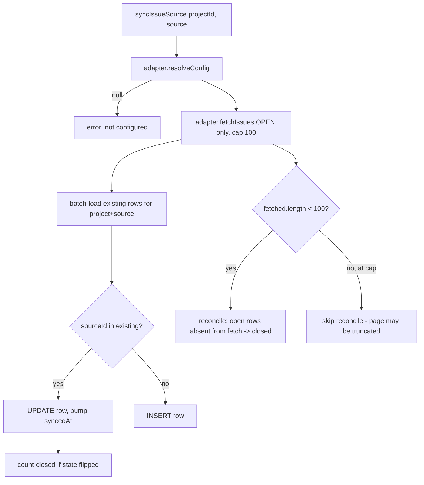

# Issue Sources

**One-paragraph what-and-why.** Issue Sources is the multi-source issue-tracker
integration: it pulls issues from six external trackers (GitHub, Jira, Linear,
GitLab, Trello, Kanboard) into a single normalised `external_issues` table so the
Issue Tracker UI can show, filter and link them uniformly. The whole design hinges
on one shape — `NormalisedIssue` — and a thin **adapter-per-source** layer that
translates each tracker's wildly different API (REST, JQL search, GraphQL,
JSON-RPC, query-string auth) into that shape. The engine (`rpc/issues.ts`) never
knows which source it is talking to; it only calls adapter methods through the
registry. The hard part isn't the fetching, it's the **diff/reconcile logic** that
keeps the local "open" view honest when every adapter only ever fetches *open*
issues.

## Key idea: normalise-then-store, adapters are stateless

The contract is `IssueSourceAdapter` (`src/bun/issue-sources/types.ts:57`). Every
adapter exposes the same five-to-eight methods and is a singleton object — there is
no per-source class or state. The registry (`src/bun/issue-sources/registry.ts:11`)
is a static `Record<IssueSource, IssueSourceAdapter>` and `getAdapter()`
(`registry.ts:20`) is the only dispatch point. Adding a source = write one adapter
file + add a descriptor in `src/shared/rpc/issues.ts:74` + one line in the registry
map.

Config is **never** passed implicitly. The engine resolves a flat
`Record<string,string>` config first, then hands it to whichever adapter method it
calls (`types.ts:57` doc comment). `resolveConfig(projectId)` is the indirection
that lets GitHub differ from everyone else (see Gotchas).

## How it works

### Configuration

Every source except GitHub stores a flat string map in the `settings` table under
category `issue_sources`, key `issueSource:<projectId>:<source>`
(`config-store.ts:8`, `config-store.ts:10`). The whole JSON blob is encrypted at
rest via `encryptSecret`/`decryptSecret` (`config-store.ts:42`, `config-store.ts:29`)
because it holds API tokens; `decryptSecret` tolerates legacy plaintext so existing
users' configs keep working. Required-field validation runs against the static
descriptor's `fields[].required` flags (`registry.ts:34`), and `cleanConfig`
(`config-store.ts:55`) trims and drops empty strings *before* validation so blank
form fields count as missing.

GitHub is special: `saveIssueSourceConfig` refuses to save it
(`rpc/issues.ts:88`) and `getIssueSourceConfig` returns `{}` (`rpc/issues.ts:78`),
because GitHub reuses the global repo URL (Project Settings) + PAT (Settings ›
GitHub) resolved on demand in `githubAdapter.resolveConfig` (`github.ts:20`).

### Sync (the core flow)

`syncIssueSource` (`rpc/issues.ts:167`) is the heart of the subsystem:

Adapters fetch **only open issues** and at most 100 (`github.ts:29` `per_page=100`,
`jira.ts:124` `maxResults=100`, `linear.ts:94` `first:100`, `gitlab.ts:63`
`per_page=100`, `trello.ts:8`/`kanboard.ts:6` slice to `MAX_*=100`). The engine
diffs the fetch against existing rows by `sourceId` in memory
(`rpc/issues.ts:191-195`): present → UPDATE, absent → INSERT. A transition from
local `open` to fetched `closed` increments the `closed` count
(`rpc/issues.ts:223`).

The **reconcile** step (`rpc/issues.ts:248-268`) is the subtle part: since
adapters only return open issues, any locally-tracked row still marked `open` but
missing from this fetch was closed/removed remotely, so it is flipped to `closed`.
The critical guard at `rpc/issues.ts:257`: reconcile runs **only when
`fetched.length < 100`** (`PAGE_CAP`). At exactly the cap the page may be truncated,
so "missing" can't be distinguished from "didn't fit", and wrongly closing overflow
issues is avoided by skipping reconcile entirely. This is why every adapter caps at
100 — the cap value is the reconcile correctness signal.

### Buckets (import filtering)

Sources whose open/closed status lives in user-defined buckets implement the
optional `fetchBuckets()` (`types.ts:84`). `getSourceBuckets` (`rpc/issues.ts:130`)
powers the configure dialog's column/list/status picker. Selected bucket ids are
stored as a JSON array under the config key `buckets` and read back by
`parseSelectedBuckets` (`types.ts:91`), which falls back to the legacy Kanboard
`columns` key for old configs. Semantics differ per source (see table) — for
Kanboard/Trello buckets are the *only* open/closed signal (`bucketSelection.required:
true` in the descriptor), whereas Jira buckets just narrow an already-reliable
`statusCategory != Done` default (`required: false`).

### Linking, create-from-task, auto-close

- **Link**: `linkExternalIssueToTask` (`rpc/issues.ts:275`) just sets
  `external_issues.taskId`.
- **Create from task**: `createExternalIssueFromTask` (`rpc/issues.ts:285`) pushes a
  kanban task out as a new issue via the optional `createIssue` adapter method,
  links it immediately, and de-dups if the task already has a linked issue in that
  source (`rpc/issues.ts:307-314`).
- **Auto-close**: when a kanban task moves to **done**, `moveKanbanTask` fires
  `closeExternalIssueForTask` best-effort (`rpc/kanban.ts:224`). It walks every open
  linked issue across **all** sources and calls the adapter's optional `closeIssue`
  (`rpc/issues.ts:354`). Failures are swallowed so one source never blocks the task
  move or the others (`rpc/issues.ts:369`); a later sync reconciles.

## Per-source quirks (why each adapter looks different)

| Source | Auth | "Open" definition | Buckets | Notable |
|---|---|---|---|---|
| GitHub (`github.ts`) | global PAT via `githubFetch` | `state=open` | — | reuses global config; filters out PRs that surface on the issues endpoint (`github.ts:48`) |
| Jira (`jira.ts`) | HTTP Basic email:token | `statusCategory != Done` (JQL) | statuses, optional | ADF body flattened to text (`jira.ts:40`); status IDs must be unquoted in JQL (`jira.ts:118`); close = find a transition into a "done" category status (`jira.ts:166`) |
| Linear (`linear.ts`) | raw API key, **not** `Bearer` (`linear.ts:14`) | state type ∉ {completed, canceled} | — | GraphQL; resolves team key→UUID (`linear.ts:68`); create requires a team |
| GitLab (`gitlab.ts`) | `PRIVATE-TOKEN` header | `state=opened` | — | no native priority → read from scoped label `priority::x` (`gitlab.ts:49`) |
| Trello (`trello.ts`) | key+token in query string | always `open` (archived excluded) | lists, **required** | created-at decoded from the card id's first 8 hex chars (`trello.ts:11`); close = archive (`trello.ts:141`) |
| Kanboard (`kanboard.ts`) | HTTP Basic `jsonrpc:token` | `status_id=1` (`is_active`) | columns per project, **required** | JSON-RPC 2.0; comma-separated multi-project (`kanboard.ts:52`); `getColumns` powers the bucket picker |

`normalisePriority` (`types.ts:102`) is the shared mapper that collapses each
tracker's priority vocabulary (P0/urgent/blocker/highest…) into
`critical|high|medium|low|null`; Linear and Kanboard map their numeric priorities
locally instead (`linear.ts:33`, `kanboard.ts:66`).

## Key files

| File | Role |
|---|---|
| `src/bun/issue-sources/types.ts` | `IssueSourceAdapter` interface, `NormalisedIssue`/`BucketGroup`, `parseSelectedBuckets`, `normalisePriority` |
| `src/bun/issue-sources/registry.ts` | static adapter map + `getAdapter`/`allSources`/`validateRequiredFields` |
| `src/bun/issue-sources/config-store.ts` | encrypted per-project/source config in the `settings` table + `cleanConfig` |
| `src/bun/issue-sources/{github,jira,linear,gitlab,trello,kanboard}.ts` | one adapter per tracker |
| `src/bun/rpc/issues.ts` | the engine: config CRUD, test, **sync (fetch→diff→upsert→reconcile)**, link, create-from-task, auto-close |
| `src/shared/rpc/issues.ts` | shared contract: `IssueSource` union, static `ISSUE_SOURCE_DESCRIPTORS` (form fields + capabilities + bucket spec), RPC types |
| `src/bun/rpc/kanban.ts` | fires `closeExternalIssueForTask` on the done transition (`:224`) |

## Gotchas / Constraints

- **The 100-cap is load-bearing, not cosmetic.** It is the signal the reconcile
  step uses to decide whether the fetch is complete. Any adapter that bumps its page
  size without updating `PAGE_CAP` (`rpc/issues.ts:256`) would break remote-close
  detection. Trello and Kanboard fetch *all* open cards/tasks then slice to 100
  *after* sorting newest-first, so older open issues silently fall out of the synced
  set.
- **GitHub is the odd one out everywhere.** It has `usesGlobalConfig: true`, no form
  fields, save/get are short-circuited in the engine (`rpc/issues.ts:78`,
  `rpc/issues.ts:88`), and `resolveConfig` reads two *other* settings subsystems
  (Project repo URL + global GitHub PAT). Don't add it to `config-store` flows.
- **Auto-close is best-effort and silent.** A `closeIssue` failure leaves the local
  row untouched (`rpc/issues.ts:369`) — the task still moves to done. The local row
  only flips to closed if the remote call succeeds *or* a later sync reconciles it.
- **Bucket-required vs bucket-optional changes correctness.** For Trello/Kanboard an
  empty selection falls back to importing *everything* (legacy-config safety net:
  `trello.ts:109`, `kanboard.ts:138`), but the descriptor marks selection
  `required: true` so the UI should never let it save empty.
- **Jira JQL is fragile.** Status filtering injects raw numeric IDs (quoted values
  are matched as *names*), so only `/^\d+$/` ids are kept (`jira.ts:120`).
- **`github_issues` table is deprecated.** This subsystem writes the unified
  `external_issues` table; the old `github-issues.ts` RPC is a legacy shim delegating
  here with `source='github'` (see CLAUDE.md).

## Related
- [[issue-fixer]] — autonomous GitHub-issue → branch/PR resolution (different subsystem; reads issues directly via its own GitHub client, not this engine)
- [[kanban-review-cycle]] — the done-transition that triggers `closeExternalIssueForTask`
- [[rpc-layer]] — RPC contract/handler/registration pattern

## Open questions
- The Jira/Linear/GitLab adapters do not paginate beyond the first 100 results; for
  trackers with >100 open issues, older open issues are never imported and (because
  reconcile is skipped at the cap) also never wrongly closed — but their state can
  drift if they close remotely. Is multi-page sync planned?
- `external_issues.metadata` is written per source but only Trello/Kanboard read it
  back (for close/list context). Unverified whether the UI surfaces any metadata.
