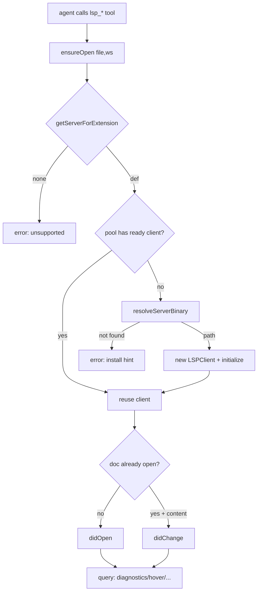

# LSP Integration

AgentDesk gives agents real **code intelligence** — diagnostics, hover types,
go-to-definition, find-references and document symbols — by spawning real
**language-server processes** and talking LSP over stdio, instead of shelling out
to `tsc`/`pyright`. The single most important thing to understand: this is a
**lazy, pooled, on-demand** subsystem. A server is never started until an agent
tool touches a file of its language; once started it is cached per
`(language, workspace)` and reused for every later request. The flow is
deliberately split into three concerns — **transport** (`jsonrpc.ts`),
**one-server lifecycle** (`client.ts`), and **pool + tools** (the `lsp-manager`
plugin) — sitting on top of a **static server catalog** (`servers.ts`) and a
**binary discovery/installer** (`installer.ts`).

## Key idea — three layers + a catalog

1. **Catalog (`servers.ts`)** — pure static data. `SERVER_DEFS` maps a language
   id to its binary name, spawn args, file extensions, per-extension LSP
   `languageId`, install recipe, and `initializationOptions`
   (`src/bun/lsp/servers.ts:40`). An `extensionMap` flattens this so any file
   extension resolves to a `ServerDef` (`src/bun/lsp/servers.ts:176`,
   `getServerForExtension` at `:184`). Eight languages ship: TypeScript/JS,
   Python (pyright), Go (gopls), Rust (rust-analyzer), PHP (intelephense), HTML,
   CSS, JSON.
2. **Transport (`jsonrpc.ts`)** — JSON-RPC 2.0 over a child process's stdio with
   `Content-Length` framing. Knows nothing about LSP semantics.
3. **Client (`client.ts`)** — one `LSPClient` = one server process. Owns the
   `initialize` handshake, document sync, diagnostic caching, and the
   request/response query methods.
4. **Pool + tools (`lsp-manager`)** — the `serverPool` `Map` keyed by
   `serverId:workspace` (`src/bun/plugins/lsp-manager/index.ts:16`) and the
   agent-facing `lsp_*` tools.

## How it works

### Spawn-on-demand (the hot path)

Every agent LSP tool funnels through `ensureOpen()`
(`src/bun/agents/tools/lsp.ts:16`), which calls
`getOrSpawnServer(ext, workspace, settings)`
(`src/bun/plugins/lsp-manager/index.ts:30`):

1. Resolve the `ServerDef` from the extension; bail if unsupported
   (`index.ts:35`).
2. Honor the `<id>_enabled` plugin setting — a disabled language returns a
   descriptive error, never a spawn (`index.ts:39`).
3. Look in `serverPool` for an existing `ready` client and reuse it
   (`index.ts:46`). A stale/`error` client is shut down and evicted first
   (`index.ts:49`).
4. Resolve the binary via the discovery chain (below), then construct and
   `initialize()` a new `LSPClient`, caching it on success (`index.ts:67`).

After a server is up, `ensureOpen` does a `textDocument/didOpen` the first time a
file is seen (tracked in the module-global `openDocs` set) or a `didChange` if
fresh `content` was supplied (`src/bun/agents/tools/lsp.ts:26`).

### The initialize handshake

`LSPClient.initialize()` spawns the binary with piped stdio, wires a
`JsonRpcTransport`, watches `process.exited` to flip state to `error`
(`src/bun/lsp/client.ts:84`), then sends `initialize` with a *minimal*
declared client capability set (hover/definition/references/documentSymbol/
publishDiagnostics, full sync) (`src/bun/lsp/client.ts:92`). It stores the
server's returned `capabilities`, sends the `initialized` notification, and marks
state `ready` (`src/bun/lsp/client.ts:113`). The handshake has a long 45s timeout
(`INIT_TIMEOUT`, `client.ts:26`) because cold servers can be slow.

Why the long timeout matters: `typescript-language-server` would otherwise try
**Automatic Type Acquisition** (npm-installing `types-registry`) during init and
hang. The catalog disables ATA via `initOptions`
(`src/bun/lsp/servers.ts:61`), passed straight into the handshake.

### Diagnostics — push, debounced, awaitable

Diagnostics are **server-pushed**, not requested. The transport routes any
no-`id` message to the client's notification handler
(`src/bun/lsp/client.ts:362`); `textDocument/publishDiagnostics` is **debounced
150ms** (`DIAGNOSTICS_DEBOUNCE`, `client.ts:27`) because servers commonly emit a
syntax-only pass then a fuller semantic pass — the debounce coalesces them so the
agent sees the final set. After the debounce, results land in `diagnosticsMap`
and any pending **waiters** resolve (`client.ts:369`).

Because pushes are async, the tools call `waitForDiagnostics(file, 10s)`
(`client.ts:226`): it registers a one-shot waiter that resolves on the next
publish, with a timeout fallback that returns whatever is cached. This is what
lets `lsp_diagnostics` behave like a synchronous "check this file" call.

URI/path conversion is a recurring trap: `pathToUri` builds
`file:///C:/...` on Windows (`client.ts:385`), but servers may echo a
differently-cased or percent-encoded drive (`file:///d%3A/`). So both
`getDiagnostics` (`client.ts:202`) and `resolveWaiters` (`client.ts:249`) fall
back to a **decoded + lowercased** URI comparison when an exact key miss occurs.

### Query methods

`hover`, `definition`, `references`, `documentSymbols` each first check
`state === "ready"` **and** the relevant server `capabilities.*Provider` flag
before issuing the request, returning empty/null otherwise
(`src/bun/lsp/client.ts:279`, `:299`, `:316`, `:334`). `definition`/`references`
normalize the union return shape (single `Location` | `Location[]`) via
`normalizeLocations` (`client.ts:405`); `documentSymbols` handles both the
hierarchical `DocumentSymbol[]` and the flat `SymbolInformation[]` server replies
(`client.ts:345`). All positions are **0-based** at the LSP boundary; the tool
layer converts to/from **1-based** for agents (e.g. `line - 1` in, `+ 1` out —
`src/bun/agents/tools/lsp.ts:135`, `:166`).

### JSON-RPC framing

`JsonRpcTransport` (`src/bun/lsp/jsonrpc.ts:32`) writes
`Content-Length: N\r\n\r\n<json>` to stdin (`:85`) and incrementally parses
stdout: it accumulates into a `Buffer`, finds the header delimiter, reads exactly
`contentLength` bytes, and only then parses — waiting for more data if the body
is incomplete (`:116`). Responses resolve/reject pending promises by `id`
(`:149`); notifications go to the handler; an inbound server→client **request**
is answered with `-32601 Method not found` since AgentDesk implements no
server-callable methods (`:175`). `dispose()` rejects all in-flight requests.

### Binary discovery & install

`resolveServerBinary` (`src/bun/lsp/installer.ts:39`) tries, in order: a
**user-override** path from plugin settings, a **system PATH** lookup (`which`),
then the **managed** install dir under `Utils.paths.userData/lsp-servers`
(`installer.ts:13`). Three install methods (`installer.ts:121`):
- **bun** — `bun add <pkgs>` into the managed dir's own `package.json`; binary
  ends up in `node_modules/.bin` (`.exe` on Windows) (`:185`).
- **go** — `go install` with `GOBIN` pointed at the managed `bin/`; requires the
  Go SDK prereq in PATH (`:209`).
- **github** — fetch the latest release, match the platform asset string
  (`getPlatformString`, `:282`), download, gunzip if needed, `chmod +x` on Unix
  (`:232`). Used only by rust-analyzer (`servers.ts:107`).

`installing` is an in-flight `Set` guarding against concurrent installs of the
same server (`installer.ts:30`, `:97`).

### Two surfaces: agents vs. settings UI

- **Agents** get five tools — `lsp_diagnostics`, `lsp_hover`, `lsp_definition`,
  `lsp_references`, `lsp_document_symbols` — registered in the agent tool
  registry from `src/bun/agents/tools/lsp.ts:275` and wired in via
  `src/bun/agents/tools/index.ts:51`. `lsp_diagnostics` additionally supports a
  `file_paths` array that checks many files in parallel
  (`tools/lsp.ts:90`). See [[agent-tools]].
- **Settings UI** gets RPCs `getLspStatus` / `installLspServer` /
  `uninstallLspServer` (`src/bun/rpc/lsp.ts:29`), registered **not** through the
  usual `rpc-registration.ts` but via `src/bun/rpc-groups/plugins-tools.ts:33`.
  Status merges the catalog with live install state and plugin settings
  (`rpc/lsp.ts:34`); contract in `src/shared/rpc/lsp.ts`. See [[rpc-layer]].

## Key files

| File | Role |
|---|---|
| `src/bun/lsp/servers.ts` | Static catalog: `SERVER_DEFS`, extension→def map, install recipes |
| `src/bun/lsp/client.ts` | `LSPClient` — one server process: handshake, doc sync, diagnostics, queries; URI⇄path utils |
| `src/bun/lsp/jsonrpc.ts` | `JsonRpcTransport` — JSON-RPC 2.0 over stdio with Content-Length framing |
| `src/bun/lsp/installer.ts` | Binary discovery chain + bun/go/github install methods |
| `src/bun/lsp/types.ts` | LSP 3.17 protocol type subset + `DiagnosticSeverity`/`SymbolKind` enums |
| `src/bun/plugins/lsp-manager/index.ts` | `serverPool`, `getOrSpawnServer`, `openDocs`, plugin lifecycle |
| `src/bun/plugins/lsp-manager/manifest.json` | Per-language `*_enabled`/`*_binary` settings + agent prompt |
| `src/bun/agents/tools/lsp.ts` | The five agent `lsp_*` tools (1-based, parallel diagnostics) |
| `src/bun/rpc/lsp.ts` | `getLspStatus`/`installLspServer`/`uninstallLspServer` handlers |
| `src/shared/rpc/lsp.ts` | RPC contract + `LspServerStatus` shape |

## Gotchas / Constraints

- **Two parallel tool implementations exist.** The agent-facing tools live in
  `src/bun/agents/tools/lsp.ts` (the ones actually used, via `tools/index.ts`).
  The `lsp-manager` plugin **also** re-registers `lsp_*` tools through
  `api.registerTool` in its `activate()` (`src/bun/plugins/lsp-manager/index.ts:144`).
  Both import the same `getOrSpawnServer`/`openDocs`, so they share the pool —
  but the duplication is real and easy to edit in the wrong place.
- **CLAUDE.md is stale on the tool list.** It mentions `completion`/`rename`
  LSP tools; the code has no rename or completion tool — the five are
  diagnostics/hover/definition/references/document_symbols.
- **Only TypeScript is enabled by default.** `typescript_enabled` defaults
  `true`; every other language defaults `false`
  (`src/bun/plugins/lsp-manager/manifest.json:22`). A disabled language returns an error
  from `getOrSpawnServer`, not silence.
- **`openDocs` is keyed by raw file path, not URI**, and is process-global across
  all servers/workspaces (`src/bun/plugins/lsp-manager/index.ts:19`). It never expires
  on its own — only `closeDocument` (per-file) or `shutdownAll` clears it.
- **Full document sync only.** `didChange` sends the entire file text every time
  (`client.ts:171`); there is no incremental sync.
- **Diagnostics can legitimately return empty.** `waitForDiagnostics` resolves on
  timeout with the cache, so an empty array can mean "clean" *or* "server slow /
  never published" — there is no distinct timeout signal to the agent.
- **Windows drive-letter URIs** are the most fragile part — the case/encoding
  fallbacks in `getDiagnostics`/`resolveWaiters` exist precisely because exact
  URI matching breaks across servers.
- **LSP RPCs bypass `rpc-registration.ts`** — they are registered only in
  `rpc-groups/plugins-tools.ts`, so grepping the main registration file won't
  find them.

## Related
- [[agent-tools]]
- [[rpc-layer]]
- [[agent-engine]]

## Open questions
- Servers are pooled per `(language, workspace)` but there is no idle eviction —
  long sessions accumulate live server processes until app exit
  (`deactivate`/`shutdownAll`). Is there a cap or TTL anywhere upstream?
- The plugin's `onFileChange` handler (`src/bun/plugins/lsp-manager/index.ts:111`) feeds
  diagnostics back into agent context on passive writes — is it actually wired to
  the file-write path, and does it ever race the tool-driven `openDocs` state?
