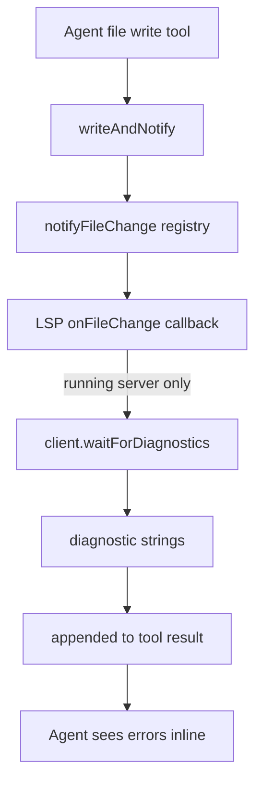

# Plugin System

**A small in-process extension framework.** A *plugin* is a directory with a
`manifest.json` + an `index.ts` that exports `activate(api)`. On activation the
plugin receives a scoped `PluginAPI` it uses to contribute agent **tools**, an
agent **prompt snippet**, **file-change callbacks**, and **UI extension points**
(sidebar items, project tabs, settings sections, chat commands, themes).
Everything runs in the main Bun process — there is no sandbox or sub-process
isolation; the `permissions` field in the manifest is currently descriptive
metadata, not an enforced boundary. The one shipped plugin is **LSP Manager**,
and the whole subsystem exists primarily to host it: language-server
intelligence for agents is delivered as a plugin rather than a hard-wired tool
group so it can be toggled off and configured per-language.

## How it works

### Discovery and load (`loader.ts`)
`scanPluginDirectory(dir)` (`src/bun/plugins/loader.ts:13`) walks one level of
sub-directories, requiring each to contain both `manifest.json` and `index.ts`
— missing either is a skip with a warning, never a throw. The manifest JSON is
parsed and validated against a zod schema (`validateManifest`,
`src/bun/plugins/manifest.ts:26`), then `index.ts` is dynamically `import()`-ed
and checked for an `activate` export (`loader.ts:43`). The result is a
`LoadedPlugin { manifest, module, directory }`.

A subtle but important detail: the zod schema lists `defaultEnabled` explicitly
(`manifest.ts:22`) because zod **strips unknown keys** — a regression once
dropped this flag and made every plugin enabled on install. Same for `prompt`
(`manifest.ts:23`).

### Two load paths (`index.ts`)
`initPlugins()` (`src/bun/plugins/index.ts:15`) is called once at startup from
the background-services block in `src/bun/index.ts:250` (after the DB is ready).
It assembles plugins from three sources:
1. **Built-in-in-code** — LSP Manager is imported directly as an ES module
   (`index.ts:8`) rather than filesystem-scanned, so its `import()` works inside
   the bundled production app where the loose `lsp-manager/` source tree is not
   on disk. Its `manifest.json` is imported as JSON (`index.ts:9`).
2. **Built-in scanned** — `scanPluginDirectory(builtinDir)` over `src/bun/plugins`.
3. **User scanned** — `scanPluginDirectory(<userData>/plugins)`.

All three lists are concatenated and each is run through `activatePlugin`.

### Activation + DB reconciliation (`registry.ts`)
`activatePlugin(loaded)` (`src/bun/plugins/registry.ts:14`) is the heart of the
lifecycle:
- It always caches the `LoadedPlugin` in the module-level `loadedPlugins` map
  (`registry.ts:18`) **even if disabled**, so it can be re-activated later
  without re-scanning disk.
- It upserts a row in the `plugins` table. First-install seeds `enabled` from
  `manifest.defaultEnabled`, materialises a `settings` JSON object from the
  manifest setting defaults, and copies the manifest `prompt` (`registry.ts:25`).
  Existing rows get the manifest prompt **back-filled** if their column is empty
  (`registry.ts:41`) — this is the migration-safety path for users who installed
  the plugin before the `prompt` column existed.
- If the DB row says disabled, activation stops there (`registry.ts:46`).
- Otherwise it builds the scoped API via `createPluginAPI(manifest)`, calls
  `module.activate(api)`, and stores a live `PluginInstance` (`registry.ts:55`)
  capturing the tools/hooks/file-callbacks the plugin registered during
  `activate`. Lifecycle hooks `onInstall` (first install only) and `onEnable`
  fire after activation (`registry.ts:67`).

The DB row is the **persistent enabled-state**; the `instances` map is the
**live runtime state**. `enablePlugin`/`disablePlugin` (`registry.ts:115`,
`:125`) flip the DB flag and then mirror it in memory — disable runs
`deactivatePlugin` (calls `onDisable`/`deactivate`, drops the instance, clears
the plugin's UI extensions), enable re-runs `activatePlugin` from the cached
`loadedPlugins` entry. `uninstallPlugin` (`registry.ts:98`) additionally calls
`onUninstall` and deletes the DB row.

### The scoped API (`api.ts`)
`createPluginAPI(manifest)` (`src/bun/plugins/api.ts:20`) returns the `api`
object plus three out-params (`registeredTools`, `registeredHooks`,
`fileChangeCallbacks`) that the registry snapshots into the instance. Key
behaviours:
- **`registerTool(name, tool)`** namespaces the key as
  `plugin__<name-with-underscores>__<toolName>` (`api.ts:33`) and pushes it into
  the **global** tool registry via `registerTools` from
  `src/bun/agents/tools/index.ts` with `category: "plugin"`. So a plugin tool
  becomes a first-class entry in the shared tool registry.
- **`getSettings()` / `setSettings(partial)`** read/merge-write the plugin's
  `settings` JSON column (`api.ts:40`, `:54`), falling back to manifest defaults.
- **`onFileChange(cb)`** registers a callback into `fileChangeCallbacks`
  (`api.ts:68`) — this is the LSP plugin's diagnostics hook (see below).
- The five `register*` UI methods delegate to `extensions.ts`, keyed by plugin
  name so they can be torn down on deactivate.
- `getProjectContext()` currently always returns `null` (`api.ts:61`) — a stub.

### How agents get plugin tools and prompts
Plugin tools are **not** filtered through the per-agent `agent_tools` table.
`getPluginTools()` (`src/bun/agents/engine-types.ts:10`) collects the
`registeredTools` keys from every live instance and pulls those tools out of the
global registry. The agent loop unconditionally spreads them into every agent's
tool map (`src/bun/agents/agent-loop.ts:883`), and the PM/engine do the same
(`engine.ts:235`, `:506`). Net effect: **every enabled plugin's tools are
available to every agent**, regardless of role.

The matching prompt guidance is injected separately:
`loadPluginPrompts()` (`src/bun/agents/prompts.ts:1082`) selects the `prompt`
column of all rows where `enabled = 1` and concatenates the non-empty snippets
into the system prompt. The user can override a plugin's prompt per the
`savePluginPrompt` RPC (`src/bun/rpc/plugins.ts:57`) while still seeing the
manifest default (`defaultPrompt`) in the UI.

### UI extension points (`extensions.ts`)
A purely in-memory registry of five maps keyed by plugin name
(`src/bun/plugins/extensions.ts:47`). Plugins push items during `activate`;
`getAllExtensions()` (`extensions.ts:86`) flattens them (stamping each with its
`pluginName`) for the frontend via the `plugin-extensions` RPC; and
`clearPluginExtensions(name)` (`extensions.ts:76`) wipes a plugin's
contributions on deactivate so they don't leak. This data is volatile — it is
rebuilt from scratch every time plugins activate.

## LSP Manager — the one real plugin

`src/bun/plugins/lsp-manager/index.ts` is a single plugin that manages **all**
language servers rather than one-plugin-per-language. It is `defaultEnabled:true`
(`manifest.json:9`) and ships five tools: `lsp_diagnostics`, `lsp_hover`,
`lsp_definition`, `lsp_references`, `lsp_document_symbols`.

Architecture:
- A module-level **server pool** keyed `serverId:workspaceRoot`
  (`lsp-manager/index.ts:16`) caches `LSPClient` instances. Servers are spawned
  **lazily** by `getOrSpawnServer(ext, workspace, settings)` (`:30`): it looks
  up the server def for the extension (`getServerForExtension` from
  `src/bun/lsp/servers.ts`), checks a per-language `<id>_enabled` setting, then
  resolves the binary (honouring a `<id>_binary` override) via
  `resolveServerBinary` from `src/bun/lsp/installer.ts`. A missing binary returns
  a helpful install hint string instead of throwing (`:57`).
- A dead/errored pooled server is shut down and re-spawned (`:49`).
- An `openDocs` set (`:19`) tracks which files have been `textDocument/didOpen`-ed
  so re-queries send `didChange` instead of a duplicate open.
- Diagnostics are **event-driven**: tools call `client.waitForDiagnostics(file)`
  (`:178`) rather than polling, and convert LSP 0-based line/col + numeric
  severity/symbol-kind into 1-based, human-labelled output (`severityLabel`
  `:387`, `symbolKindLabel` `:375`).

### File-change → live diagnostics loop
This is the mechanism that surfaces type errors to agents after a write. When a
file tool writes, `writeAndNotify` (`src/bun/agents/tools/file-ops.ts:15`) calls
`notifyFileChange(path, content)` (`src/bun/plugins/registry.ts:139`), which fans
out to every instance's `fileChangeCallbacks`. The LSP plugin's callback
(`lsp-manager/index.ts:111`) **only notifies already-running servers** — it
deliberately does not spawn a server on a passive write (`:117`) — opens/updates
the doc, waits for diagnostics, and returns them as `path:line:col: sev: message`
strings. The file tool appends those to its result via `formatDiagnosticsSuffix`
(`file-ops.ts:25`), so the agent sees compile errors inline in the same tool
turn that wrote the file. `deactivate()` shuts down every pooled server (`:368`).

## Key files

| File | Role |
|---|---|
| `src/bun/plugins/index.ts` | `initPlugins()` — three load paths; LSP imported in-code |
| `src/bun/plugins/loader.ts` | `scanPluginDirectory` — manifest+index validation |
| `src/bun/plugins/registry.ts` | Activate/deactivate/enable/disable lifecycle + DB reconcile; `notifyFileChange` fan-out |
| `src/bun/plugins/manifest.ts` | zod manifest schema + `validateManifest` |
| `src/bun/plugins/api.ts` | `createPluginAPI` — scoped, namespaced API given to `activate` |
| `src/bun/plugins/extensions.ts` | In-memory UI extension registries + `getAllExtensions` |
| `src/bun/plugins/types.ts` | `PluginManifest`, `PluginModule`, `PluginAPI`, `PluginInstance` |
| `src/bun/plugins/lsp-manager/index.ts` | LSP server pool, 5 tools, file-change diagnostics callback |
| `src/bun/plugins/lsp-manager/manifest.json` | LSP plugin manifest + per-language enable/binary settings |
| `src/bun/agents/engine-types.ts` | `getPluginTools()` — pulls plugin tools into agent loops |
| `src/bun/agents/prompts.ts:1082` | `loadPluginPrompts()` — injects enabled plugin prompts |
| `src/bun/rpc/plugins.ts` | RPC: list/toggle/get-settings/save-settings/save-prompt |
| `src/bun/rpc/plugin-extensions.ts` | RPC: `getAllExtensions` for the frontend |

## Gotchas / Constraints

- **No sandboxing.** Plugins run in the main process with full access; the
  `permissions: ["fs"|"shell"|"network"]` manifest field is validated by zod but
  not enforced anywhere. Treat plugin code as trusted.
- **Plugin tools bypass per-agent tool gating.** Once a plugin is enabled, its
  tools are added to *every* agent unconditionally (`agent-loop.ts:883`), not
  filtered by the `agent_tools` table like built-in tools.
- **Tool keys are namespaced**, e.g. the LSP diagnostics tool is registered as
  `plugin__lsp_manager__lsp_diagnostics` (hyphens → underscores, `api.ts:33`).
  The manifest's `tools` array lists the *unprefixed* names.
- **`defaultEnabled` and `prompt` must stay in the zod schema** — zod strips
  unknown keys, which has silently broken these before (`manifest.ts:21-23`).
- **DB row vs. live instance** are separate states. A disabled plugin still has
  a cached `LoadedPlugin` (so it can be re-enabled without rescanning) but no
  `PluginInstance` and no contributed tools/extensions.
- **LSP diagnostics on write only fire for already-running servers.** A passive
  write never spawns a server (`lsp-manager/index.ts:117`); the server starts on
  first explicit `lsp_*` tool call for that language/workspace.
- **Per-language LSP servers are mostly off by default** — only TypeScript is
  enabled (`manifest.json:12`); Python/Go/Rust/PHP/etc. require flipping their
  `<id>_enabled` setting and having the binary installed.
- `getProjectContext()` is a `null` stub (`api.ts:61`) — plugins cannot read the
  active project yet.

## Related
- [[agent-tools]] — the shared tool registry plugin tools feed into
- [[agent-engine]] — consumes `getPluginTools()` + `loadPluginPrompts()`
- [[rpc-layer]] — plugins/plugin-extensions RPC handlers
- [[database]] — the `plugins` table (enabled flag, settings, prompt)

## Open questions
- Are there any user-installed plugins in the wild, or is the user-dir scan path
  effectively dead code today? (Only LSP Manager ships built-in.)
- The LSP `client.ts`/`servers.ts`/`installer.ts` internals (binary resolution,
  install methods) are referenced but not documented here — candidate for an
  [[lsp|lsp-internals]] page.
