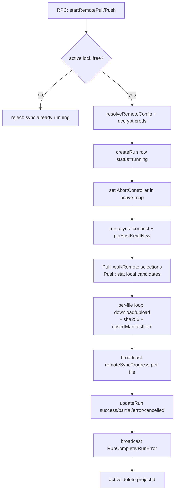

# Remote Sync

**Per-project file sync between the project workspace and a remote server over
SFTP, FTP, or FTPS.** It is a *one-way-at-a-time, explicit* sync (the user picks
paths, then Pull or Push) — not a live mirror. Credentials are AES-256-GCM
encrypted at rest with a master key stored outside the DB, and the whole feature
is deliberately protocol-agnostic above a single [[remote-sync|`RemoteClient`]]
interface so the engine never branches on protocol. It powers the **Remote** tab
(`src/mainview/components/remote-sync/`).

## Key idea

Three concerns are cleanly separated, which is the thing to understand first:

1. **`client.ts`** — *how to talk to one server*. A protocol-agnostic
   `RemoteClient` interface (`client.ts:46`) with two implementations
   (`SftpRemoteClient`, `FtpRemoteClient`). One instance holds **one live
   connection**: `connect()` → batch of list/stat/download/upload →
   `disconnect()`. Nothing above this layer knows whether it's SFTP or FTP.
2. **`config.ts`** — *what to sync and with what credentials*. Persists config,
   the local↔remote **manifest**, and run history; decrypts credentials into a
   `ResolvedRemoteConfig` (`config.ts:174`) for the engine. The DTO returned to
   the UI never contains secrets — they collapse to `hasPassword` booleans
   (`config.ts:58`).
3. **`engine.ts`** — *orchestration*: test, browse, pull, diff, push. Owns the
   per-project lock, cancellation, path-traversal guards, exclude globs, and all
   progress broadcasting.

## How it works

### Configuration & credential lifecycle
The user fills the Connection form → `saveRemoteSyncConfig` (`rpc/remote-sync.ts:33`)
→ `config.ts:96`. Secret fields use a three-state convention (`config.ts:106`):
`undefined` = keep existing, `""`/`null` = clear, a string = re-encrypt. After a
save the engine's cached browse connection is evicted (`rpc/remote-sync.ts:40`)
so the next browse reconnects with the new host/creds.

Secrets are encrypted via `encryptSecret`, which `crypto.ts` re-exports from the
shared `lib/secret-crypto.ts` (`crypto.ts:10`). The scheme is AES-256-GCM with a
12-byte IV and the layout `[12-byte IV][16-byte tag][ciphertext]`, base64'd
behind the prefix `enc:v1:` (`secret-crypto.ts:62`). The 32-byte master key
lives in a file named `remote-sync.key` under `userData` —
**separate from `agentdesk.db`** so a DB leak alone does not expose secrets
(`secret-crypto.ts:23`, `:44`). The filename is historical: Remote Sync shipped
this scheme first, so the whole app now reuses that key to keep already-encrypted
values readable. `decryptSecret` is tolerant — non-`enc:v1:` values pass through
unchanged (legacy plaintext) and it only throws on an authentication failure
(`secret-crypto.ts:77`). `resolveRemoteConfig` wraps that throw into an
actionable "the encryption key has changed or is missing — re-enter the
password" message (`config.ts:179`), the symptom when app data is moved without
the key file.

### Connection: host-key trust & FTP quirks
SFTP connect captures the server host key in a `hostVerifier` and computes a
`SHA256:…` fingerprint (`client.ts:103`). On the **first** connection it is
trust-on-first-use (returns `true`); once a fingerprint is pinned in config, a
mismatch refuses the connection — a basic MITM guard. The engine persists a
freshly observed key only when none was pinned, via `pinHostKeyIfNew`
(`engine.ts:166`), and turns a connect failure that is actually a key mismatch
into a clear message (`hostKeyMismatchMessage`, `engine.ts:176`).

FTP/FTPS has two hard-won workarounds in `FtpRemoteClient`:
- **List by CWD, not by path arg** (`client.ts:203`) — many servers ignore the
  path given to LIST/MLSD and return the working dir, so it `cd`s in first
  (FileZilla/WinSCP behaviour).
- **Failed-data-transfer detection** (`client.ts:218`) — it sniffs PureFTPd's
  "226 N matches total" line; if the server reported >2 items but the parse
  returned 0, the unencrypted data channel was likely mangled by a firewall/ALG.
  It retries once, then throws a message telling the user to switch to FTPS.

FTP has no portable `stat`, so it is derived from the parent directory listing
(`client.ts:240`).

### Browse (lazy tree)
The Remote tab expands the remote tree one directory per click. To avoid a fresh
connection per expand, the engine keeps **one short-lived browse connection per
project** (`engine.ts:215`), closed after 30s idle (`BROWSE_IDLE_MS`,
`engine.ts:191`). Browse ops are **serialized per project** through a promise
queue (`browseQueues`, `engine.ts:314`) so two commands never race on the shared
socket. A *reused* connection that lists nothing or throws is dropped and retried
once on a fresh one; a *fresh* connection's empty listing is trusted as real
(`engine.ts:290`).

### Pull / Push flow

A **single `active` map** holds one `AbortController` per project, giving both the
lock (`isBusy`, `engine.ts:44`) and cancellation (`cancel`, `engine.ts:48`).
`pull` (`engine.ts:355`) and `push` (`engine.ts:787`) validate config, claim the
lock, create the run row, then fire the work `void`-asynchronously and report
purely through broadcasts; `finally` deletes the lock.

**Pull** (`runPull`, `engine.ts:381`): expands `dir` selections via `walkRemote`
(`engine.ts:328`, which skips symlinks for loop-safety and rejects `.`/`..`
names from a hostile server), then downloads each file, hashes it, and records it
in the manifest with the **remote mtime + local SHA** captured at sync time. File
selections are always included; excludes only prune inside directory walks.

**Push** (`runPush`, `engine.ts:826`): the UI first calls `computePushDiff`
(`engine.ts:511`) to show what changed, the user selects rows, then `push`
uploads only files that still exist locally (`engine.ts:804`). Each upload
`ensureRemoteDir`s the parent first and refreshes the manifest with a `null`
remote mtime (we don't re-stat after upload).

### The manifest is the diff baseline
`remote_sync_items` (`schema.ts:993`) stores one row per synced file: remote
size/mtime and the **local content SHA-256 at last sync**. This is what makes
diffing cheap and offline-capable:
- **Push diff** (`engine.ts:511`): a local file with no manifest row = `new`;
  SHA differs from manifest = `modified`; in manifest but gone locally =
  `deleted` (reported only, **never auto-deleted remotely**, `engine.ts:563`).
  It then does a *conflict check* — one remote listing per parent dir (rsync
  style, not a stat-per-file, `engine.ts:591`) — flagging `remoteChanged` when
  the server copy changed since last sync (size diff, or mtime diff beyond a 2s
  FTP-granularity tolerance, `engine.ts:626`). Unreachable server ⇒
  `remoteChanged = null` (unknown), never a false alarm.
- **Pull conflict preflight** (`computePullConflicts`, `engine.ts:661`): a pure
  *local-vs-manifest* comparison (no remote round-trip) that finds tracked files
  whose current local SHA differs from the manifest — i.e. un-pushed local edits
  that a Pull would silently clobber — so the UI can warn first.
- **Per-file push diff** (`getPushFileDiff`, `engine.ts:736`): fetches local +
  current-server content (capped at 512KB, binary-sniffed via NUL bytes) so the
  push dialog can render a real text diff.

### Path-traversal safety
Every base-relative path coming back from a remote server is treated as
untrusted. `toLocalAbs` (`engine.ts:98`) resolves the local target and throws if
it escapes the sync root; `isSafeSegment`/`isSafeRel` (`engine.ts:84`) reject
`.`, `..`, and separator/NUL characters. These are applied inside the per-file
loops so one hostile path fails just that file, not the whole run.

### Crash recovery
Runs are created with `status="running"`. On app startup `index.ts:177` calls
`failInterruptedRuns` (`config.ts:307`), which marks any leftover `running` rows
as `failed` ("Interrupted by app restart") so the Activity tab never shows a
phantom in-progress sync after a crash.

## Key files
| File | Role |
|---|---|
| `src/bun/remote-sync/engine.ts` | Orchestration: test/browse/pull/diff/push, per-project lock, traversal guards, exclude globs, progress broadcasts |
| `src/bun/remote-sync/client.ts` | Protocol-agnostic `RemoteClient` over `ssh2-sftp-client` (SFTP) + `basic-ftp` (FTP/FTPS); host-key fingerprinting; FTP listing workarounds |
| `src/bun/remote-sync/config.ts` | Config + manifest + run-history persistence; DTO mapping (secrets→booleans); `resolveRemoteConfig` (decrypts); `failInterruptedRuns` |
| `src/bun/remote-sync/crypto.ts` | Thin re-export shim → `lib/secret-crypto` (kept for import stability) |
| `src/bun/lib/secret-crypto.ts` | App-wide AES-256-GCM secret encryption; `remote-sync.key` master key under userData |
| `src/bun/rpc/remote-sync.ts` | RPC handlers; evicts browse cache on save; `revealRemoteSyncSecret` round-trips the decrypted password to the UI |
| `src/bun/db/schema.ts` | `remote_sync_config` (`:955`), `remote_sync_items` manifest (`:993`), `remote_sync_runs` (`:1021`) |

## Gotchas / Constraints
- **The master key file (`remote-sync.key`) is not in the DB and not in a backup
  of the DB.** Move/restore app data without it and *all* encrypted secrets
  (Remote Sync, GitHub tokens, issue-tracker keys) become undecryptable —
  surfaced as the "re-enter the password" error (`config.ts:179`). Key perms are
  `0o600` but advisory on Windows (`secret-crypto.ts:49`).
- **Deletions are never propagated.** A locally-deleted tracked file shows as
  `deleted` in the diff but Remote Sync will not remove it from the server
  (`engine.ts:563`).
- **One operation per project.** The `active` map blocks a second pull/push while
  one is running (`engine.ts:356`, `:791`). Browse uses a *separate* cached
  connection and is not blocked by it.
- **Plain FTP data channels are fragile.** Firewalls/ALGs commonly break the
  unencrypted data connection, producing empty listings; the client detects this
  and steers users to FTPS (`client.ts:223`).
- **FTPS tolerates self-signed certs by default** (`rejectUnauthorized` off,
  `client.ts:194`) — the channel is encrypted but the cert is unverified unless
  the user opts into strict verification.
- **Symlinks are never followed** on either side (`engine.ts:341`, `:498`).
- **`revealRemoteSyncSecret`** (`rpc/remote-sync.ts:44`) sends the *decrypted*
  password/passphrase to the webview so the form can show it — intentional, but
  worth knowing the plaintext crosses the RPC boundary on demand.

## Related
- [[database-tables]]
- [[rpc-layer]]
- [[github-token-auth]]

## Open questions
- Pull/push run a single connection sequentially (no parallelism) — adequate for
  correctness/narration, but large trees could be slow. No chunked/parallel
  transfer is implemented.
- No incremental "pull only changed remote files" mode exists; Pull always
  re-downloads every selected file (the manifest is used for *push* diffing and
  *pull conflict* warnings, not to skip unchanged downloads).
