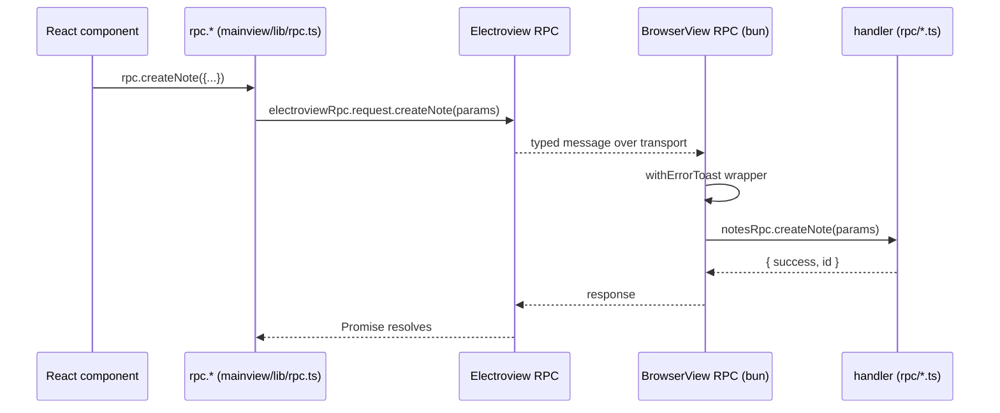

# RPC Layer

**The single typed boundary between the React renderer (webview) and the Bun
main process.** Every frontend → backend call and every backend → frontend push
flows through Electrobun's typed RPC, whose shape is described once in
`src/shared/rpc/*` and shared by both sides. There is no other IPC channel and
the frontend never touches the DB directly — `CLAUDE.md` makes this contract the
hard interface boundary.

> **Second transport (remote access).** As of the web-app feature, the same
> request-handler map is ALSO served over a **WebSocket** — directly via
> `Bun.serve` (`src/bun/remote/rpc-ws-server.ts`) or through the blind relay
> (`src/bun/remote/relay-session.ts`) — so the renderer's RPC works in a plain
> browser, not just the Electrobun bridge. The renderer picks the transport at the
> single `rpc.ts` seam (`IS_REMOTE`); handlers are transport-agnostic (one shared
> map in `src/bun/remote/rpc-handlers.ts`). See [[remote-access]].

## Key idea: one schema type, two registration points

Electrobun's RPC is bidirectional. The whole contract is the single type
`AgentDeskRPC` in `src/shared/rpc/index.ts:70-76`, which has two halves:

- `bun` — what the **Bun side handles**: `requests` (the giant
  `BunRequests` intersection at `index.ts:40-68`) plus `messages` (fire-and-forget
  log calls, `BunMessages`).
- `webview` — what the **webview side handles** (`WebviewSchema`,
  `src/shared/rpc/webview.ts:3`): a single request `getViewState`, and a large
  `messages` map — these are the **broadcasts Bun pushes to the UI** (toasts,
  stream tokens, kanban updates, freelance events, etc.).

Both sides import the *same* `AgentDeskRPC` and call `defineRPC<AgentDeskRPC>`:
the Bun side in `src/bun/rpc-registration.ts:36` (`BrowserView.defineRPC`), the
webview side in `src/mainview/lib/rpc.ts:29` (`Electroview.defineRPC`). Because
the type is shared, a contract change is a compile error on whichever side
hasn't been updated — that is the entire safety guarantee of this layer.

## How a call flows (request/response)

1. **Contract** — the params/response shape lives in a domain file, e.g.
   `createNote` in `src/shared/rpc/notes.ts:31-34`. Each domain file exports a
   `*Requests` type; `index.ts` intersects them all into `BunRequests`.
2. **Frontend call** — components never call `electroviewRpc` directly. They use
   the hand-written convenience wrapper `rpc` in `src/mainview/lib/rpc.ts:340`
   (e.g. `createNote` at `rpc.ts:649`). Each wrapper is a thin one-liner that
   maps positional args to the params object and calls
   `electroviewRpc.request.<name>(params)`.
3. **Dispatch** — Electrobun routes the named request to the matching key in the
   Bun `handlers.requests` map.
4. **Handler registration** — handlers are *not* registered individually.
   `rpc-registration.ts:40-49` spreads eight pre-assembled group objects into one
   `requests` map, all wrapped by `withErrorToast` (`rpc-registration.ts:19-33`),
   which catches any throw, broadcasts a `showToast` error to the UI, and
   re-throws so the Promise still rejects.
5. **Group → implementation** — each group file (e.g.
   `src/bun/rpc-groups/agents-kanban-notes.ts:7`) is a flat `Record<string, fn>`
   that delegates to the real implementation modules in `src/bun/rpc/*`
   (`notesRpc.createNote` → `src/bun/rpc/notes.ts:26`). Implementations do the DB
   work via Drizzle / raw SQLite and return the response shape.

## How a broadcast flows (Bun → UI push)

Bun pushes events through `broadcastToWebview(method, payload)` in
`src/bun/engine-manager.ts:252` — a thin `mainWindowRef?.webview?.rpc?.send?.[method]?.(payload)`
that silently no-ops if the window is gone. The `method` must be a key in
`WebviewSchema.messages`. On the webview side, every such message has a handler
in `electroviewRpc.handlers.messages` (`src/mainview/lib/rpc.ts:46-321`) that
simply **re-emits it as a DOM `CustomEvent`** (e.g. `kanbanTaskUpdated` →
`agentdesk:kanban-task-updated`). Zustand stores / components listen for those
DOM events (see `chat-event-handlers.ts`) — this DOM-event indirection decouples
the transport from React state. Group handlers often do both: e.g.
`createKanbanTask` runs the DB write then `broadcastToWebview("kanbanTaskUpdated", …)`
(`agents-kanban-notes.ts:22-30`).

## Wiring at startup

`src/bun/index.ts:25` imports the assembled `rpc` object and passes it to the
`BrowserWindow` constructor (`index.ts:202`, `rpc`). That single object IS the
backend RPC server. `index.ts` also re-exports `onSettingChange` from
`rpc-registration.ts:7`, which forwards to the in-memory callback registry in
`rpc-groups/setting-callbacks.ts` so settings changed via RPC can sync live
state without a restart.

## Adding a new RPC end-to-end

1. **Contract** — add `myCall: { params; response }` to the right domain file in
   `src/shared/rpc/`. If it's a new domain, create `src/shared/rpc/foo.ts`
   exporting `FooRequests`, import it in `index.ts`, and add it to the
   `BunRequests` intersection (`index.ts:40-68`).
2. **Implementation** — write the function in `src/bun/rpc/<domain>.ts`.
3. **Registration** — add `myCall: (params) => fooRpc.myCall(params)` to the
   matching group in `src/bun/rpc-groups/*.ts` (or to `features.ts` for newer
   domains). It's auto-picked-up by the spread in `rpc-registration.ts` — you do
   NOT edit `rpc-registration.ts` unless adding a whole new group import.
4. **Frontend wrapper** — add a convenience method to the `rpc` object in
   `src/mainview/lib/rpc.ts` and call it from components.
5. **(Broadcast only)** add the message to `WebviewSchema.messages` in
   `webview.ts` and a re-emit handler in `mainview/lib/rpc.ts`'s
   `handlers.messages`.

## Why grouping exists

The original layout had one handler-registration call per domain. The
`rpc-groups/` directory bundles ~50 implementation modules into 8 coarse groups
(settings-providers, projects-system, conversations-control, agents-kanban-notes,
git-analytics, channels-inbox-scheduler, plugins-tools, features) so
`rpc-registration.ts` stays a short 8-line spread. The implementation modules in
`src/bun/rpc/*` remain one-file-per-domain; the group is just the assembly layer.

## Key files

| File | Role |
|---|---|
| `src/shared/rpc/index.ts` | Assembles `AgentDeskRPC` from all `*Requests` domain types; the single shared contract |
| `src/shared/rpc/*.ts` | One file per domain: params/response shapes + exported DTO types |
| `src/shared/rpc/webview.ts` | `WebviewSchema` — the Bun→UI broadcast message catalog |
| `src/bun/rpc-registration.ts` | `BrowserView.defineRPC`; spreads 8 groups; `withErrorToast` wrapper |
| `src/bun/rpc-groups/*.ts` | Assembly layer — flat `Record<string,fn>` delegating to `rpc/*` (+ broadcasts) |
| `src/bun/rpc/*.ts` | Actual handler implementations (DB via Drizzle / SQLite, business logic) |
| `src/bun/engine-manager.ts` | `broadcastToWebview(method,payload)` — the Bun→UI push primitive |
| `src/mainview/lib/rpc.ts` | `Electroview.defineRPC`; webview message→DOM-event re-emitters; the typed `rpc` wrapper |
| `src/bun/index.ts` | Passes the `rpc` object to `BrowserWindow` at startup |

## Gotchas / Constraints

- **`maxRequestTime: Infinity` on both sides** (`rpc-registration.ts:37`,
  `mainview/lib/rpc.ts:31`) — Electrobun's default 1 s request timeout is
  disabled because agent runs take minutes. Don't reintroduce a finite timeout.
- **Errors are auto-toasted and re-thrown.** Every Bun request goes through
  `withErrorToast`; a thrown handler surfaces a UI error toast AND rejects the
  Promise. Callers still need their own catch if they want bespoke handling.
- **Broadcasts are fire-and-forget and lossy.** `broadcastToWebview` swallows all
  errors and no-ops when the window is closed — never rely on a broadcast for
  state correctness; treat them as cache-invalidation hints, refetch on mount.
- **Broadcasts cross two indirections** (typed message → DOM CustomEvent → store
  listener). Adding a broadcast requires a `webview.ts` entry AND a re-emit
  handler in `mainview/lib/rpc.ts`, or it silently does nothing.
- **The `rpc` wrapper is hand-maintained**, not generated — it can drift from the
  contract. A wrapper can lag behind a new contract method until someone adds it.
- **Never bypass this boundary** with direct DB access from the frontend
  (`CLAUDE.md` critical rule). All frontend↔backend traffic is RPC.
- **`group` ≠ contract domain.** Contract files and implementation files are
  per-domain, but a group can mix several domains (e.g. agents-kanban-notes).
  When adding a handler, find the group that imports your `rpc/*` module.

## Related

- [[agent-engine]]
- [[chat-flow]]
- [[directory-map]]

## Open questions

- The `rpc` convenience wrapper (`mainview/lib/rpc.ts`, ~1587 lines) is partly
  redundant with the typed `electroviewRpc.request.*` surface — is it kept purely
  for ergonomics, or do any callers depend on its arg-reshaping? Worth a lint to
  confirm no contract methods are missing wrappers.
