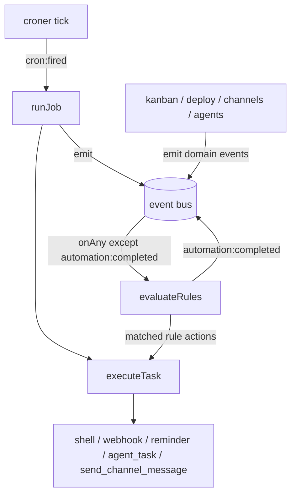

# Scheduler & Automation

The `src/bun/scheduler/` module is AgentDesk's background-execution backbone. It has
three cooperating parts that all converge on a single executor:

- **Cron scheduler** — time-driven jobs (`croner`), restart-safe with missed-run recovery.
- **Automation engine** — event-driven rules that react to things happening in the app.
- **Event bus** — an in-process pub/sub that the rest of the backend emits domain events
  onto, and that the automation engine subscribes to.

The single most important idea: **both the cron scheduler and the automation engine
funnel everything through one function, `executeTask()` in `task-executor.ts`.** A "cron
job" and an "automation rule" differ only in *what triggers them* (a clock tick vs. an
event); the actual side effect — run a shell command, hit a webhook, dispatch an agent,
send a reminder, post to a channel — is the same code path either way.

## How it works

### Boot order (everything starts early)

`src/bun/index.ts:183-186` wires and starts the subsystem at app startup, deliberately
*before* the slower plugin/skill/channel/MCP init (which is deferred to dom-ready). Order:

1. `setTaskExecutorEngine(getOrCreateEngine)` — injects the PM-engine resolver so agent
   task types can dispatch through the per-project `AgentEngine` (see [[agent-engine]]).
2. `await initCronScheduler()` — loads and arms all enabled jobs, runs missed-run recovery.
3. `setSchedulerRunning(true)` — flips the health flag (`rpc/health.ts`).
4. `initAutomationEngine()` — subscribes to the event bus.

Starting early matters because the health check gates on the scheduler being up, and
because jobs whose scheduled time already passed during downtime must fire promptly.

### Cron path

`startJob()` constructs a `new Cron(expr, { timezone }, callback)` and stores it in an
in-memory `Map` keyed by job id (`cron-scheduler.ts:83-93`). Jobs are **only kept in
memory** — there is no persistent croner state; the DB `cron_jobs` table is the source of
truth and the in-memory map is rebuilt on every boot.

When a job fires, `runJob()` (`cron-scheduler.ts:25-81`):
1. Re-reads the job from `cron_jobs` (so edits between fires are picked up).
2. Inserts a `cron_job_history` row with status `running`.
3. Parses `taskConfig` JSON and injects `_jobName` + `_projectId` so the executor has
   context (`cron-scheduler.ts:42-44`).
4. Calls `executeTask(taskType, config)`.
5. Updates the history row (success/error, output, `durationMs`) and the job's
   `lastRunAt`/`lastRunStatus`.
6. Sends a **desktop notification** only for task types with no other UI feedback —
   `shell`, `webhook`, `send_channel_message` (the `NOTIFY_ON_COMPLETE` set,
   `cron-scheduler.ts:12`).
7. If the job is `oneShot` and succeeded, deletes its history + the job and stops it
   (`cron-scheduler.ts:73-77`).
8. Emits `cron:fired` onto the event bus — which means a cron job can itself trigger
   automation rules.

**Missed-run recovery** (`cron-scheduler.ts:108-125`): for each enabled job with a
`lastRunAt`, it builds a *paused* `Cron` and asks `nextRun(lastRanDate)`. If that next
scheduled time is already in the past, a run was missed during downtime, so it fires once
immediately. The comment explains the choice: `previousRun()` is unreliable on paused
instances, so `nextRun(lastRan)` is used because it is always computable.

`refreshJob()` (stop + re-read + re-arm if enabled) is how RPC edits propagate without a
restart; `triggerJobNow()` exposes manual "run now"; `getNextRuns()` previews upcoming
fire times for the UI.

### Automation path

`initAutomationEngine()` (`automation-engine.ts:87-101`) registers a single
`eventBus.onAny` listener. On every event *except* `automation:completed` (skipped to
avoid double-processing — chaining handles that), it calls `evaluateRules(event, 0)`.

`evaluateRules()` (`automation-engine.ts:42-83`):
1. Loads all enabled `automation_rules` ordered by `priority` ascending.
2. For each rule, parses `trigger` JSON; skips if `trigger.eventType !== event.type`.
3. Requires **all** conditions to match (`Array.every`). Matching is case-insensitive and
   reads fields directly off the event object via `equals`/`contains`/`not_equals`
   (`automation-engine.ts:26-40`).
4. Runs each action through `executeTask(action.type, action.config)`.
5. Stamps `lastTriggeredAt`, emits `automation:completed`, then **recurses** with
   `chainDepth + 1` so the completion event can trigger downstream rules.

**Chaining is depth-capped** at `MAX_CHAIN_DEPTH = 5` (`automation-engine.ts:8,43-46`) to
prevent infinite loops (e.g. a rule that triggers on `automation:completed` and emits it
again).

### Event bus

`event-bus.ts` is a thin wrapper over Node's `EventEmitter`. Every `emit()` fires twice:
once on the typed event name and once on the wildcard `"*"` channel
(`event-bus.ts:22-25`), which is how `onAny` works. `AgentDeskEvent` is a discriminated
union (`event-bus.ts:4-13`) — the exhaustive list of what can be reacted to. Max listeners
is bumped to 50 (`event-bus.ts:19`).

Emitters across the backend (where automation rules get their triggers from):
`kanban.ts:138,210` (`task:created`, `task:moved`), `deploy.ts:96,159`
(`deploy:completed`), `channels/manager.ts:501` (`message:received`),
`agents/engine.ts:336` (`agent:completed`), plus the scheduler's own `cron:fired` and
`automation:completed`.

### The executor (shared sink)

`executeTask()` (`task-executor.ts:30-404`) is a `switch` over `TaskType`
(`task-executor.ts:13`). Notable behaviors:

- `pm_prompt` / `agent_task` route through the injected `engineResolver` (the PM engine)
  when targeting `project-manager`, creating a fresh conversation and broadcasting
  `conversationUpdated` so it appears in the sidebar (`task-executor.ts:40-52,122-134`).
  The `agent_task`/`project-manager` branch prints `[SCHEDULER→PM]` right before
  calling `engineResolver(projectId).sendMessage(...)` (`task-executor.ts:134`) —
  the first line in tracing a scheduled run through the console, followed by the
  PM's own `[TOOLCALL]`/`[PM→DISPATCH]` logs (see [[agent-engine]]).
- `agent_task` with a **non-PM** agent runs that agent directly via `runInlineAgent`, with
  full broadcast callbacks mirroring `engine-manager.ts` so the UI streams parts, and an
  `AbortController` registered so the stop button + "N agents working" badge work
  (`task-executor.ts:135-261`).
- `agent_task_simple` runs a **project-less** agent via `ai`'s `generateText` with the full
  tool set (agent tools + plugin tools + MCP), writes the prompt + reply into the inbox,
  and broadcasts the result to all channels (`task-executor.ts:266-380`).
- `shell` spawns `sh -c` with a timeout-kill; `webhook` does a `fetch` with an
  `AbortController` timeout; `reminder` writes to the inbox + desktop notification;
  `send_channel_message` delegates to `channels/manager`.
- Every branch returns a `TaskResult { success, output?, error?, durationMs }` and never
  throws to the caller — failures are captured into `error` (`task-executor.ts:397-403`).

## Key files

| File | Role |
|---|---|
| `src/bun/scheduler/cron-scheduler.ts` | Croner job lifecycle, `runJob`, missed-run recovery, history writes |
| `src/bun/scheduler/automation-engine.ts` | Event-rule evaluation, condition matching, depth-capped chaining |
| `src/bun/scheduler/event-bus.ts` | In-process pub/sub; `AgentDeskEvent` union; wildcard `*` channel |
| `src/bun/scheduler/task-executor.ts` | Single `executeTask()` sink for all task types |
| `src/bun/scheduler/index.ts` | Barrel re-export for the subsystem |
| `src/bun/index.ts:183-186` | Boot wiring + start order |
| `src/bun/db/schema.ts:419-471` | `cron_jobs`, `cron_job_history`, `automation_rules` tables |

## Gotchas / Constraints

- **`agent_task_simple` ("Agent Task" in the UI) cannot dispatch sub-agents,
  even when `agentId` is `project-manager`.** It runs a single project-less
  `generateText` call (`task-executor.ts:336`) with tools from
  `getToolsForAgent(agentId)` (`tools/index.ts:103`) + plugin/MCP tools —
  `run_agent`/`run_agents_parallel` are pm-tools.ts **factory** tools, never
  spread into the static registry (see [[agent-tools]]), so they are wired
  only into the real PM engine's `pmTools` (`engine.ts`, used by the
  `agent_task`/"Agent Project Task" branch, `task-executor.ts:128-134`). A
  scheduled prompt that instructs "dispatch X via run_agent" run under
  `agent_task_simple` has no such tool available — the model can only
  fabricate the multi-stage dispatch as prose in one completion, with no
  real sub-agent spawned and no `[PM→DISPATCH]`/`agent_start` message parts.
  Diagnosed via the `[SCHEDULER→AGENT_SIMPLE]` log line the branch now prints
  (`task-executor.ts`, next to `wrapToolsWithCallLogging`). **Fix: pick "Agent
  Project Task" (`agent_task`) with a project selected**, which creates a real
  conversation and routes through `engineResolver` → the full PM engine.

- **In-memory only.** Active croner instances live in a module-level `Map`; nothing about a
  running timer survives a restart. Restart-safety comes entirely from `initCronScheduler`
  re-arming enabled jobs from the DB + the missed-run recovery, not from persisted timers.
- **Missed recovery fires at most once per job per boot**, regardless of how many fires were
  actually missed — it is a "catch up" not a "replay".
- **One-shot deletion only happens on success** (`cron-scheduler.ts:73`). A failing one-shot
  job stays in the table and will fire again on its next scheduled time.
- **Automation conditions only see top-level event fields.** `matchesCondition` indexes
  `event[field]` directly (`automation-engine.ts:27-28`); there is no nested-path support,
  and all comparisons are stringified + lowercased.
- **`automation:completed` is intentionally not re-evaluated by the top-level listener**
  (`automation-engine.ts:93`); chaining is the *only* way it propagates, and it is bounded
  by `MAX_CHAIN_DEPTH`.
- **`engineResolver` must be set before any agent-typed task runs.** `index.ts` calls
  `setTaskExecutorEngine` before `initCronScheduler`, but a job firing before injection would
  throw "Engine not initialized" (`task-executor.ts:45`).
- **Desktop notifications are deliberately suppressed** for task types that already surface in
  the UI (agent tasks, reminders) to avoid noise — only `shell`/`webhook`/`send_channel_message`
  notify (`cron-scheduler.ts:12,64-70`).

## Related
- [[agent-engine]] — the PM engine that agent task types dispatch through
- [[channels]] — `message:received` events + `send_channel_message` / broadcast sink
- [[database]] — `cron_jobs`, `cron_job_history`, `automation_rules` schema
- [[rpc-layer]] — cron/automation CRUD RPCs that call `refreshJob`/`triggerJobNow`

## Open questions
- The `agent:error` and `agent:stale` event variants are declared in `AgentDeskEvent`
  (`event-bus.ts:9-10`) and are selectable as automation triggers in the UI
  (`automation-rule-form.tsx:92`), but no in-tree backend `eventBus.emit` for them was
  found — so rules keyed on them would currently never fire. Possibly reserved for future
  emission or emitted from a not-yet-wired path.
- Shutdown runs on app quit via `index.ts:395-396` (`shutdownCronScheduler` clears the timer
  map; `shutdownAutomationEngine` removes all bus listeners) — confirmed, no open question.
