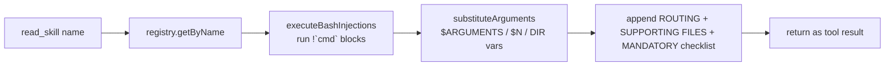

# Skills System

A **skill** is a filesystem directory containing a `SKILL.md` file (YAML
frontmatter + markdown instructions) that injects specialized, on-demand
expertise into any agent. The format is the Claude Code / Agent Skills open
standard, so skills are portable in both directions. The single most important
design choice: skills use **compact prompt injection** — only the name and a
one-line description of every skill land in an agent's system prompt; the full
body is loaded on demand via the `read_skill` tool. This keeps the prompt cheap
even with dozens of skills installed, and makes relevance a decision the LLM
makes for itself rather than something the engine scores. There is no DB
involvement at all — skills live only on disk and in an in-memory registry.

## Key idea: discover once, list compactly, resolve on demand

The system has three layers that map cleanly onto three files:

1. **Loader** (`src/bun/skills/loader.ts`) — pure functions: scan a directory,
   parse one `SKILL.md` into a `Skill` object, validate frontmatter, and resolve
   content (bash injection + argument substitution). No state.
2. **Registry** (`src/bun/skills/registry.ts`) — a singleton `SkillRegistry`
   holding a `Map<name, Skill>`, fed by the loader from two directories.
3. **Consumption** — the registry is read by the prompt builder
   (`buildSkillsDescriptionSection`, `prompts.ts:679`) for the compact listing,
   and by the four agent tools in `src/bun/agents/tools/skills.ts` for on-demand
   loading.

## How it works

### Startup discovery (no file watcher)

On boot, `src/bun/index.ts:282` calls `skillRegistry.loadAll()` exactly once.
There is no file watcher — picking up new or edited skills requires either an app
restart or a manual `refreshSkills` RPC (`rpc/skills.ts:43`) which calls
`registry.reload()` → `loadAll()` again.

### Dual-directory loading with user override

`loadAll` (`registry.ts:51`) reads two directories in order:

- **Bundled** (`registry.ts:27`) — read-only, ships with the app. In production
  it resolves to `resolve(import.meta.dir, "../skills")` inside the bundle; in
  dev it prefers `process.cwd()/skills` so newly added project-root skills appear
  on Refresh without a rebuild.
- **User** (`registry.ts:19`) — read-write, at `Utils.paths.userData/skills`,
  created on first run if absent.

Bundled skills load first and are tagged `isBundled = true` (`registry.ts:69`);
**user skills are loaded second and override a bundled skill of the same name**
(`registry.ts:79-84`). This lets a user replace a built-in skill without touching
the app bundle. `deleteSkill` (`registry.ts:125`) refuses to delete bundled
skills — only user skills can be removed.

### Parsing a SKILL.md

`parseSkillFile` (`loader.ts:83`) reads the file, splits frontmatter from body
with `gray-matter`, and builds the `Skill` object:

- **Name resolution** (`resolveSkillName`, `loader.ts:187`): use the frontmatter
  `name` if it matches the `^[a-z0-9](?:[a-z0-9-]*[a-z0-9])?$` pattern and length
  ≤ 64; otherwise normalize the directory name (lowercase, hyphenate).
- **Description fallback** (`loader.ts:93`): frontmatter `description`, else the
  first non-empty, non-heading paragraph of the body (`extractFirstParagraph`,
  `loader.ts:200`, capped at 200 chars).
- **allowed-tools** (`loader.ts:96`): accepts both comma- and space-delimited
  lists. Informational only — not enforced as a tool allowlist.
- **Supporting files** (`loadSupportingFiles`, `loader.ts:224`): recursively
  lists every file except `SKILL.md`, as forward-slashed relative paths.

`validateSkill` (`loader.ts:141`) records errors (not throws) for: missing
name/description, name too long / bad pattern / consecutive hyphens, and — a key
constraint — **the frontmatter `name` must equal the directory name**
(`loader.ts:161`). Errors are stored on the `Skill` and surfaced in the UI rather
than blocking load.

### Feature gating and hidden skills

Two frontmatter fields control visibility:

- `hidden: true` (`loader.ts:120`) — loaded and available to agents, but excluded
  from the Skills UI (`rpc/skills.ts:8` `isSkillVisible`).
- `feature: <name>` (`loader.ts:121`) — a feature gate. A skill tagged
  `feature: freelance` is only listed in agent prompts when freelance is enabled
  (`prompts.ts:681` filters via `isFeatureEnabled`, `prompts.ts:674`), and only
  shown in the UI when the flag is on (`rpc/skills.ts:10`).

### The compact prompt listing

`buildSkillsDescriptionSection` (`prompts.ts:679`) produces the `## Available
Skills` block appended to every agent's system prompt (`prompts.ts:973` for the
PM, `prompts.ts:1240` for standard sub-agents; the scheduler's task executor and
the freelance chat/wizard call it too). Each line is
`- **name**: <120-char description> [agent: <preferredAgent>]`. The `[agent:…]`
tag and the delegation/routing/skill-creation rules (`prompts.ts:701-719`) are
only emitted when `includeAgentRules` is true — the standalone hidden agents
(playground-agent / issue-fixer, `prompts.ts:1170`) and custom-prompt
(`useSystemPromptOnly`) agents (`prompts.ts:1210`) get the listing *without*
the routing rules; standard roster sub-agents get the full variant
(`prompts.ts:1240`).

### Content resolution pipeline (on `read_skill`)

When an agent calls `read_skill` (`tools/skills.ts:39`), the registry runs
`resolveSkillContent` (`loader.ts:343`) in a fixed order:

1. **Bash injection** (`executeBashInjections`, `loader.ts:274`): every
   `` !`command` `` is executed with `execSync` (10s timeout) and replaced by its
   stdout. Failures are swallowed into an inline `[Error running command: …]`
   string so a bad command never crashes resolution. This is **preprocessing** —
   the agent sees only the output, never the command.
2. **Argument substitution** (`substituteArguments`, `loader.ts:301`): replaces
   `${AGENTDESK_SKILL_DIR}`, `${AGENTDESK_SKILLS_USER_DIR}`, `$ARGUMENTS`,
   `$ARGUMENTS[N]`, and `$N` shorthand. Order matters — `$ARGUMENTS[N]` is
   replaced before bare `$ARGUMENTS` (`loader.ts:321` before `:327`) to avoid
   partial matches, and `$N` is limited to 1–2 digits to avoid clobbering literal
   dollar amounts in content.

The `read_skill` tool then wraps the resolved body with extra scaffolding
(`tools/skills.ts:58-107`): a `[ROUTING]` line if the skill has a
`preferredAgent`, a `[SUPPORTING FILES]` listing of full paths (binaries filtered
out by extension, `tools/skills.ts:72`), and a `[MANDATORY COMPLIANCE]` checklist
built from any lines containing "MANDATORY" via `extractMandatoryFiles`
(`tools/skills.ts:14`).

### The four agent tools

All four are category `skills` and available to every agent (`tools/skills.ts:38`):

- `read_skill` — resolve + return a skill body by exact name.
- `read_skill_file` (`tools/skills.ts:112`) — read a supporting file, **only** if
  the path is inside the bundled or user skills dir (`tools/skills.ts:129`), with
  a null-byte binary guard and a 512KB size cap.
- `find_skills` (`tools/skills.ts:172`) — case-insensitive substring search over
  name + description (`registry.ts:106`).
- `validate_skill` (`tools/skills.ts:197`) — re-parses a skill dir and adds extra
  lint checks: ≤500 body lines, no hardcoded absolute paths, warns on bloat files
  (`package.json`, `README.md`, …). Used after creating/editing a skill.

## Human-facing bridge: Search Remote Skills chat

The bundled `search-skills` skill (which shells out to `npx skills find/add`
against the skills.sh ecosystem) was previously reachable only inside an agent
conversation. `src/bun/rpc/skills-search-chat.ts` exposes the same capability
directly to a human via a **Search Remote Skills** button on the Skills page
(`src/mainview/pages/skills.tsx`), which opens a chat modal
(`src/mainview/components/skills/skills-search-chat-modal.tsx`) built on the
same streaming UX as Freelance Chat (tool-call cards, stop/regenerate/clear/
export, error bubble with retry).

Key design points, distinct from every other agent-run chat in the app:

- **No DB persistence** — history is a single module-level in-memory array,
  not a table. There is no per-entity key (unlike Freelance Chat, which is
  keyed by `listingId`) — it is one global conversation that resets on app
  restart or Clear.
- **Not a seeded agent.** Same as Freelance Chat and the Dashboard PM chatbot:
  an ad-hoc `streamText` loop with a hand-picked tool subset, no `agents` row,
  no kanban/engine dispatch.
- **`run_shell` is auto-approved** (`autoApprovedShellTool`,
  `agents/tools/shell.ts`) — required because `search-skills`'s own
  instructions run `npx skills find/add`. The OS-level approval popup is
  skipped, but the skill's own instructions still require an explicit
  in-chat "should I install this?" confirmation before anything is actually
  installed — the risky step is gated conversationally instead.
- **Auto-refreshing registry**: after every completed turn, the handler
  unconditionally calls `skillRegistry.reload()` and broadcasts
  `skillsChat.registryRefreshed`; the Skills page listens for this DOM event
  and re-fetches the grid, so a newly installed skill appears without the
  user clicking Refresh.
- Also appends `buildSkillsDescriptionSection(false)` to its system prompt —
  a fifth call site alongside the ones listed in the "Two prompt variants"
  gotcha below.

## Key files

| File | Role |
|---|---|
| `src/bun/skills/loader.ts` | Stateless parse/validate/resolve functions (`parseSkillFile`, `validateSkill`, `executeBashInjections`, `substituteArguments`) |
| `src/bun/skills/registry.ts` | `SkillRegistry` singleton — dual-dir load, user-overrides-bundled, search, delete |
| `src/bun/agents/tools/skills.ts` | The four agent tools: `read_skill`, `read_skill_file`, `find_skills`, `validate_skill` |
| `src/bun/agents/prompts.ts` | `buildSkillsDescriptionSection` — compact `## Available Skills` prompt block |
| `src/bun/rpc/skills.ts` | RPC handlers for the read-only Skills UI page + refresh/open-folder |
| `src/bun/rpc/skills-search-chat.ts` | Search Remote Skills chat — in-memory `streamText` loop wrapping `search-skills` |
| `src/mainview/components/skills/skills-search-chat-modal.tsx` | Chat modal UI (mirrors `freelance-chat-modal.tsx`) |
| `src/bun/index.ts:282` | One-time `skillRegistry.loadAll()` on startup |
| `docs/skills.md` | Long-form spec + Claude Code compatibility matrix |

## Gotchas / Constraints

- **No live reload.** Skills are read once at startup; edits need an app restart
  or a manual Refresh (`rpc/skills.ts:43`). Do not assume `getAll()` reflects the
  disk after a user edits a file.
- **Name must equal directory name.** A mismatch is recorded as a validation
  error (`loader.ts:161`) and shown in the UI, though the skill still loads under
  the resolved name.
- **`allowed-tools` is not enforced.** It is purely informational/UI metadata —
  it does *not* restrict which tools an agent may call. Real tool gating happens
  in [[agent-tools]] via `agent_tools` rows, not here.
- **Bash injection runs arbitrary shell** with a 10s timeout and no sandbox
  (`loader.ts:278`). A skill author's `` !`command` `` runs on the user's machine
  at resolve time. Failed commands degrade gracefully into an inline error string
  rather than aborting.
- **`read_skill_file` is path-confined** to the two skills dirs and rejects
  binaries / files >512KB (`tools/skills.ts:129-160`) to protect agent context.
- **Two prompt variants, several callers.** `buildSkillsDescriptionSection(true)`
  includes routing+delegation rules (PM `prompts.ts:973`, standard sub-agents
  `prompts.ts:1240`, scheduler task executor); `(false)` is the bare listing for
  the standalone hidden agents and custom-prompt agents (`prompts.ts:1170,1210`)
  plus the freelance chat/wizard and the Search Remote Skills chat
  (`rpc/skills-search-chat.ts`) — keep all call sites in mind when editing the
  prompt copy.
- **Removed legacy fields.** `disable-model-invocation`, `user-invocable`,
  `_activeSkill`, and keyword `matchForAgent()` auto-matching no longer exist
  (`docs/skills.md:108`, `:268-271`). All skills are visible to all agents; the LLM
  alone decides relevance.

## Related
- [[agent-tools]]
- [[agent-engine]]
- [[freelance-autoearn]]

## Open questions
- The dev-vs-prod bundled-dir resolution (`registry.ts:31-41`) assumes
  `import.meta.dir` lands at `Resources/app/bun/`; not re-verified against a fresh
  production bundle here.
